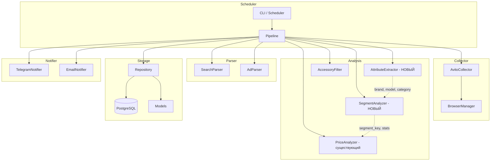
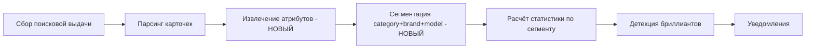
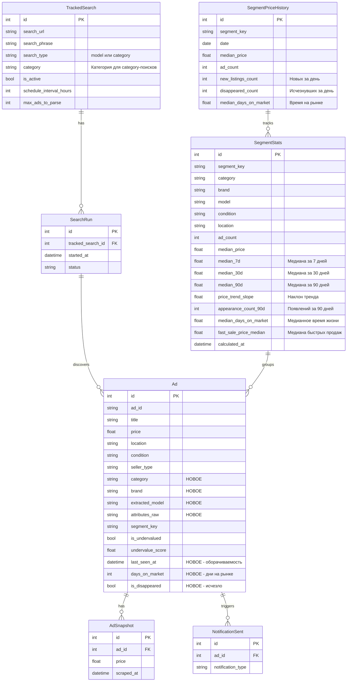
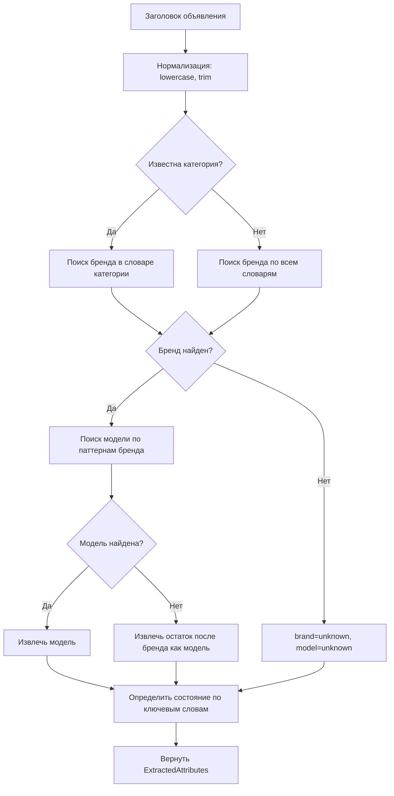
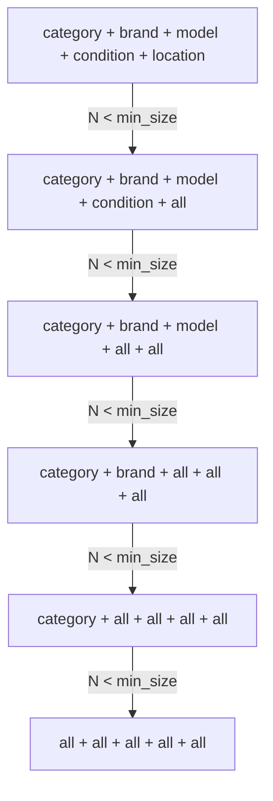
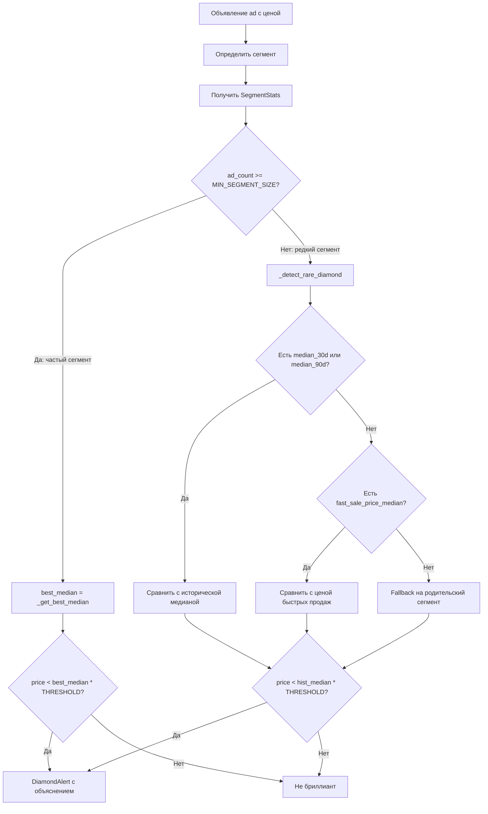
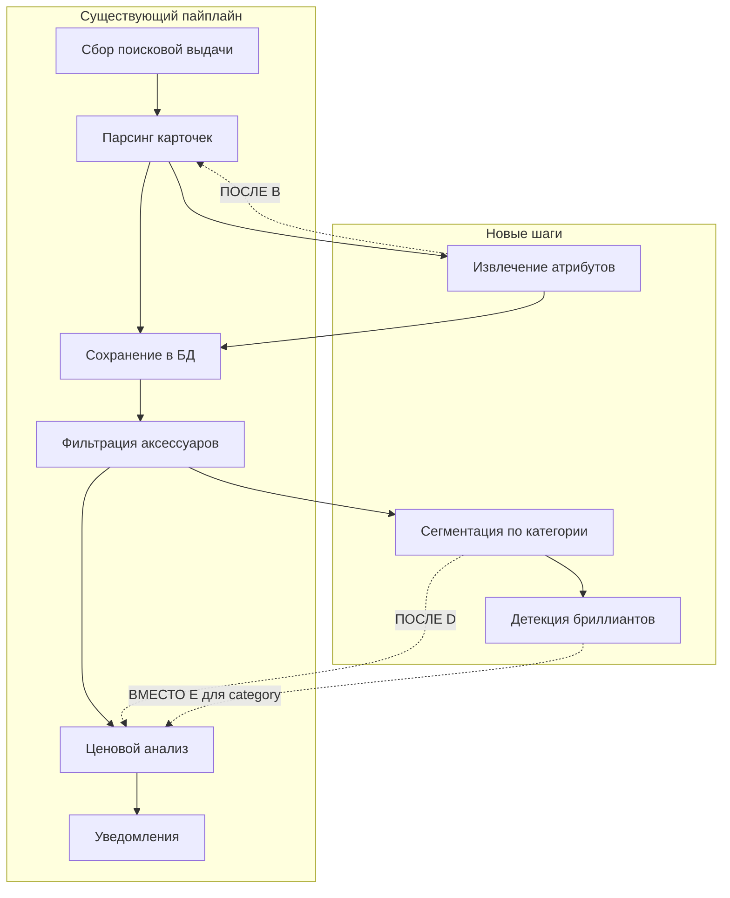
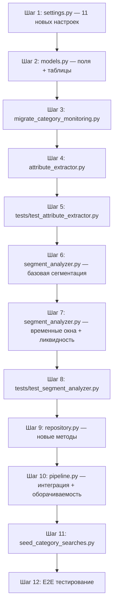

# Архитектура системы широкого мониторинга категорий с сегментацией

> **Статус:** Проект (MVP+)
> **Дата:** 2026-04-13 (v2 — с временными окнами и ликвидностью)
> **Цель:** Расширить систему мониторинга с конкретных моделей на широкие категории с автоматической сегментацией, детекцией «бриллиантов» и учётом динамики рынка

---

## 1. Общая архитектура

### 1.1 Диаграмма компонентов



### 1.2 Поток данных — расширенный пайплайн



### 1.3 Принципы проектирования

| Принцип | Описание |
|---------|----------|
| **Без ML на старте** | Только словари и regex-паттерны для извлечения атрибутов |
| **Объяснимость** | Каждый алерт содержит: сегмент, медиану, отклонение, размер выборки |
| **Обратная совместимость** | Существующий поиск по конкретным моделям не ломается |
| **Масштабируемость** | Новые категории добавляются через словари без изменения кода |
| **Простота MVP** | Минимальный рабочий продукт, итеративное улучшение |

---

## 2. Изменения в модели данных

### 2.1 Новые поля в `TrackedSearch`

| Поле | Тип | Default | Описание |
|------|-----|---------|----------|
| `search_type` | `String(20)` | `"model"` | Тип поиска: `"model"` или `"category"` |
| `category` | `String(128)` | `NULL` | Название категории для category-поисков |

**Логика:**
- `search_type = "model"` — существующее поведение, ищем конкретный товар
- `search_type = "category"` — широкая лента, собираем ВСЕ объявления категории

### 2.2 Новые поля в `Ad`

| Поле | Тип | Default | Описание |
|------|-----|---------|----------|
| `category` | `String(128)` | `NULL` | Категория товара: телефоны, велосипеды, шины |
| `brand` | `String(128)` | `NULL` | Бренд: apple, samsung, stels, michelin |
| `extracted_model` | `String(256)` | `NULL` | Извлечённая модель: iphone 15 pro, navigator 800 |
| `attributes_raw` | `Text` | `NULL` | JSON с полными результатами извлечения атрибутов |

> **Примечание:** Поле называется `extracted_model`, а не `model`, чтобы избежать конфликта с термином SQLAlchemy «model».

### 2.3 Новая таблица: `segment_stats`

Хранит предрасчитанную статистику по сегментам. Позволяет не пересчитывать медиану при каждом запуске. Включает **временные окна** (7d/30d/90d) и **метрики ликвидности**.

```python
class SegmentStats(Base):
    __tablename__ = "segment_stats"

    id: int                          # PK
    segment_key: str                 # "телефоны|apple|iphone 15|used|moscow"
    category: str                    # "телефоны"
    brand: str                       # "apple"
    model: str                       # "iphone 15"
    condition: str                   # "used" / "new"
    location: str                    # "moscow"

    # === Статистика текущих активных объявлений ===
    ad_count: int                    # Количество объявлений в сегменте
    median_price: float              # Медианная цена (текущая)
    mean_price: float                # Средняя цена
    q1_price: float                  # 25-й перцентиль
    q3_price: float                  # 75-й перцентиль
    iqr: float                       # Межквартильный размах
    std_dev: float                   # Стандартное отклонение
    min_price: float                 # Минимальная цена
    max_price: float                 # Максимальная цена
    lower_fence: float               # Q1 - 1.5 * IQR

    # === Временные окна медианы ===
    median_7d: float | None          # Медиана за последние 7 дней (историческая)
    median_30d: float | None         # Медиана за последние 30 дней — основная
    median_90d: float | None         # Медиана за последние 90 дней — справочная
    price_trend_slope: float | None  # Наклон тренда цены (руб/день)
    price_trend_r2: float | None     # R² линейной регрессии тренда

    # === Метрики ликвидности / оборачиваемости ===
    appearance_count_90d: int        # Сколько объявлений появилось за 90 дней
    median_days_on_market: float | None  # Медианное время жизни объявления (дни)
    fast_sale_price_median: float | None # Медиана цен быстро продавшихся товаров
    listing_price_median: float | None   # Медиана цен текущих листингов

    calculated_at: datetime          # Время расчёта
```

> **Ключевой принцип:** `median_30d` — основная метрика для сравнения. `median_price` (текущая) может быть искажена малой выборкой. Если `median_30d` доступна — используем её; если нет — fallback на `median_price`.

### 2.4 Новая таблица: `segment_price_history`

История цен по сегментам для трекинга динамики. Записывается ежедневно (snapshot).

```python
class SegmentPriceHistory(Base):
    __tablename__ = "segment_price_history"

    id: int                          # PK
    segment_key: str                 # Ключ сегмента
    date: date                       # Дата снимка
    median_price: float              # Медиана на эту дату
    mean_price: float                # Средняя цена
    ad_count: int                    # Количество объявлений
    new_listings_count: int          # Новых объявлений за день
    disappeared_count: int           # Исчезнувших объявлений за день
    median_days_on_market: float | None  # Медианное время на рынке
```

> **Использование:** По этой таблице рассчитываются `median_7d`, `median_30d`, `median_90d` и `price_trend_slope` в `SegmentStats`.

### 2.5 Новые поля в `Ad` для оборачиваемости

| Поле | Тип | Default | Описание |
|------|-----|---------|----------|
| `last_seen_at` | `DateTime` | `NULL` | Последний раз, когда объявление было обнаружено активным |
| `days_on_market` | `Integer` | `NULL` | Количество дней на рынке (last_seen_at - first_seen_at) |
| `is_disappeared` | `Boolean` | `False` | Объявление исчезло из выдачи (продано / снято) |

> **Логика:** При каждом цикле сбора проверяем наличие объявления. Если оно исчезло — помечаем `is_disappeared=True` и считаем `days_on_market`. Это даёт данные для `median_days_on_market` и `fast_sale_price_median`.

### 2.7 ER-диаграмма



---

## 3. Модуль `attribute_extractor.py`

### 3.1 Дизайн класса

```python
@dataclass
class ExtractedAttributes:
    """Результат извлечения атрибутов из заголовка."""
    category: str | None = None      # "телефоны"
    brand: str | None = None         # "apple"
    model: str | None = None         # "iphone 15 pro"
    condition: str | None = None     # "new" / "used"
    confidence: float = 0.0          # Уверенность 0.0–1.0
    raw: dict = field(default_factory=dict)  # Сырые данные извлечения


class AttributeExtractor:
    """Извлечение атрибутов из заголовка объявления без ML."""

    def __init__(self, brand_dicts: dict[str, list] | None = None):
        self._brand_dicts = brand_dicts or DEFAULT_BRAND_DICTIONARIES
        self._compiled_patterns = self._compile_patterns()

    def extract(self, title: str, search_category: str | None = None) -> ExtractedAttributes:
        """Извлечь атрибуты из заголовка."""
        ...

    def _detect_brand(self, title_lower: str) -> tuple[str | None, str | None]:
        """Определить бренд по словарю. Возвращает (brand_key, matched_word)."""
        ...

    def _detect_model(self, title_lower: str, brand: str) -> str | None:
        """Извлечь модель после бренда."""
        ...

    def _detect_condition(self, title_lower: str) -> str | None:
        """Определить состояние по ключевым словам."""
        ...
```

### 3.2 Словари брендов/моделей для старта

```python
DEFAULT_BRAND_DICTIONARIES = {
    "телефоны": {
        "apple": {
            "patterns": ["iphone", "айфон"],
            "models": [
                "iphone 16 pro max", "iphone 16 pro", "iphone 16 plus", "iphone 16",
                "iphone 15 pro max", "iphone 15 pro", "iphone 15 plus", "iphone 15",
                "iphone 14 pro max", "iphone 14 pro", "iphone 14 plus", "iphone 14",
                "iphone 13 pro max", "iphone 13 pro", "iphone 13 mini", "iphone 13",
                "iphone 12 pro max", "iphone 12 pro", "iphone 12 mini", "iphone 12",
                "iphone 11 pro max", "iphone 11 pro", "iphone 11",
                "iphone se", "iphone xs", "iphone xr", "iphone x",
            ],
        },
        "samsung": {
            "patterns": ["samsung", "самсунг", "galaxy"],
            "models": [
                "galaxy s24 ultra", "galaxy s24+", "galaxy s24",
                "galaxy s23 ultra", "galaxy s23+", "galaxy s23",
                "galaxy s22 ultra", "galaxy s22+", "galaxy s22",
                "galaxy a55", "galaxy a54", "galaxy a53",
                "galaxy a35", "galaxy a34", "galaxy a33",
                "galaxy z flip", "galaxy z fold",
            ],
        },
        "xiaomi": {
            "patterns": ["xiaomi", "сяоми", "redmi", "poco"],
            "models": [
                "redmi note 13 pro+", "redmi note 13 pro", "redmi note 13",
                "redmi 13c", "redmi 13",
                "poco x6 pro", "poco x6", "poco m6 pro",
                "xiaomi 14", "xiaomi 13t", "xiaomi 13",
            ],
        },
        "google": {
            "patterns": ["pixel", "google pixel"],
            "models": [
                "pixel 9 pro", "pixel 9",
                "pixel 8 pro", "pixel 8",
                "pixel 7 pro", "pixel 7",
                "pixel 6 pro", "pixel 6",
            ],
        },
    },
    "ноутбуки": {
        "apple": {
            "patterns": ["macbook", "макбук"],
            "models": [
                "macbook pro 16 m3", "macbook pro 16 m2", "macbook pro 16 m1",
                "macbook pro 14 m3", "macbook pro 14 m2", "macbook pro 14 m1",
                "macbook air 15 m3", "macbook air 15 m2",
                "macbook air 13 m3", "macbook air 13 m2", "macbook air 13 m1",
            ],
        },
        "lenovo": {
            "patterns": ["lenovo", "thinkpad", "legion", "ideapad"],
            "models": [
                "thinkpad x1 carbon", "thinkpad t14", "thinkpad t16",
                "legion 5 pro", "legion 5", "legion 7",
                "ideapad 5", "ideapad 3", "ideapad gaming",
            ],
        },
        "asus": {
            "patterns": ["asus", "rog", "zenbook", "vivobook"],
            "models": [
                "rog strix g16", "rog strix g18", "rog zephyrus g14", "rog zephyrus g16",
                "zenbook 14", "zenbook 15", "vivobook 15", "vivobook 16",
            ],
        },
    },
    "велосипеды": {
        "stels": {
            "patterns": ["stels", "стелс"],
            "models": [
                "navigator 800", "navigator 760", "navigator 630",
                "pilot 950", "pilot 710",
                "aggressor", "challenge", "energy",
            ],
        },
        "merida": {
            "patterns": ["merida", "мерида"],
            "models": [
                "big nine 15", "big nine 20", "big seven 15",
                "matts 6.5", "matts 6.2",
                "scultura 4000", "reacto 4000",
            ],
        },
        "trek": {
            "patterns": ["trek"],
            "models": [
                "marlin 7", "marlin 6", "marlin 5",
                "x-caliber 8", "x-caliber 7",
                "domane al 2", "emonda alr",
            ],
        },
        "forward": {
            "patterns": ["forward", "форвард"],
            "models": [
                "impulse x", "impulse 29", "apex",
                "sport 2.0", "sport 3.0", "trail",
            ],
        },
        "altair": {
            "patterns": ["altair", "альтаир"],
            "models": [
                "mtb ht 27.5", "mtb ht 29", "city 26",
            ],
        },
    },
    "шины": {
        "michelin": {
            "patterns": ["michelin", "мишлен"],
            "models": [
                "x-ice north 4", "x-ice north 3", "x-ice 3",
                "pilot sport 4", "pilot sport 5",
                "primacy 4", "energy saver",
                "crossclimate 2",
            ],
        },
        "nokian": {
            "patterns": ["nokian", "хакка", "hakka"],
            "models": [
                "hakkapeliitta r5", "hakkapeliitta r4",
                "hakkapeliitta 9", "hakkapeliitta 8",
                "nordman rs2", "nordman 7",
                "wr d4", "wr a4",
            ],
        },
        "continental": {
            "patterns": ["continental", "континенталь"],
            "models": [
                "wintercontact ts870", "wintercontact ts860",
                "premiumcontact 7", "premiumcontact 6",
                "eccontact 6",
            ],
        },
        "pirelli": {
            "patterns": ["pirelli", "пирелли"],
            "models": [
                "winter sottozero 3", "ice zero",
                "cinturato p7", "scorpion verde",
            ],
        },
        "kama": {
            "patterns": ["kama", "кама"],
            "models": [
                "euro-519", "euro-129", "breeze-131",
                "hk-131", "flame-131",
            ],
        },
    },
}

# Ключевые слова для определения состояния
CONDITION_KEYWORDS = {
    "new": ["новый", "новая", "новое", "новые", "new", "в упаковке", "заводская упаковка", "нераспакованный"],
    "used": ["б/у", "бу", "б/у.", "подержанный", "used", "с пробегом"],
}
```

### 3.3 Алгоритм извлечения



---

## 4. Модуль `segment_analyzer.py`

### 4.1 Дизайн класса

```python
@dataclass
class CategorySegmentKey:
    """Ключ сегмента для категорийного мониторинга."""
    category: str       # "телефоны"
    brand: str          # "apple"
    model: str          # "iphone 15"
    condition: str      # "used"
    location: str       # "moscow"

    def to_string(self) -> str:
        """Строковое представление: 'телефоны|apple|iphone 15|used|moscow'."""
        return "|".join([
            self.category or "unknown",
            self.brand or "unknown",
            self.model or "unknown",
            self.condition or "unknown",
            self.location or "unknown",
        ])


@dataclass
class DiamondAlert:
    """Алерт о «бриллианте» — товаре значительно ниже рынка."""
    ad: Ad
    segment_key: CategorySegmentKey
    segment_stats: SegmentStats
    price: float
    median_price: float
    discount_percent: float    # (median - price) / median * 100
    sample_size: int
    reason: str                # Человекочитаемая причина


class SegmentAnalyzer:
    """Анализатор сегментов для категорийного мониторинга."""

    def __init__(self, settings: Settings | None = None):
        self.settings = settings or get_settings()
        self._log = structlog.get_logger("segment_analyzer")

    def build_segment_key(self, ad: Ad) -> CategorySegmentKey:
        """Построить ключ сегмента из атрибутов объявления."""
        ...

    def segment_ads(self, ads: list[Ad]) -> dict[str, list[Ad]]:
        """Разбить объявления на сегменты по category|brand|model|condition|location."""
        ...

    def merge_small_segments(
        self, segments: dict[str, list[Ad]], min_size: int = 5,
    ) -> dict[str, list[Ad]]:
        """Объединить мелкие сегменты по иерархии."""
        # Уровень 1: убрать location → category|brand|model|condition|all
        # Уровень 2: убрать condition → category|brand|model|all|all
        # Уровень 3: убрать model → category|brand|all|all|all
        ...

    def calculate_segment_stats(
        self, segment_ads: list[Ad], segment_key: CategorySegmentKey,
    ) -> SegmentStats:
        """Рассчитать статистику для одного сегмента."""
        ...

    def detect_diamonds(
        self, ads: list[Ad], segments: dict[str, list[Ad]],
        segment_stats: dict[str, SegmentStats] | None = None,
    ) -> list[DiamondAlert]:
        """Детекция «бриллиантов» — товаров значительно ниже рынка.

        Для частых сегментов (sample_size >= MIN_SEGMENT_SIZE):
            price < best_median * DISCOUNT_THRESHOLD

        Для редких сегментов (sample_size < MIN_SEGMENT_SIZE):
            делегирует в _detect_rare_diamond() с историей и ликвидностью.

        best_median выбирается по приоритету:
            1. median_30d — устойчивая, учитывает историю
            2. median_price — текущая медиана активных объявлений
            3. fallback на родительский сегмент
        """
        ...

    def _get_best_median(self, stats: SegmentStats) -> float:
        """Выбрать лучшую медиану для сравнения.

        Приоритет:
            1. median_30d — устойчивая, учитывает историю
            2. median_7d — если 30d нет, но есть недавняя
            3. median_price — текущие активные объявления
        """
        if stats.median_30d is not None and stats.median_30d > 0:
            return stats.median_30d
        if stats.median_7d is not None and stats.median_7d > 0:
            return stats.median_7d
        return stats.median_price or 0.0

    def _detect_rare_diamond(
        self, ad: Ad, stats: SegmentStats,
        price_history: list[SegmentPriceHistory],
    ) -> DiamondAlert | None:
        """Детекция бриллианта для редкого сегмента.

        Для редких товаров медиана текущих активных объявлений
        НЕ равна реальной рыночной цене. Используем:
            1. Историческую медиану (median_30d / median_90d)
            2. Цену быстрых продаж (fast_sale_price_median)
            3. Тренд цены (price_trend_slope)
            4. Иерархию сегментов (parent segment)

        Правило:
            Если товар редкий, но исторически быстрые продажи
            были сильно выше текущего листинга → кандидат на бриллиант.
        """
        ...

    def calculate_temporal_medians(
        self, segment_key: str, repo: Repository,
    ) -> dict[str, float | None]:
        """Рассчитать медианы за 7d/30d/90d из segment_price_history.

        Returns:
            {"median_7d": ..., "median_30d": ..., "median_90d": ...,
             "price_trend_slope": ..., "price_trend_r2": ...}
        """
        ...

    def calculate_liquidity_metrics(
        self, segment_key: str, ads: list[Ad], repo: Repository,
    ) -> dict:
        """Рассчитать метрики ликвидности для сегмента.

        Returns:
            {"appearance_count_90d": ...,
             "median_days_on_market": ...,
             "fast_sale_price_median": ...,
             "listing_price_median": ...}
        """
        ...
```

### 4.2 Иерархия объединения сегментов



### 4.3 Алгоритм детекции «бриллиантов» (v2 — с временными окнами)



### 4.4 Выбор медианы для сравнения

| Ситуация | Используемая медиана | Обоснование |
|----------|---------------------|-------------|
| Частый сегмент, есть история 30d | `median_30d` | Устойчивая, учитывает сезонность |
| Частый сегмент, нет истории | `median_price` | Текущие активные объявления |
| Редкий сегмент, есть история 90d | `median_90d` | Накопленная статистика |
| Редкий сегмент, есть fast_sale | `fast_sale_price_median` | Реальная цена продажи |
| Редкий сегмент, нет данных | Родительский сегмент | Иерархия: убрать model → brand → category |

### 4.5 Пример: редкий сегмент

```
Сегмент: велосипеды|trek|domane alr 2|used|екатеринбург
Текущих объявлений: 2 (мало!)

Но за 90 дней:
  - appearance_count_90d = 14 (были 14 объявлений)
  - median_90d = 85 000₽
  - fast_sale_price_median = 78 000₽ (те, что ушли за <7 дней)
  - median_days_on_market = 12 дней

Текущее объявление: Trek Domane ALR 2 за 52 000₽

Вывод: 52 000 < 78 000 × 0.7 = 54 600 → ДА, бриллиант!
Причина: "Цена 52 000₽ при медиане быстрых продаж 78 000₽ (-33%).
         Сегмент редкий (2 активных, 14 за 90 дней).
         Среднее время продажи: 12 дней."
```

---

## 5. Изменения в `pipeline.py`

### 5.1 Точки интеграции



### 5.2 Изменения в `_process_ad`

После парсинга карточки добавить шаг извлечения атрибутов:

```python
# Существующий код: парсинг
ad_data = parse_ad_page(html, normalized_url)

# НОВЫЙ ШАГ: извлечение атрибутов
extractor = AttributeExtractor()
attributes = extractor.extract(
    title=ad_data.title,
    search_category=self._get_category_for_search(search_url),
)

# Обновление записи в БД — добавлены новые поля
repo.update_ad(
    ad_id,
    title=ad_data.title,
    price=ad_data.price,
    location=ad_data.location,
    seller_name=ad_data.seller_name,
    condition=ad_data.condition,
    publication_date=ad_data.publication_date,
    parse_status="parsed",
    # Новые поля:
    category=attributes.category,
    brand=attributes.brand,
    extracted_model=attributes.model,
    attributes_raw=json.dumps(attributes.raw, ensure_ascii=False),
)
```

### 5.3 Изменения в `_analyze_and_notify_searches`

Добавить ветвление по типу поиска:

```python
for search in searches:
    if search.search_type == "category":
        # НОВЫЙ ПУТЬ: категорийный анализ
        await self._analyze_category_search(search, repo)
    else:
        # СУЩЕСТВУЮЩИЙ ПУТЬ: анализ конкретных моделей
        await self._analyze_model_search(search, repo)
```

### 5.4 Новый метод `_analyze_category_search`

```python
async def _analyze_category_search(
    self, search: TrackedSearch, repo: Repository,
) -> None:
    """Анализ для category-поиска с сегментацией."""
    ads = repo.get_ads_for_analysis(search.search_url, days=...)

    # Фильтрация аксессуаров
    filtered_ads = self._filter_accessories(ads)

    # Извлечение атрибутов для объявлений без них
    extractor = AttributeExtractor()
    for ad in filtered_ads:
        if ad.brand is None:
            attrs = extractor.extract(ad.title, search.category)
            repo.update_ad(
                ad.ad_id,
                category=attrs.category,
                brand=attrs.brand,
                extracted_model=attrs.model,
            )

    # Сегментация
    segment_analyzer = SegmentAnalyzer(self.settings)
    segments = segment_analyzer.segment_ads(filtered_ads)
    segments = segment_analyzer.merge_small_segments(
        segments, min_size=self.settings.CATEGORY_MIN_SEGMENT_SIZE,
    )

    # Расчёт статистики и кэширование
    for seg_key, seg_ads in segments.items():
        stats = segment_analyzer.calculate_segment_stats(seg_ads, seg_key)
        repo.upsert_segment_stats(stats)

    # Детекция бриллиантов
    diamonds = segment_analyzer.detect_diamonds(filtered_ads, segments)

    # Обновление БД и отправка уведомлений
    for diamond in diamonds:
        repo.update_ad(
            diamond.ad.ad_id,
            is_undervalued=True,
            undervalue_score=diamond.discount_percent / 100,
            segment_key=diamond.segment_key.to_string(),
        )

    await self._send_diamond_notifications(diamonds, repo)
```

---

## 6. Изменения в `settings.py`

### 6.1 Новые настройки

```python
# === Категорийный мониторинг ===

CATEGORY_MIN_SEGMENT_SIZE: int = Field(
    default=5,
    ge=2,
    description="Минимальный размер сегмента для детекции бриллиантов",
)

CATEGORY_DISCOUNT_THRESHOLD: float = Field(
    default=0.7,
    gt=0.0,
    le=1.0,
    description="Порог: price < median * threshold → бриллиант",
)

CATEGORY_MAX_ADS_PER_RUN: int = Field(
    default=20,
    ge=5,
    le=100,
    description="Максимум объявлений для category-поиска за запуск",
)

CATEGORY_SEGMENT_CACHE_TTL_HOURS: int = Field(
    default=4,
    ge=1,
    description="Время жизни кэша статистики сегментов (часы)",
)

CATEGORY_PRICE_HISTORY_DAYS: int = Field(
    default=30,
    ge=7,
    description="Глубина истории цен для трекинга динамики (дни)",
)

ATTRIBUTE_EXTRACTION_ENABLED: bool = Field(
    default=True,
    description="Включить извлечение атрибутов из заголовков",
)

# === Временные окна медианы ===
CATEGORY_TEMPORAL_WINDOWS: list[int] = Field(
    default=[7, 30, 90],
    description="Окна для расчёта исторической медианы (дни)",
)
CATEGORY_FAST_SALE_DAYS: int = Field(
    default=7,
    ge=1,
    description="Порог быстрых продаж: объявление снято за N дней (дни)",
)
CATEGORY_RARE_SEGMENT_THRESHOLD: int = Field(
    default=5,
    ge=2,
    description="Размер сегмента, ниже которого он считается редким",
)

# === Трекинг оборачиваемости ===
CATEGORY_TRACK_DISAPPEARED: bool = Field(
    default=True,
    description="Отслеживать исчезнувшие объявления для расчёта ликвидности",
)
CATEGORY_DISAPPEARED_CHECK_HOURS: int = Field(
    default=24,
    ge=1,
    description="Объявление не найдено N часов → считается исчезнувшим",
)

---

## 7. Миграция БД

### 7.1 SQL-миграция

```sql
-- ============================================================
-- Миграция: Добавление поддержки категорийного мониторинга
-- Версия: 2 (с временными окнами и ликвидностью)
-- ============================================================

-- 1. Новые поля в tracked_searches
ALTER TABLE tracked_searches
    ADD COLUMN IF NOT EXISTS search_type VARCHAR(20) DEFAULT 'model',
    ADD COLUMN IF NOT EXISTS category VARCHAR(128) DEFAULT NULL;

-- 2. Новые поля в ads (атрибуты + оборачиваемость)
ALTER TABLE ads
    ADD COLUMN IF NOT EXISTS category VARCHAR(128) DEFAULT NULL,
    ADD COLUMN IF NOT EXISTS brand VARCHAR(128) DEFAULT NULL,
    ADD COLUMN IF NOT EXISTS extracted_model VARCHAR(256) DEFAULT NULL,
    ADD COLUMN IF NOT EXISTS attributes_raw TEXT DEFAULT NULL,
    ADD COLUMN IF NOT EXISTS last_seen_at TIMESTAMP DEFAULT NULL,
    ADD COLUMN IF NOT EXISTS days_on_market INTEGER DEFAULT NULL,
    ADD COLUMN IF NOT EXISTS is_disappeared BOOLEAN DEFAULT FALSE;

-- 3. Индексы для новых полей
CREATE INDEX IF NOT EXISTS idx_ads_category ON ads(category);
CREATE INDEX IF NOT EXISTS idx_ads_brand ON ads(brand);
CREATE INDEX IF NOT EXISTS idx_ads_category_brand_model
    ON ads(category, brand, extracted_model);
CREATE INDEX IF NOT EXISTS idx_tracked_searches_search_type
    ON tracked_searches(search_type);
CREATE INDEX IF NOT EXISTS idx_ads_is_disappeared
    ON ads(is_disappeared) WHERE is_disappeared = FALSE;
CREATE INDEX IF NOT EXISTS idx_ads_last_seen_at
    ON ads(last_seen_at);

-- 4. Новая таблица: segment_stats (с временными окнами и ликвидностью)
CREATE TABLE IF NOT EXISTS segment_stats (
    id SERIAL PRIMARY KEY,
    segment_key VARCHAR(512) NOT NULL,
    category VARCHAR(128) NOT NULL,
    brand VARCHAR(128) NOT NULL DEFAULT 'unknown',
    model VARCHAR(256) NOT NULL DEFAULT 'unknown',
    condition VARCHAR(128) NOT NULL DEFAULT 'unknown',
    location VARCHAR(256) NOT NULL DEFAULT 'unknown',

    -- Текущая статистика
    ad_count INTEGER NOT NULL DEFAULT 0,
    median_price FLOAT,
    mean_price FLOAT,
    q1_price FLOAT,
    q3_price FLOAT,
    iqr FLOAT,
    std_dev FLOAT DEFAULT 0.0,
    min_price FLOAT,
    max_price FLOAT,
    lower_fence FLOAT,

    -- Временные окна медианы
    median_7d FLOAT DEFAULT NULL,
    median_30d FLOAT DEFAULT NULL,
    median_90d FLOAT DEFAULT NULL,
    price_trend_slope FLOAT DEFAULT NULL,
    price_trend_r2 FLOAT DEFAULT NULL,

    -- Метрики ликвидности
    appearance_count_90d INTEGER DEFAULT 0,
    median_days_on_market FLOAT DEFAULT NULL,
    fast_sale_price_median FLOAT DEFAULT NULL,
    listing_price_median FLOAT DEFAULT NULL,

    calculated_at TIMESTAMP NOT NULL DEFAULT NOW()
);

CREATE UNIQUE INDEX IF NOT EXISTS idx_segment_stats_key
    ON segment_stats(segment_key);
CREATE INDEX IF NOT EXISTS idx_segment_stats_category
    ON segment_stats(category);
CREATE INDEX IF NOT EXISTS idx_segment_stats_calculated
    ON segment_stats(calculated_at);

-- 5. Новая таблица: segment_price_history (расширенная)
CREATE TABLE IF NOT EXISTS segment_price_history (
    id SERIAL PRIMARY KEY,
    segment_key VARCHAR(512) NOT NULL,
    date DATE NOT NULL,
    median_price FLOAT,
    ad_count INTEGER NOT NULL DEFAULT 0,
    mean_price FLOAT,
    new_listings_count INTEGER DEFAULT 0,
    disappeared_count INTEGER DEFAULT 0,
    median_days_on_market FLOAT DEFAULT NULL
);

CREATE UNIQUE INDEX IF NOT EXISTS idx_segment_price_history_key_date
    ON segment_price_history(segment_key, date);
```

---

## 8. Порядок реализации

### 8.1 Список файлов для создания/изменения

| # | Файл | Действие | Описание |
|---|------|----------|----------|
| 1 | `app/config/settings.py` | Изменить | Добавить новые настройки (11 параметров) |
| 2 | `app/storage/models.py` | Изменить | Поля в TrackedSearch/Ad, SegmentStats, SegmentPriceHistory |
| 3 | `scripts/migrate_category_monitoring.py` | Создать | Скрипт миграции БД |
| 4 | `app/analysis/attribute_extractor.py` | Создать | Модуль извлечения атрибутов из заголовков |
| 5 | `app/analysis/segment_analyzer.py` | Создать | Сегментация, временные окна, ликвидность, детекция |
| 6 | `app/storage/repository.py` | Изменить | Методы для SegmentStats, истории, оборачиваемости |
| 7 | `app/scheduler/pipeline.py` | Изменить | Интеграция новых модулей + трекинг оборачиваемости |
| 8 | `app/analysis/__init__.py` | Изменить | Экспортировать новые классы |
| 9 | `scripts/seed_category_searches.py` | Создать | Скрипт для добавления category-поисков |
| 10 | `tests/test_attribute_extractor.py` | Создать | Тесты для извлечения атрибутов |
| 11 | `tests/test_segment_analyzer.py` | Создать | Тесты для сегментации, детекции, временных окон |

### 8.2 Порядок выполнения



### 8.3 Детализация шагов

**Шаг 1: `settings.py`**
- Добавить 11 новых настроек (см. раздел 6)
- 6 базовых + 5 для временных окон и ликвидности
- Без изменения существующих настроек

**Шаг 2: `models.py`**
- Добавить `search_type` и `category` в `TrackedSearch`
- Добавить `category`, `brand`, `extracted_model`, `attributes_raw` в `Ad`
- Добавить `last_seen_at`, `days_on_market`, `is_disappeared` в `Ad`
- Создать `SegmentStats` с полями временных окон и ликвидности
- Создать `SegmentPriceHistory` с расширенными полями
- Обновить `__repr__` для новых полей

**Шаг 3: Миграция**
- Создать SQL-миграцию (см. раздел 7)
- Обновить `ensure_tables()` в `database.py` для новых таблиц

**Шаг 4: `attribute_extractor.py`**
- Реализовать `ExtractedAttributes` dataclass
- Реализовать `AttributeExtractor` с словарями брендов
- Методы: `extract()`, `_detect_brand()`, `_detect_model()`, `_detect_condition()`
- Покрыть все 4 стартовые категории: телефоны, ноутбуки, велосипеды, шины

**Шаг 5: Тесты attribute_extractor**
- Тесты на точное совпадение брендов и моделей
- Тесты на частичное совпадение
- Тесты на неизвестные бренды
- Тесты на определение состояния

**Шаг 6: `segment_analyzer.py` — базовая сегментация**
- Реализовать `CategorySegmentKey`
- Реализовать `SegmentAnalyzer.segment_ads()` и `merge_small_segments()`
- Реализовать `calculate_segment_stats()` — базовая статистика
- Иерархия объединения мелких сегментов

**Шаг 7: `segment_analyzer.py` — временные окна + ликвидность**
- Реализовать `calculate_temporal_medians()` — median_7d/30d/90d из истории
- Реализовать `calculate_liquidity_metrics()` — оборачиваемость, быстрые продажи
- Реализовать `_get_best_median()` — приоритет медиан
- Реализовать `_detect_rare_diamond()` — умная детекция для редких сегментов
- Реализовать `detect_diamonds()` — полная детекция с fallback-ами

**Шаг 8: Тесты segment_analyzer**
- Тесты на построение ключей сегментов
- Тесты на объединение мелких сегментов
- Тесты на детекцию бриллиантов (частые сегменты)
- Тесты на детекцию бриллиантов (редкие сегменты с историей)
- Тесты на выбор лучшей медианы

**Шаг 9: `repository.py`**
- `upsert_segment_stats()` — создать/обновить статистику сегмента
- `get_segment_stats()` — получить статистику по ключу
- `get_stale_segments()` — получить сегменты с устаревшей статистикой
- `save_price_history()` — сохранить исторический снимок
- `get_price_history()` — получить историю для расчёта трендов
- `get_ads_by_category()` — получить объявления по категории
- `mark_ads_disappeared()` — отметить исчезнувшие объявления
- `get_active_ads_for_segment()` — активные объявления сегмента
- Обновить `update_ad()` для новых полей

**Шаг 10: `pipeline.py`**
- Добавить `AttributeExtractor` в `_process_ad()`
- Добавить ветвление по `search_type` в `_analyze_and_notify_searches()`
- Создать `_analyze_category_search()` с расчётом временных окон
- Создать `_track_disappeared_ads()` — трекинг оборачиваемости
- Создать `_save_segment_snapshots()` — ежедневные снимки истории
- Создать `_send_diamond_notifications()`

**Шаг 11: `seed_category_searches.py`**
- Скрипт для добавления category-поисков в БД
- Примеры: велосипеды, телефоны, шины

**Шаг 12: E2E тестирование**
- Запустить category-поиск
- Проверить извлечение атрибутов
- Проверить сегментацию
- Проверить детекцию бриллиантов
- Проверить уведомления

---

## 9. Пример работы системы

### 9.1 Сценарий: мониторинг «велосипеды»

1. **TrackedSearch**: `search_type="category"`, `category="велосипеды"`, URL = `https://www.avito.ru/rossiya/velosipedy`
2. **Сбор**: Находим 50 объявлений на странице
3. **Парсинг**: Извлекаем title, price, location, condition
4. **Извлечение атрибутов**:
   - "Велосипед Stels Navigator 800 V Brake" → `brand=stels`, `model=navigator 800`
   - "Горный велосипед Merida Big Nine 15" → `brand=merida`, `model=big nine 15`
   - "Велосипед Forward Impulse X" → `brand=forward`, `model=impulse x`
5. **Сегментация**:
   - `велосипеды|stels|navigator 800|used|москва` → 8 объявлений, медиана 25 000₽
   - `велосипеды|merida|big nine 15|used|москва` → 5 объявлений, медиана 45 000₽
6. **Детекция бриллианта**:
   - Stels Navigator 800 за 15 000₽ при медиане 25 000₽ (−40%)
   - `15 000 < 25 000 × 0.7 = 17 500` → **ДА, бриллиант!**
7. **Уведомление**:
   ```
   💎 БРИЛЛИАНТ: Stels Navigator 800
   Цена: 15 000₽ (медиана: 25 000₽, -40%)
   Сегмент: велосипеды|stels|navigator 800|used|москва
   Выборка: 8 объявлений
   https://avito.ru/item/...
   ```

---

## 10. Совместимость с существующим функционалом

| Аспект | Влияние | Митигация |
|--------|---------|-----------|
| Существующие model-поиски | Не затрагиваются | Ветвление по `search_type` |
| Таблица `ads` | Только новые nullable-поля | Миграция с `DEFAULT NULL` |
| `PriceAnalyzer` | Используется как есть для model-поисков | Не изменяется |
| `AccessoryFilter` | Работает для обоих типов | Без изменений |
| `Repository` | Только новые методы | Существующие методы не меняются |
| Уведомления | Новый формат для category | Отдельный метод отправки |
