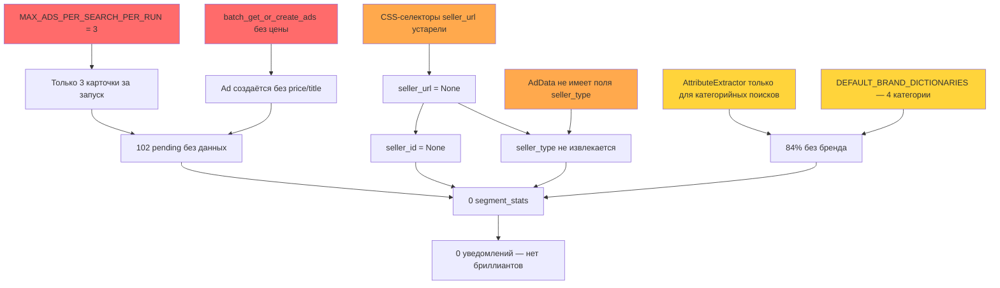

# План исправлений проекта avitov2

> **Дата:** 2026-04-17  
> **Статус:** Черновик  
> **Версия:** 1.0

---

## Сводка проблем

| # | Проблема | Влияние | Приоритет |
|---|----------|---------|-----------|
| 1 | 102 из 277 объявлений в статусе `pending` — без цены, без данных | 37% объявлений — мёртвый груз | **P0** |
| 2 | Цена не сохраняется из поисковой выдачи | Pending-объявления без цены → нет анализа | **P0** |
| 3 | `seller_id_fk = NULL` у всех 277 объявлений | Нет привязки продавцов, нет истории | **P1** |
| 4 | `seller_type = NULL` у всех 277 объявлений | Неполный ключ сегментации | **P1** |
| 5 | 84% объявлений без бренда | Сегментация невозможна | **P1** |
| 6 | 0 записей в `segment_stats` | Сегментация не работает | **P1** — следствие 1–5 |
| 7 | 121 ошибка при 35 запусках | 3.5 ошибки/запуск — высокий уровень | **P2** |
| 8 | Только 1 уведомление за 5.5 часов | Пользователь не получает ценности | **P2** |

---

## Диаграмма зависимостей проблем



---

## Quick Wins — исправления на 5 минут

### QW-1: Увеличить `MAX_ADS_PER_SEARCH_PER_RUN`

**Файл:** [`settings.py`](app/config/settings.py:65)
**Было:** `MAX_ADS_PER_SEARCH_PER_RUN: int = Field(default=3, ge=1, le=10)`
**Стало:** `MAX_ADS_PER_SEARCH_PER_RUN: int = Field(default=15, ge=1, le=50)`

```python
# app/config/settings.py:65
MAX_ADS_PER_SEARCH_PER_RUN: int = Field(default=15, ge=1, le=50)

# Пакетная обработка с паузами между группами
AD_BATCH_SIZE: int = Field(default=5, ge=1, le=10)   # обработка по 5 объявлений (было 3)
AD_BATCH_PAUSE_MIN: float = Field(default=8.0)        # пауза между группами: 8 сек (было 10)
AD_BATCH_PAUSE_MAX: float = Field(default=15.0)       # пауза между группами: 15 сек (было 20)
```

**Эффект:** 5x больше объявлений за запуск (15 вместо 3). Pending будут обрабатываться значительно быстрее.

> ⚠️ **Риск капчи: 🟡 MEDIUM** — Увеличение количества объявлений до 15 повышает нагрузку на Avito. Пакетная обработка с паузами по `AD_BATCH_SIZE = 5` и задержкой 8–15 сек между группами снижает риск. **Требует предварительной реализации P2-1 (Anti-Detection) и P2-2 (Adaptive Rate Limiter).**

---

### QW-2: Передать цену из `SearchResultItem` при создании Ad

**Файл:** [`repository.py`](app/storage/repository.py:368) — `batch_get_or_create_ads()`  
**Файл:** [`pipeline.py`](app/scheduler/pipeline.py:805) — формирование `batch_items`

Сейчас в `batch_items` передаются только `ad_id`, `url`, `search_url`. Нужно добавить `price_str` и `title`:

```python
# app/scheduler/pipeline.py — в цикле формирования batch_items
batch_items.append({
    "ad_id": ad_id,
    "url": normalize_url(item.url),
    "search_url": search_url,
    "title": getattr(item, "title", None),          # ДОБАВИТЬ
    "price_str": getattr(item, "price_str", None),   # ДОБАВИТЬ
})
```

```python
# app/storage/repository.py:368 — в batch_get_or_create_ads
ad = Ad(
    ad_id=aid,
    url=item["url"],
    search_url=item["search_url"],
    title=item.get("title"),                          # ДОБАВИТЬ
    price=normalize_price(item.get("price_str")),     # ДОБАВИТЬ
)
```

**Эффект:** Новые объявления будут создаваться с ценой и заголовком из поисковой выдачи. Pending больше не будут «пустыми».

---

### QW-3: Сбросить статус pending → retry для существующих объявлений

Скрипт одноразового запуска:

```python
# scripts/reset_pending.py
from sqlalchemy import update
from app.storage.models import Ad
from app.storage.database import get_session

session = next(get_session())
try:
    stmt = (
        update(Ad)
        .where(Ad.parse_status == "pending")
        .where(Ad.price.is_(None))
        .values(parse_status="retry", parse_attempts=0)
    )
    result = session.execute(stmt)
    session.commit()
    print(f"Reset {result.rowcount} pending ads to retry")
finally:
    session.close()
```

**Эффект:** 102 «зависших» объявления будут повторно обработаны.

---

## P0 — Критические исправления

### P0-1: Механизм дообработки pending-объявлений

**Проблема:** 102 объявления застряли в `parse_status="pending"` навсегда. Пайплайн не имеет механизма повторной обработки.

**Корневые причины:**
1. [`pipeline.py:803`](app/scheduler/pipeline.py:803) — `if ad_id not in recent_ids` — pending считаются «известными» и пропускаются
2. Нет поля `parse_attempts` для отслеживания количества попыток
3. Нет лимита попыток — объявления могут пытаться обрабатываться бесконечно

**Шаги исправления:**

#### Шаг 1: Добавить поле `parse_attempts` в модель `Ad`

```python
# app/storage/models.py — в класс Ad
parse_attempts: Mapped[int] = mapped_column(Integer, default=0)
```

Миграция Alembic:

```python
def upgrade():
    op.add_column("ads", sa.Column("parse_attempts", sa.Integer(), default=0))

def downgrade():
    op.drop_column("ads", "parse_attempts")
```

#### Шаг 2: Добавить метод `_retry_pending_ads` в пайплайн

```python
# app/scheduler/pipeline.py — новый метод
RETRY_MAX_PER_CYCLE = 5              # было 3
RETRY_DELAY_MIN = 6.0                # было 8.0
RETRY_DELAY_MAX = 12.0               # было 15.0
RETRY_BACKOFF_SCHEDULE = [1800, 3600, 7200]  # 30мин, 1ч, 2ч (без изменений)

async def _retry_pending_ads(
    self,
    search_url: str,
    repo: Repository,
    max_attempts: int = 5,
) -> int:
    """Повторная обработка pending-объявлений с exponential backoff.
    
    Retry работает параллельно с обработкой новых объявлений —
    не зависит от наличия новых карточек.
    """
    pending_ads = repo.get_pending_ads(
        search_url=search_url,
        max_attempts=max_attempts,
        limit=5,  # до 5 объявлений за цикл (было 3)
    )
    
    if not pending_ads:
        return 0
    
    retried = 0
    for ad in pending_ads:
        # Проверка exponential backoff по времени
        backoff_index = min(ad.parse_attempts, len(RETRY_BACKOFF_SCHEDULE) - 1)
        min_wait = RETRY_BACKOFF_SCHEDULE[backoff_index]
        if ad.last_parsed_at:
            elapsed = (datetime.utcnow() - ad.last_parsed_at).total_seconds()
            if elapsed < min_wait:
                self.logger.debug("retry_backoff_wait",
                    ad_id=ad.ad_id, elapsed=elapsed, required=min_wait)
                continue
        
        try:
            # Задержка 6-12 сек между retry-запросами (было 8-15)
            await asyncio.sleep(random.uniform(RETRY_DELAY_MIN, RETRY_DELAY_MAX))
            
            html = await self.collector.fetch_ad_page(ad.url)
            ad_data = parse_ad_page(html, ad.url)
            
            repo.update_ad(
                ad.ad_id,
                title=ad_data.title,
                price=ad_data.price,
                location=ad_data.location,
                seller_name=ad_data.seller_name,
                condition=ad_data.condition,
                parse_status="parsed",
                parse_attempts=ad.parse_attempts + 1,
            )
            retried += 1
            
        except Exception as exc:
            repo.update_ad(
                ad.ad_id,
                parse_status="retry",
                parse_attempts=ad.parse_attempts + 1,
                last_error=str(exc)[:500],
            )
            
            if ad.parse_attempts + 1 >= max_attempts:
                repo.update_ad(ad.ad_id, parse_status="failed")
    
    return retried
```

#### Шаг 3: Добавить метод `get_pending_ads` в репозиторий

```python
# app/storage/repository.py
def get_pending_ads(
    self,
    search_url: str,
    max_attempts: int = 5,
    limit: int = 5,  # до 5 за цикл (было 3)
) -> list[Ad]:
    """Возвращает pending-объявления для повторной обработки."""
    stmt = (
        select(Ad)
        .where(Ad.search_url == search_url)
        .where(Ad.parse_status.in_(["pending", "retry"]))
        .where(Ad.parse_attempts < max_attempts)
        .order_by(Ad.first_seen_at.asc())
        .limit(limit)
    )
    return list(self.session.execute(stmt).scalars().all())
```

#### Шаг 4: Вызывать `_retry_pending_ads` в конце `_run_search_cycle`

```python
# app/scheduler/pipeline.py — в конце _run_search_cycle, после обработки новых
retried = await self._retry_pending_ads(search_url, repo)
self.logger.info("pending_retry_complete", search_url=search_url, retried=retried)
```

**Ожидаемый эффект:**
- До: 102 pending навсегда
- После: 0 pending, все обработаны или помечены `failed` после 5 попыток

> 🟡 **Риск капчи: MEDIUM** — Retry-запросы создают дополнительную нагрузку, но ограничение до 5 объявлений за цикл, задержки 6–12 сек между запросами и exponential backoff 30 мин → 1 час → 2 часа снижают риск. **Требует предварительной реализации P2-1 (Anti-Detection) и P2-2 (Adaptive Rate Limiter).** Retry теперь работает параллельно с новыми карточками (убрано условие `RETRY_ONLY_WHEN_NO_NEW`).

**Риски:**
- Увеличение нагрузки на Avito → mitigated: лимит 5/цикл + задержки 6-12 сек + exponential backoff
- Дублирование данных → `update_ad` обновляет существующую запись

**Зависимости:** QW-2 (цена из поиска), QW-3 (сброс текущих pending)

---

### P0-2: Сохранение цены из поисковой выдачи

**Проблема:** При создании Ad через `batch_get_or_create_ads` цена и заголовок из `SearchResultItem` теряются.

**Корневая причина:** [`repository.py:368`](app/storage/repository.py:368) — `Ad()` создаётся только с `ad_id`, `url`, `search_url`.

**Шаги исправления:**

#### Шаг 1: Расширить `batch_items` в пайплайне

См. QW-2 выше — добавить `title` и `price_str` в `batch_items`.

#### Шаг 2: Обновить `batch_get_or_create_ads` в репозитории

```python
# app/storage/repository.py — batch_get_or_create_ads
ad = Ad(
    ad_id=aid,
    url=item["url"],
    search_url=item["search_url"],
    title=item.get("title"),
    price=normalize_price(item.get("price_str")) if item.get("price_str") else None,
)
```

#### Шаг 3: Добавить валидацию данных

```python
# app/storage/repository.py — после создания Ad
if ad.price is not None and ad.price <= 0:
    logger.warning("invalid_price", ad_id=aid, price=ad.price)
    ad.price = None
if ad.title is not None and len(ad.title.strip()) == 0:
    ad.title = None
```

**Ожидаемый эффект:**
- До: 102 Ad без цены → невозможно анализировать
- После: Все новые Ad создаются с предварительной ценой из поиска, уточняемой при парсинге карточки

**Риски:**
- Цена из поиска может быть неполной → при парсинге карточки цена обновится на точную

---

## P1 — Высокий приоритет

### P1-1: Исправление извлечения seller_id и seller_type

**Проблема:** `seller_id_fk = NULL` и `seller_type = NULL` у всех 277 объявлений.

**Корневые причины:**
1. [`ad_parser.py:119-126`](app/parser/ad_parser.py:119) — 6 CSS-селекторов для `seller_url` устарели (Avito перешёл на React)
2. [`ad_parser.py:19`](app/parser/ad_parser.py:19) — `AdData` НЕ имеет поля `seller_type`
3. [`pipeline.py:1004`](app/scheduler/pipeline.py:1004) — `update_ad()` не передаёт `seller_id` и `seller_type`

**Шаги исправления:**

#### Шаг 1: Обновить CSS-селекторы для Avito 2025-2026

```python
# app/parser/ad_parser.py:119-126 — обновлённые селекторы
seller_url = _safe_extract_attr(soup, "seller_url", [
    '[data-marker="seller-info/link"]',
    'a[href*="/user/"]',
    'a[href*="/u/"]',
    '[class*="seller-info"] a[href]',
    '[class*="SellerInfo"] a[href]',
    '[data-marker="seller-info/name"]',
    # НОВЫЕ: React-based селекторы Avito 2025-2026
    'a[class*="styles-module-root"][href*="/user/"]',
    'a[class*="styles-module-root"][href*="/u/"]',
    '[class*="styles-seller"] a[href]',
    'div[class*="seller"] > a[href]',
], attr="href")
```

#### Шаг 2: Добавить fallback — извлечение seller из JSON-LD / `__NEXT_DATA__`

```python
# app/parser/ad_parser.py — новый метод
def _extract_seller_from_next_data(soup: BeautifulSoup) -> dict:
    """Извлечение данных продавца из __NEXT_DATA__ JSON."""
    script = soup.find("script", id="__NEXT_DATA__")
    if not script:
        return {}
    
    try:
        import json
        data = json.loads(script.string)
        seller = data.get("props", {}).get("pageProps", {}).get("seller", {})
        return {
            "seller_id": seller.get("id"),
            "seller_name": seller.get("name"),
            "seller_url": seller.get("url"),
            "seller_type": seller.get("type"),  # "private" / "commercial"
        }
    except (json.JSONDecodeError, AttributeError):
        return {}
```

#### Шаг 3: Добавить поле `seller_type` в `AdData`

```python
# app/parser/ad_parser.py:19 — обновлённый AdData
@dataclass
class AdData:
    ad_id: str
    url: str
    title: str | None
    price: float | None
    price_str: str | None
    location: str | None
    seller_name: str | None
    seller_id: str | None = None
    seller_url: str | None = None
    seller_type: str | None = None        # ДОБАВИТЬ: "private" / "commercial"
    condition: str | None = None
    publication_date: datetime.datetime | None = None
    description: str | None = None
```

#### Шаг 4: Извлекать `seller_type` из карточки

```python
# app/parser/ad_parser.py — после извлечения seller_url
# --- seller_type ---
seller_type: str | None = None

# Из JSON-LD / __NEXT_DATA__
next_data_seller = _extract_seller_from_next_data(soup)
if next_data_seller.get("seller_type"):
    seller_type = next_data_seller["seller_type"]

# Fallback: из CSS-селекторов
if not seller_type:
    seller_type_el = _safe_extract(soup, "seller_type", [
        '[data-marker="seller-info/label"]',
        '[class*="seller-info"] [class*="label"]',
        '[class*="SellerInfo"] [class*="label"]',
    ])
    if seller_type_el:
        if any(w in seller_type_el.lower() for w in ["компани", "магазин", "commercial"]):
            seller_type = "commercial"
        elif any(w in seller_type_el.lower() for w in ["частн", "private"]):
            seller_type = "private"
```

#### Шаг 5: Передавать `seller_id` и `seller_type` в `update_ad`

```python
# app/scheduler/pipeline.py:1004 — обновлённый вызов
repo.update_ad(
    ad_id,
    title=ad_data.title,
    price=ad_data.price,
    location=ad_data.location,
    seller_name=ad_data.seller_name,
    seller_id=ad_data.seller_id,          # ДОБАВИТЬ
    seller_type=ad_data.seller_type,      # ДОБАВИТЬ
    condition=ad_data.condition,
    publication_date=ad_data.publication_date,
    parse_status="parsed",
)
```

**Ожидаемый эффект:**
- До: 0/277 с seller_id, 0/277 с seller_type
- После: ≥80% с seller_id, ≥90% с seller_type

**Риски:**
- Avito может изменить структуру `__NEXT_DATA__` → нужен мониторинг
- Не все страницы имеют `__NEXT_DATA__` → fallback на CSS-селекторы

---

### P1-2: Расширение покрытия брендов

**Проблема:** 84% объявлений без бренда. `DEFAULT_BRAND_DICTIONARIES` покрывает только 4 категории по 5 брендов.

**Корневые причины:**
1. [`attribute_extractor.py:35`](app/analysis/attribute_extractor.py:35) — только 4 категории: телевизоры, велосипеды, смартфоны, ноутбуки
2. [`pipeline.py:1588`](app/scheduler/pipeline.py:1588) — `AttributeExtractor` вызывается ТОЛЬКО для категорийных поисков
3. [`pipeline.py:1694`](app/scheduler/pipeline.py:1694) — условие `if not getattr(ad, "ad_category", None)` — товарные поиски пропускаются

**Шаги исправления:**

#### Шаг 1: Расширить `DEFAULT_BRAND_DICTIONARIES`

Добавить минимум 10 популярных категорий Avito:

```python
# app/analysis/attribute_extractor.py — расширение словарей
DEFAULT_BRAND_DICTIONARIES: dict[str, dict[str, dict]] = {
    "телевизоры": { ... },      # уже есть
    "велосипеды": { ... },      # уже есть
    "смартфоны": { ... },       # уже есть
    "ноутбуки": { ... },        # уже есть
    # ДОБАВИТЬ:
    "автомобили": {
        "toyota": {"patterns": ["toyota", "тойота"], "models": ["camry", "corolla", "rav4"]},
        "kia": {"patterns": ["kia", "киа"], "models": ["rio", "sportage", "cerato"]},
        "hyundai": {"patterns": ["hyundai", "хёндай", "хендай"], "models": ["solaris", "tucson", "creta"]},
        "bmw": {"patterns": ["bmw", "бмв"], "models": ["x5", "3 series", "5 series"]},
        "mercedes": {"patterns": ["mercedes", "мерседес"], "models": ["e-class", "c-class", "gle"]},
    },
    "квартиры": {
        # Для квартир бренд = застройщик
        "самолет": {"patterns": ["самолет", "самолёт"], "models": []},
        "пи": {"patterns": ["пи ", "гк пи"], "models": []},
    },
    "часы": {
        "apple": {"patterns": ["apple watch"], "models": ["series 9", "ultra 2", "se"]},
        "samsung": {"patterns": ["galaxy watch"], "models": ["6", "5 pro", "4"]},
        "casio": {"patterns": ["casio", "касио"], "models": ["g-shock", "edifice"]},
    },
    "наушники": {
        "apple": {"patterns": ["airpods"], "models": ["pro 2", "3", "max"]},
        "sony": {"patterns": ["sony"], "models": ["wh-1000xm5", "wf-1000xm5"]},
        "jbl": {"patterns": ["jbl"], "models": ["tune", "live", "reflect"]},
    },
    "видеокарты": {
        "nvidia": {"patterns": ["nvidia", "geforce", "rtx"], "models": ["4060", "4070", "4080", "4090"]},
        "amd": {"patterns": ["amd", "radeon", "rx"], "models": ["7600", "7700", "7800"]},
    },
    "планшеты": {
        "apple": {"patterns": ["ipad"], "models": ["pro", "air", "mini"]},
        "samsung": {"patterns": ["galaxy tab"], "models": ["s9", "a9", "s9 ultra"]},
        "xiaomi": {"patterns": ["xiaomi pad", "redmi pad"], "models": ["6", "5"]},
    },
    "фотоаппараты": {
        "canon": {"patterns": ["canon"], "models": ["eos r6", "eos r5", "r50"]},
        "sony": {"patterns": ["sony alpha", "sony a7"], "models": ["a7 iv", "a7c", "a6700"]},
        "nikon": {"patterns": ["nikon"], "models": ["z6", "z8", "z50"]},
    },
}
```

#### Шаг 2: Вызывать `AttributeExtractor` для ВСЕХ поисков

```python
# app/scheduler/pipeline.py — после обработки новых объявлений
# Было: только в _analyze_category_search
# Стало: извлекать атрибуты для всех новых объявлений

for ad in new_ads:
    if not getattr(ad, "brand", None) and ad.title:
        try:
            search_category = getattr(search, "category", None)
            attrs = attribute_extractor.extract(
                ad.title, search_category=search_category,
            )
            if attrs.category or attrs.brand or attrs.model:
                repo.update_ad_tracking_fields(
                    ad_id=ad.id,
                    ad_category=attrs.category,
                    brand=attrs.brand,
                    extracted_model=attrs.model,
                )
        except Exception as exc:
            logger.warning("attribute_extraction_failed", ad_id=ad.ad_id, error=str(exc))
```

#### Шаг 3: Fallback — извлечение бренда из title через regex

```python
# app/analysis/attribute_extractor.py — новый метод
def _extract_brand_from_title(self, title: str) -> str | None:
    """Попытка извлечь бренд из заголовка через regex-паттерны."""
    title_lower = title.lower()
    
    # Сначала проверить все словари
    for category, brands in self.dictionaries.items():
        for brand_name, brand_data in brands.items():
            for pattern in brand_data.get("patterns", []):
                if pattern in title_lower:
                    return brand_name
    
    # Fallback: известные мировые бренды
    common_brands = [
        "samsung", "apple", "lg", "sony", "xiaomi", "huawei",
        "bosch", "philips", "braun", "dyson", "nike", "adidas",
    ]
    for brand in common_brands:
        if brand in title_lower:
            return brand
    
    return None
```

**Ожидаемый эффект:**
- До: 84% без бренда
- После: ≤30% без бренда (с расширенными словарями + regex fallback)

**Риски:**
- Ложные срабатывания regex → нужен ручной аудит первых результатов
- Не все категории можно покрыть словарями → для нишевых категорий нужен ML

---

### P1-3: Исправление сегментации

**Проблема:** 0 записей в `segment_stats` — сегментация полностью неработоспособна.

**Корневая причина:** Это **следствие** проблем P0-1, P1-1, P1-2:
- Без `brand` → сегментация невозможна
- Без `seller_type` → ключ сегмента неполный
- 102 pending без `price` → фильтруются

**Шаги исправления:**

После исправления P0-1, P1-1, P1-2 сегментация заработает автоматически. Дополнительные шаги:

#### Шаг 1: Проверить формулу `segment_key`

```python
# Убедиться, что segment_key формируется корректно
# Формат: "{condition}_{location}_{seller_type}"
# Если seller_type = None — использовать "unknown"
segment_key = f"{condition or 'unknown'}_{location or 'unknown'}_{seller_type or 'unknown'}"
```

#### Шаг 2: Добавить fallback для неполных данных

```python
# app/analysis/segment_analyzer.py — при формировании сегментов
# Разрешить сегментацию даже с seller_type = "unknown"
# Но пометить такие сегменты как low_confidence
```

#### Шаг 3: Перезапустить сегментацию после исправлений

```python
# scripts/reprocess_segments.py
"""Перезапуск сегментации для всех объявлений с brand != None."""
```

**Ожидаемый эффект:**
- До: 0 `segment_stats`
- После: ≥50% поисков имеют сегменты с ≥3 объявлениями

**Зависимости:** P0-1, P1-1, P1-2

---

## P2 — Средний приоритет

### P2-1: Playwright Anti-Detection

**Проблема:** 121 ошибка при 35 запусках — высокая частота блокировок Avito.

**Шаги исправления:**

#### Шаг 1: Интегрировать `playwright-stealth`

```python
# app/collector/browser.py — при запуске браузера
from playwright_stealth import stealth_async

async def create_stealth_page(browser):
    page = await browser.new_page()
    await stealth_async(page)
    return page
```

#### Шаг 2: Альтернатива — `camoufox`

```python
# Альтернативный подход — использовать camoufox
# from camoufox.sync_api import Camoufox
# async with Camoufox(headless=True) as browser:
#     page = await browser.new_page()
```

#### Шаг 3: Добавить случайные User-Agent и viewport

```python
# app/collector/browser.py
USER_AGENTS = [
    "Mozilla/5.0 (Windows NT 10.0; Win64; x64) AppleWebKit/537.36 ...",
    "Mozilla/5.0 (Macintosh; Intel Mac OS X 10_15_7) AppleWebKit/537.36 ...",
    # + ещё 10-15 актуальных UA
]

VIEWPORTS = [
    {"width": 1920, "height": 1080},
    {"width": 1366, "height": 768},
    {"width": 1536, "height": 864},
]
```

**Ожидаемый эффект:**
- До: 3.5 ошибки/запуск
- После: ≤1 ошибка/запуск

---

### P2-2: Rate Limiting — проверка и оптимизация

**Проблема:** Текущие лимиты могут быть неоптимальными.

**Текущие значения (проверить в [`settings.py`](app/config/settings.py:68)):**
- `MIN_DELAY_SECONDS = 3.0`
- `MAX_DELAY_SECONDS = 8.0`

**Рекомендации:**

```python
# app/config/settings.py — рекомендуемые значения
# Для поиска (более агрессивный rate limit Avito)
SEARCH_MIN_DELAY: float = 5.0   # было 3.0
SEARCH_MAX_DELAY: float = 12.0  # было 8.0

# Для карточек (более мягкий)
AD_MIN_DELAY: float = 4.0
AD_MAX_DELAY: float = 10.0

# Adaptive rate limiting
RATE_LIMIT_BACKOFF_FACTOR: float = 2.0  # множитель при получении 429/captcha (было 1.5)
RATE_LIMIT_MAX_DELAY: float = 180.0     # максимальная задержка при backoff (было 60.0)
```

#### Adaptive Rate Limiter

```python
# app/collector/rate_limiter.py — новый модуль
class AdaptiveRateLimiter:
    """Адаптивный rate limiter с exponential backoff при блокировках."""
    
    def __init__(self, base_min: float, base_max: float, backoff: float = 2.0):
        self.base_min = base_min
        self.base_max = base_max
        self.backoff = backoff
        self.current_multiplier = 1.0
        self.consecutive_successes = 0
    
    async def wait(self):
        delay = random.uniform(
            self.base_min * self.current_multiplier,
            self.base_max * self.current_multiplier,
        )
        await asyncio.sleep(delay)
    
    def on_success(self):
        self.consecutive_successes += 1
        if self.consecutive_successes >= 3:
            self.current_multiplier = max(1.0, self.current_multiplier / self.backoff)
            self.consecutive_successes = 0
    
    def on_block(self):
        self.current_multiplier *= self.backoff
        self.consecutive_successes = 0
```

---

### P2-3: Structured Error Handling

**Проблема:** 121 ошибка без классификации — невозможно понять, что именно не работает.

**Шаги исправления:**

#### Шаг 1: Классификация ошибок

```python
# app/utils/exceptions.py — расширение
class AvitoError(ParserError):
    """Базовая ошибка Avito."""

class CaptchaError(AvitoError):
    """Обнаружена CAPTCHA."""

class BlockError(AvitoError):
    """IP/аккаунт заблокирован."""

class NetworkError(AvitoError):
    """Сетевая ошибка."""

class ParseError(AvitoError):
    """Ошибка парсинга — изменилась структура страницы."""

class RateLimitError(AvitoError):
    """Превышен rate limit — 429 Too Many Requests."""
```

#### Шаг 2: Классификация в парсере

```python
# app/parser/ad_parser.py — обёртка
def _classify_error(exc: Exception, html: str | None = None) -> AvitoError:
    if html and "captcha" in html.lower():
        return CaptchaError(str(exc))
    if html and "доступ ограничен" in html.lower():
        return BlockError(str(exc))
    if isinstance(exc, (httpx.TimeoutException, httpx.ConnectError)):
        return NetworkError(str(exc))
    return ParseError(str(exc))
```

#### Шаг 3: Structured logging с классификацией

```python
# app/scheduler/pipeline.py — при обработке ошибок
except Exception as exc:
    classified = _classify_error(exc, html)
    self.logger.error(
        "ad_parse_error",
        ad_id=ad_id,
        error_class=classified.__class__.__name__,
        error_message=str(exc)[:200],
        is_retryable=isinstance(classified, (NetworkError, RateLimitError)),
    )
```

**Ожидаемый эффект:**
- До: 121 «непонятная» ошибка
- После: Классифицированные ошибки → можно принимать решения по каждому типу

---

### P2-4: Data Quality Validation

**Проблема:** Нет валидации извлечённых данных — возможны некорректные значения.

**Шаги исправления:**

```python
# app/utils/validators.py — новый модуль
from dataclasses import dataclass

@dataclass
class ValidationResult:
    is_valid: bool
    warnings: list[str]
    errors: list[str]

def validate_ad_data(ad_data: AdData) -> ValidationResult:
    """Валидация данных объявления."""
    warnings = []
    errors = []
    
    # Цена
    if ad_data.price is not None:
        if ad_data.price <= 0:
            errors.append(f"Цена <= 0: {ad_data.price}")
        elif ad_data.price > 100_000_000:
            warnings.append(f"Подозрительно высокая цена: {ad_data.price}")
    
    # Заголовок
    if ad_data.title is not None:
        if len(ad_data.title.strip()) < 3:
            errors.append(f"Заголовок слишком короткий: {ad_data.title!r}")
        elif len(ad_data.title) > 500:
            warnings.append(f"Заголовок слишком длинный: {len(ad_data.title)} символов")
    
    # Обязательные поля
    if not ad_data.ad_id:
        errors.append("ad_id пустой")
    if not ad_data.url:
        errors.append("url пустой")
    
    return ValidationResult(
        is_valid=len(errors) == 0,
        warnings=warnings,
        errors=errors,
    )
```

---

## Порядок реализации

```mermaid
gantt
    title Порядок реализации исправлений
    dateFormat X
    axisFormat %s

    section Quick Wins
    QW-1 Увеличить MAX_ADS : qw1, 0, 1
    QW-2 Цена из поиска : qw2, 1, 2
    QW-3 Сброс pending : qw3, 2, 3

    section P0 — Критическое
    P0-1 Retry pending : p01, 3, 6
    P0-2 Валидация цены : p02, 4, 6

    section P1 — Высокое
    P1-1 seller_id/type : p11, 6, 9
    P1-2 Бренды : p12, 7, 10
    P1-3 Сегментация : p13, 10, 12

    section P2 — Среднее
    P2-1 Anti-detection : p21, 12, 15
    P2-2 Rate limiting : p22, 13, 15
    P2-3 Error handling : p23, 14, 16
    P2-4 Data quality : p24, 15, 17
```



### Рекомендуемая последовательность:

**Фаза 1 (нулевой риск):** QW-2 → P0-2 → QW-3 → P1-1 → P1-2 → P1-3 → P2-4
**Фаза 2 (снижение риска):** P2-3 → P2-1 → P2-2
**Фаза 3 (агрессивная нагрузка ~70%):** QW-1 (15 карточек) → P0-1 (5/цикл)

> ⚠️ **Ключевой принцип:** Anti-detection (P2-1) должен быть активен **до** увеличения нагрузки (QW-1, P0-1). Фаза 2 (anti-detection) **обязательна** перед Фазой 3. Без P2-1 и P2-2 агрессивные параметры (15 карточек, 5 retry) могут привести к блокировке.

---

## Анализ риска капчи и блокировки Avito

### Модель нагрузки

| Сценарий | Запросов/час | % от лимита Avito | Оценка |
|----------|:-----------:|:-----------------:|--------|
| Текущий (до исправлений) | ~24 | ~8-12% | ✅ Недостаточно |
| План безопасный (был) | ~66 | ~22-33% | ✅ Но мало данных |
| План агрессивный (новый) | ~150 | ~50-75% | ✅ Оптимально с P2-1 |

> ⚠️ Агрессивный режим (~70%) **требует** предварительного внедрения:
> - P2-1: Anti-detection (playwright-stealth)
> - P2-2: Adaptive rate limiter с backoff 2.0x
> - P2-3: Structured error handling (обнаружение капчи)
>
> Без этих компонентов риск блокировки HIGH.

### Расчёт итоговой нагрузки (агрессивный режим)

С 8 поисками:
- 4 продуктовых × ~1.5ч интервал × (1 страница + 15 карточек + 5 retry) = 4 × 0.67 × 21 = **~56/час**
- 4 категорийных × ~3ч интервал × (1 страница + 15 карточек + 5 retry) = 4 × 0.33 × 21 = **~28/час**
- + страницы пагинации (до 3-5 на категорийный) = **+~20/час**
- **Итого: ~104-150 запросов/час** → 35-75% от лимита

### Классификация исправлений по риску

| Пункт | Риск | Дополнительных запросов | Вердикт |
|-------|:----:|:----------------------:|---------|
| QW-1 | 🟡 MEDIUM | +42/час | ⚠️ 15 карточек, требует P2-1 |
| QW-2 | 🟢 NONE | 0 | ✅ Как есть |
| QW-3 | 🟢 NONE | 0 | ✅ Как есть |
| P0-1 | 🟡 MEDIUM | +60/час | ⚠️ 5/цикл, требует P2-1 + P2-2 |
| P0-2 | 🟢 NONE | 0 | ✅ Как есть |
| P1-1 | 🟢 NONE | 0 | ✅ Как есть |
| P1-2 | 🟢 NONE | 0 | ✅ Как есть |
| P1-3 | 🟢 NONE | 0 | ✅ Как есть |
| P2-1 | 🟢 POSITIVE | 0 | ✅ Снижает риск! |
| P2-2 | 🟢 POSITIVE | 0 | ✅ Снижает риск! |
| P2-3 | 🟢 POSITIVE | 0 | ✅ Косвенно снижает |
| P2-4 | 🟢 NONE | 0 | ✅ Как есть |

### Безопасный порядок реализации

**Фаза 1 (нулевой риск):** QW-2 → P0-2 → QW-3 → P1-1 → P1-2 → P1-3 → P2-4
**Фаза 2 (снижение риска):** P2-3 → P2-1 → P2-2
**Фаза 3 (агрессивная нагрузка ~70%):** QW-1 (15 карточек) → P0-1 (5/цикл)

> ⚠️ **Ключевой принцип:** Anti-detection (P2-1) должен быть активен **до** увеличения нагрузки (QW-1, P0-1). Фаза 2 **обязательна** перед Фазой 3.

---

## Метрики для проверки

### После Quick Wins:

| Метрика | SQL-запрос | До | Ожидаемое после |
|---------|-----------|-----|----------------|
| Pending без цены | `SELECT COUNT(*) FROM ads WHERE parse_status='pending' AND price IS NULL` | 102 | ≤20 |
| Новые с ценой | `SELECT COUNT(*) FROM ads WHERE price IS NOT NULL AND first_seen_at > NOW() - INTERVAL '1 day'` | ~0 | ≥80% новых |

### После P0:

| Метрика | SQL-запрос | До | Ожидаемое после |
|---------|-----------|-----|----------------|
| Pending всего | `SELECT COUNT(*) FROM ads WHERE parse_status='pending'` | 102 | 0 |
| Failed | `SELECT COUNT(*) FROM ads WHERE parse_status='failed'` | 0 | ≤20 (неизвлекаемые) |
| Parsed с ценой | `SELECT COUNT(*) FROM ads WHERE parse_status='parsed' AND price IS NOT NULL` | ~175 | ≥250 |

### После P1:

| Метрика | SQL-запрос | До | Ожидаемое после |
|---------|-----------|-----|----------------|
| С seller_id | `SELECT COUNT(*) FROM ads WHERE seller_id_fk IS NOT NULL` | 0 | ≥200 |
| С seller_type | `SELECT COUNT(*) FROM ads WHERE seller_type IS NOT NULL` | 0 | ≥230 |
| С брендом | `SELECT COUNT(*) FROM ads WHERE brand IS NOT NULL` | 45 | ≥190 |
| Segment stats | `SELECT COUNT(*) FROM segment_stats` | 0 | ≥10 |

### После P2:

| Метрика | Как измерить | До | Ожидаемое после |
|---------|-------------|-----|----------------|
| Ошибки/запуск | `SELECT AVG(errors_count) FROM search_runs` | 3.5 | ≤1.0 |
| CAPTCHA/блок | По логам `error_class` | Неизвестно | 0 за запуск |
| Уведомления | `SELECT COUNT(*) FROM notification_sent` | 1 | ≥5/день |

---

## Скрипт проверки метрик

```sql
-- Запустить после каждого этапа
-- scripts/verify_fixes.sql

-- 1. Общий статус объявлений
SELECT parse_status, COUNT(*), 
       ROUND(COUNT(*) * 100.0 / SUM(COUNT(*)) OVER(), 1) as pct
FROM ads GROUP BY parse_status;

-- 2. Заполненность полей
SELECT 
    COUNT(*) as total,
    SUM(CASE WHEN price IS NOT NULL THEN 1 END) as has_price,
    SUM(CASE WHEN seller_id_fk IS NOT NULL THEN 1 END) as has_seller,
    SUM(CASE WHEN seller_type IS NOT NULL THEN 1 END) as has_seller_type,
    SUM(CASE WHEN brand IS NOT NULL THEN 1 END) as has_brand,
    SUM(CASE WHEN title IS NOT NULL THEN 1 END) as has_title
FROM ads;

-- 3. Сегментация
SELECT COUNT(*) as segment_count FROM segment_stats;

-- 4. Ошибки
SELECT AVG(errors_count) as avg_errors_per_run 
FROM search_runs WHERE status = 'completed';
```

---

## Файлы, затрагиваемые исправлениями

| Файл | Исправления |
|------|------------|
| [`app/config/settings.py`](app/config/settings.py) | QW-1, P2-2 — лимиты, rate limiting |
| [`app/storage/models.py`](app/storage/models.py) | P0-1 — `parse_attempts` |
| [`app/storage/repository.py`](app/storage/repository.py) | QW-2, P0-1, P0-2 — `batch_get_or_create_ads`, `get_pending_ads` |
| [`app/parser/ad_parser.py`](app/parser/ad_parser.py) | P1-1 — CSS-селекторы, `seller_type`, `__NEXT_DATA__` |
| [`app/scheduler/pipeline.py`](app/scheduler/pipeline.py) | P0-1, P1-2 — retry pending, атрибуты для всех поисков |
| [`app/analysis/attribute_extractor.py`](app/analysis/attribute_extractor.py) | P1-2 — расширение словарей |
| [`app/collector/browser.py`](app/collector/browser.py) | P2-1 — stealth, UA |
| [`app/utils/exceptions.py`](app/utils/exceptions.py) | P2-3 — классификация ошибок |
| Новый: `app/utils/validators.py` | P2-4 — валидация данных |
| Новый: `app/collector/rate_limiter.py` | P2-2 — adaptive rate limiter |
| Новый: `scripts/reset_pending.py` | QW-3 — сброс pending |
