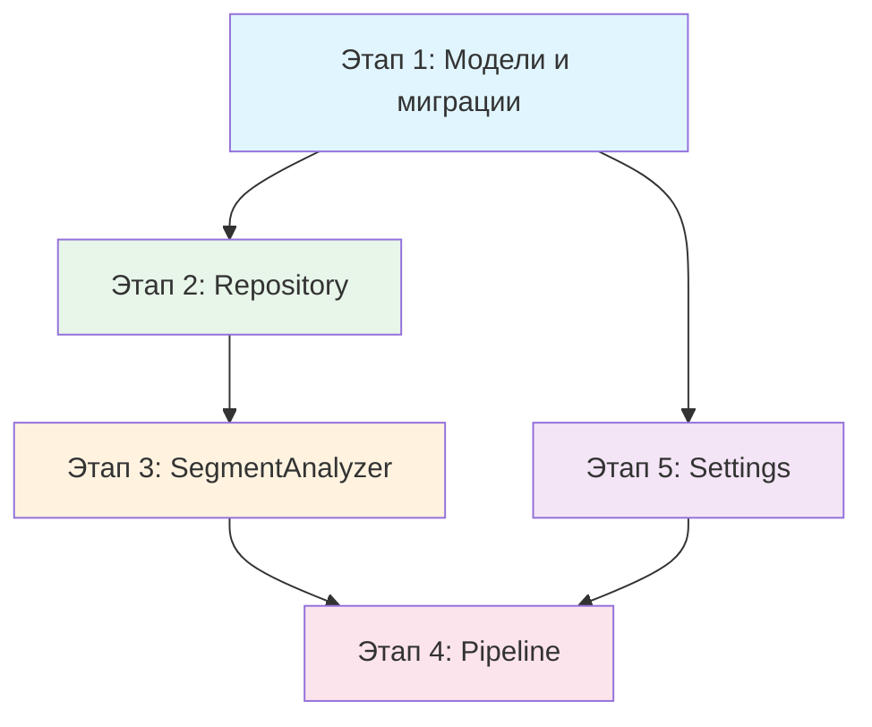
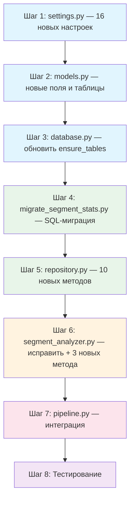

# Детальный план реализации улучшений системы ценообразования и анализа сегментов

> **Версия:** 1.0
> **Дата:** 2026-04-14
> **Статус:** На согласовании

---

## Содержание

1. [Анализ текущего состояния](#1-анализ-текущего-состояния)
2. [Общая архитектура изменений](#2-общая-архитектура-изменений)
3. [Этап 1: Модели данных и миграции](#3-этап-1-модели-данных-и-миграции)
4. [Этап 2: Репозиторий — новые методы](#4-этап-2-репозиторий--новые-методы)
5. [Этап 3: Анализатор сегментов — новые функции](#5-этап-3-анализатор-сегментов--новые-функции)
6. [Этап 4: Пайплайн — интеграция](#6-этап-4-пайплайн--интеграция)
7. [Этап 5: Настройки конфигурации](#7-этап-5-настройки-конфигурации)
8. [Порядок реализации и зависимости](#8-порядок-реализации-и-зависимости)

---

## 1. Анализ текущего состояния

### 1.1 Что уже реализовано

| Компонент | Файл | Статус |
|-----------|------|--------|
| [`TrackedSearch`](app/storage/models.py:31) | `models.py` | ✅ Существует, нужны поля `search_type`, `category` |
| [`Ad`](app/storage/models.py:146) | `models.py` | ✅ Существует, нужны поля `category`, `brand`, `extracted_model`, `last_seen_at`, `days_on_market`, `is_disappeared` |
| [`AdSnapshot`](app/storage/models.py:234) | `models.py` | ✅ Полностью готов |
| [`NotificationSent`](app/storage/models.py:274) | `models.py` | ✅ Полностью готов |
| [`SegmentStats`](app/storage/models.py) | `models.py` | ❌ **НЕ существует** — только импортируется в [`segment_analyzer.py:22`](app/analysis/segment_analyzer.py:22) |
| [`SegmentPriceHistory`](app/storage/models.py) | `models.py` | ❌ **НЕ существует** — только импортируется в [`segment_analyzer.py:22`](app/analysis/segment_analyzer.py:22) |
| [`SegmentAnalyzer`](app/analysis/segment_analyzer.py:104) | `segment_analyzer.py` | ⚠️ Существует, но сломан из-за отсутствия моделей в БД |
| [`CategorySegmentKey`](app/analysis/segment_analyzer.py:33) | `segment_analyzer.py` | ✅ Готов |
| [`DiamondAlert`](app/analysis/segment_analyzer.py:79) | `segment_analyzer.py` | ⚠️ Зависит от `SegmentStats` |
| [`PriceAnalyzer`](app/analysis/analyzer.py:149) | `analyzer.py` | ✅ Полностью функционален |
| [`Repository`](app/storage/repository.py:25) | `repository.py` | ⚠️ Нет методов для `SegmentStats`, `SegmentPriceHistory`, оборачиваемости |
| [`Pipeline`](app/scheduler/pipeline.py:23) | `pipeline.py` | ⚠️ Нет интеграции с `SegmentAnalyzer` |

### 1.2 Ключевая проблема

[`segment_analyzer.py`](app/analysis/segment_analyzer.py) импортирует `SegmentStats` и `SegmentPriceHistory` из [`models.py`](app/storage/models.py:22), но эти модели **не определены** в файле моделей. Это означает, что категорийный мониторинг спроектирован, но не реализован на уровне БД.

---

## 2. Общая архитектура изменений

### 2.1 Диаграмма зависимостей между этапами



### 2.2 Поток данных после изменений

```mermaid
flowchart LR
    A[Сбор выдачи] --> B[Парсинг карточек]
    B --> C[Извлечение атрибутов]
    C --> D[Сохранение в БД]
    D --> E[Обновление last_seen_at]
    E --> F[Проверка исчезнувших]
    F --> G[Сегментация]
    G --> H[Расчёт статистики + временные окна]
    H --> I[Snapshot в segment_price_history]
    I --> J[Детекция бриллиантов]
    J --> K[Уведомления]
```



---

## 3. Этап 1: Модели данных и миграции

### 3.1 Изменения в [`models.py`](app/storage/models.py)

#### 3.1.1 Новые поля в [`TrackedSearch`](app/storage/models.py:31)

```python
# Добавить после строки 65 (max_ads_to_parse):
search_type: Mapped[str] = mapped_column(
    String(20), default="model", nullable=False,
)
category: Mapped[str | None] = mapped_column(
    String(128), nullable=True,
)
```

#### 3.1.2 Новые поля в [`Ad`](app/storage/models.py:146)

```python
# Добавить после строки 207 (last_error):

# --- Атрибуты категорийного мониторинга ---
category: Mapped[str | None] = mapped_column(
    String(128), nullable=True,
)
brand: Mapped[str | None] = mapped_column(
    String(128), nullable=True,
)
extracted_model: Mapped[str | None] = mapped_column(
    String(256), nullable=True,
)
attributes_raw: Mapped[str | None] = mapped_column(
    Text, nullable=True,
)

# --- Оборачиваемость ---
last_seen_at: Mapped[datetime.datetime | None] = mapped_column(
    DateTime, nullable=True,
)
days_on_market: Mapped[int | None] = mapped_column(
    Integer, nullable=True,
)
is_disappeared: Mapped[bool] = mapped_column(
    Boolean, default=False,
)
```

#### 3.1.3 Новая модель `SegmentStats`

Добавить **после** класса [`AdSnapshot`](app/storage/models.py:234) (строка 267):

```python
class SegmentStats(Base):
    """Предрасчитанная статистика по сегменту с временными окнами."""

    __tablename__ = "segment_stats"
    __table_args__ = (
        UniqueConstraint("segment_key", name="uq_segment_stats_key"),
    )

    id: Mapped[int] = mapped_column(Integer, primary_key=True, autoincrement=True)
    segment_key: Mapped[str] = mapped_column(String(512), nullable=False)
    category: Mapped[str] = mapped_column(String(128), nullable=False)
    brand: Mapped[str] = mapped_column(String(128), default="unknown")
    model: Mapped[str] = mapped_column(String(256), default="unknown")
    condition: Mapped[str] = mapped_column(String(128), default="unknown")
    location: Mapped[str] = mapped_column(String(256), default="unknown")

    # === Текущая статистика активных объявлений ===
    ad_count: Mapped[int] = mapped_column(Integer, default=0)
    median_price: Mapped[float | None] = mapped_column(Float, nullable=True)
    mean_price: Mapped[float | None] = mapped_column(Float, nullable=True)
    q1_price: Mapped[float | None] = mapped_column(Float, nullable=True)
    q3_price: Mapped[float | None] = mapped_column(Float, nullable=True)
    iqr: Mapped[float | None] = mapped_column(Float, nullable=True)
    std_dev: Mapped[float] = mapped_column(Float, default=0.0)
    min_price: Mapped[float | None] = mapped_column(Float, nullable=True)
    max_price: Mapped[float | None] = mapped_column(Float, nullable=True)
    lower_fence: Mapped[float | None] = mapped_column(Float, nullable=True)

    # === Временные окна медианы ===
    median_7d: Mapped[float | None] = mapped_column(Float, nullable=True)
    median_30d: Mapped[float | None] = mapped_column(Float, nullable=True)
    median_90d: Mapped[float | None] = mapped_column(Float, nullable=True)
    price_trend_slope: Mapped[float | None] = mapped_column(Float, nullable=True)
    price_trend_r2: Mapped[float | None] = mapped_column(Float, nullable=True)

    # === Метрики ликвидности / оборачиваемости ===
    appearance_count_90d: Mapped[int] = mapped_column(Integer, default=0)
    median_days_on_market: Mapped[float | None] = mapped_column(Float, nullable=True)
    fast_sale_price_median: Mapped[float | None] = mapped_column(Float, nullable=True)
    listing_price_median: Mapped[float | None] = mapped_column(Float, nullable=True)

    # === Supply tracking ===
    ad_count_7d_ago: Mapped[int | None] = mapped_column(Integer, nullable=True)
    ad_count_30d_ago: Mapped[int | None] = mapped_column(Integer, nullable=True)
    supply_change_percent_30d: Mapped[float | None] = mapped_column(Float, nullable=True)

    calculated_at: Mapped[datetime.datetime] = mapped_column(
        DateTime, default=_utcnow,
    )
```

#### 3.1.4 Новая модель `SegmentPriceHistory`

Добавить **после** `SegmentStats`:

```python
class SegmentPriceHistory(Base):
    """История цен по сегментам — ежедневные snapshots."""

    __tablename__ = "segment_price_history"
    __table_args__ = (
        UniqueConstraint("segment_key", "date", name="uq_segment_history_key_date"),
    )

    id: Mapped[int] = mapped_column(Integer, primary_key=True, autoincrement=True)
    segment_key: Mapped[str] = mapped_column(String(512), nullable=False)
    date: Mapped[datetime.date] = mapped_column(
        DateTime, nullable=False,
    )
    median_price: Mapped[float | None] = mapped_column(Float, nullable=True)
    mean_price: Mapped[float | None] = mapped_column(Float, nullable=True)
    ad_count: Mapped[int] = mapped_column(Integer, default=0)
    new_listings_count: Mapped[int] = mapped_column(Integer, default=0)
    disappeared_count: Mapped[int] = mapped_column(Integer, default=0)
    median_days_on_market: Mapped[float | None] = mapped_column(Float, nullable=True)
```

#### 3.1.5 Обновить [`ensure_tables()`](app/storage/database.py:47)

В файле [`database.py`](app/storage/database.py:49) добавить импорт новых моделей:

```python
from app.storage.models import (
    Ad, AdSnapshot, NotificationSent, SearchRun, TrackedSearch,
    SegmentStats, SegmentPriceHistory,  # Добавить
)
```

### 3.2 SQL-миграция

Создать файл `scripts/migrate_segment_stats.py`:

```sql
-- ============================================================
-- Миграция: Расширенная статистика сегментов и оборачиваемость
-- ============================================================

-- 1. Новые поля в tracked_searches
ALTER TABLE tracked_searches
    ADD COLUMN IF NOT EXISTS search_type VARCHAR(20) DEFAULT 'model',
    ADD COLUMN IF NOT EXISTS category VARCHAR(128) DEFAULT NULL;

-- 2. Новые поля в ads — атрибуты категорийного мониторинга
ALTER TABLE ads
    ADD COLUMN IF NOT EXISTS category VARCHAR(128) DEFAULT NULL,
    ADD COLUMN IF NOT EXISTS brand VARCHAR(128) DEFAULT NULL,
    ADD COLUMN IF NOT EXISTS extracted_model VARCHAR(256) DEFAULT NULL,
    ADD COLUMN IF NOT EXISTS attributes_raw TEXT DEFAULT NULL;

-- 3. Новые поля в ads — оборачиваемость
ALTER TABLE ads
    ADD COLUMN IF NOT EXISTS last_seen_at TIMESTAMP DEFAULT NULL,
    ADD COLUMN IF NOT EXISTS days_on_market INTEGER DEFAULT NULL,
    ADD COLUMN IF NOT EXISTS is_disappeared BOOLEAN DEFAULT FALSE;

-- 4. Индексы для новых полей ads
CREATE INDEX IF NOT EXISTS idx_ads_category ON ads(category);
CREATE INDEX IF NOT EXISTS idx_ads_brand ON ads(brand);
CREATE INDEX IF NOT EXISTS idx_ads_category_brand_model
    ON ads(category, brand, extracted_model);
CREATE INDEX IF NOT EXISTS idx_ads_is_disappeared
    ON ads(is_disappeared) WHERE is_disappeared = FALSE;
CREATE INDEX IF NOT EXISTS idx_ads_last_seen_at ON ads(last_seen_at);
CREATE INDEX IF NOT EXISTS idx_tracked_searches_search_type
    ON tracked_searches(search_type);

-- 5. Новая таблица: segment_stats
CREATE TABLE IF NOT EXISTS segment_stats (
    id SERIAL PRIMARY KEY,
    segment_key VARCHAR(512) NOT NULL,
    category VARCHAR(128) NOT NULL,
    brand VARCHAR(128) NOT NULL DEFAULT 'unknown',
    model VARCHAR(256) NOT NULL DEFAULT 'unknown',
    condition VARCHAR(128) NOT NULL DEFAULT 'unknown',
    location VARCHAR(256) NOT NULL DEFAULT 'unknown',

    ad_count INTEGER NOT NULL DEFAULT 0,
    median_price FLOAT,
    mean_price FLOAT,
    q1_price FLOAT,
    q3_price FLOAT,
    iqr FLOAT,
    std_dev FLOAT DEFAULT 0.0,
    min_price FLOAT,
    max_price FLOAT,
    lower_fence FLOAT,

    median_7d FLOAT DEFAULT NULL,
    median_30d FLOAT DEFAULT NULL,
    median_90d FLOAT DEFAULT NULL,
    price_trend_slope FLOAT DEFAULT NULL,
    price_trend_r2 FLOAT DEFAULT NULL,

    appearance_count_90d INTEGER DEFAULT 0,
    median_days_on_market FLOAT DEFAULT NULL,
    fast_sale_price_median FLOAT DEFAULT NULL,
    listing_price_median FLOAT DEFAULT NULL,

    ad_count_7d_ago INTEGER DEFAULT NULL,
    ad_count_30d_ago INTEGER DEFAULT NULL,
    supply_change_percent_30d FLOAT DEFAULT NULL,

    calculated_at TIMESTAMP NOT NULL DEFAULT NOW()
);

CREATE UNIQUE INDEX IF NOT EXISTS idx_segment_stats_key
    ON segment_stats(segment_key);
CREATE INDEX IF NOT EXISTS idx_segment_stats_category
    ON segment_stats(category);
CREATE INDEX IF NOT EXISTS idx_segment_stats_calculated
    ON segment_stats(calculated_at);

-- 6. Новая таблица: segment_price_history
CREATE TABLE IF NOT EXISTS segment_price_history (
    id SERIAL PRIMARY KEY,
    segment_key VARCHAR(512) NOT NULL,
    date DATE NOT NULL,
    median_price FLOAT,
    mean_price FLOAT,
    ad_count INTEGER NOT NULL DEFAULT 0,
    new_listings_count INTEGER DEFAULT 0,
    disappeared_count INTEGER DEFAULT 0,
    median_days_on_market FLOAT DEFAULT NULL
);

CREATE UNIQUE INDEX IF NOT EXISTS idx_segment_price_history_key_date
    ON segment_price_history(segment_key, date);
```

---

## 4. Этап 2: Репозиторий — новые методы

### 4.1 Новые методы в [`Repository`](app/storage/repository.py:25)

Добавить в класс [`Repository`](app/storage/repository.py:25) **перед** секцией "Common" (строка 821):

#### 4.1.1 `upsert_segment_stats()`

```python
def upsert_segment_stats(self, stats: SegmentStats) -> SegmentStats:
    """Создать или обновить статистику сегмента.

    Ищет существующую запись по segment_key.
    Если найдена — обновляет все поля.
    Если нет — создаёт новую.

    Args:
        stats: Объект SegmentStats (не привязанный к сессии).

    Returns:
        SegmentStats: Привязанный к сессии объект.
    """
```

**Логика:**
1. `SELECT` по `segment_key`
2. Если найден — `setattr` для всех полей
3. Если нет — `session.add(new)`
4. `flush()`

#### 4.1.2 `get_segment_stats()`

```python
def get_segment_stats(self, segment_key: str) -> SegmentStats | None:
    """Получить статистику сегмента по ключу.

    Args:
        segment_key: Ключ сегмента.

    Returns:
        SegmentStats | None: Статистика или None.
    """
```

#### 4.1.3 `get_all_segment_stats()`

```python
def get_all_segment_stats(
    self, category: str | None = None, max_age_hours: int = 24,
) -> list[SegmentStats]:
    """Получить всю актуальную статистику сегментов.

    Args:
        category: Фильтр по категории (опционально).
        max_age_hours: Максимальный возраст записи в часах.

    Returns:
        list[SegmentStats]: Список статистик.
    """
```

#### 4.1.4 `get_price_history()`

```python
def get_price_history(
    self, segment_key: str, days: int = 90,
) -> list[SegmentPriceHistory]:
    """Получить историю цен сегмента за N дней.

    Args:
        segment_key: Ключ сегмента.
        days: Количество дней истории.

    Returns:
        list[SegmentPriceHistory]: Записи истории, отсортированные по date.
    """
```

#### 4.1.5 `save_price_history_snapshot()`

```python
def save_price_history_snapshot(
    self,
    segment_key: str,
    date: datetime.date,
    median_price: float | None,
    mean_price: float | None,
    ad_count: int,
    new_listings_count: int = 0,
    disappeared_count: int = 0,
    median_days_on_market: float | None = None,
) -> SegmentPriceHistory:
    """Сохранить ежедневный snapshot истории цен сегмента.

    Использует UPSERT по (segment_key, date).
    """
```

#### 4.1.6 `mark_ad_last_seen()`

```python
def mark_ad_last_seen(self, ad_id: str) -> None:
    """Обновить last_seen_at для объявления.

    Вызывается при каждом обнаружении объявления в выдаче.

    Args:
        ad_id: Идентификатор объявления Avito.
    """
```

#### 4.1.7 `mark_ads_disappeared()`

```python
def mark_ads_disappeared(
    self, search_url: str, active_ad_ids: set[str],
) -> int:
    """Отметить исчезнувшие объявления.

    Для всех объявлений search_url, чьи ad_id НЕ в active_ad_ids
    и у которых is_disappeared = False:
    - Установить is_disappeared = True
    - Рассчитать days_on_market = (now - first_seen_at).days
    - Установить last_seen_at = now, если ещё не установлен

    Args:
        search_url: URL поисковой выдачи.
        active_ad_ids: Множество ad_id, найденных в текущей выдаче.

    Returns:
        int: Количество отмеченных объявлений.
    """
```

#### 4.1.8 `get_disappeared_ads_for_segment()`

```python
def get_disappeared_ads_for_segment(
    self, segment_key: str, days: int = 90,
) -> list[Ad]:
    """Получить исчезнувшие объявления для расчёта ликвидности.

    Args:
        segment_key: Ключ сегмента.
        days: За сколько последних дней.

    Returns:
        list[Ad]: Исчезнувшие объявления с is_disappeared=True.
    """
```

#### 4.1.9 `get_active_ads_for_segment()`

```python
def get_active_ads_for_segment(
    self, segment_key: str,
) -> list[Ad]:
    """Получить активные (не исчезнувшие) объявления сегмента.

    Args:
        segment_key: Ключ сегмента.

    Returns:
        list[Ad]: Активные объявления.
    """
```

#### 4.1.10 `count_new_listings_for_segment()`

```python
def count_new_listings_for_segment(
    self, segment_key: str, since: datetime.datetime,
) -> int:
    """Посчитать новые объявления в сегменте с указанной даты.

    Args:
        segment_key: Ключ сегмента.
        since: Начальная дата.

    Returns:
        int: Количество новых объявлений.
    """
```

### 4.2 Обновить импорты в [`repository.py`](app/storage/repository.py:14)

```python
from app.storage.models import (
    Ad,
    AdSnapshot,
    NotificationSent,
    SearchRun,
    TrackedSearch,
    SegmentStats,          # Добавить
    SegmentPriceHistory,   # Добавить
)
```

---

## 5. Этап 3: Анализатор сегментов — новые функции

### 5.1 Исправить импорты в [`segment_analyzer.py`](app/analysis/segment_analyzer.py:22)

Файл уже импортирует `SegmentStats` и `SegmentPriceHistory` — после создания моделей в `models.py` импорт будет работать.

### 5.2 Новые методы в [`SegmentAnalyzer`](app/analysis/segment_analyzer.py:104)

#### 5.2.1 `calculate_liquidity_metrics()` — НОВЫЙ

```python
def calculate_liquidity_metrics(
    self,
    segment_key: str,
    segment_ads: list[Ad],
    repo: Any,
) -> dict:
    """Рассчитать метрики ликвидности для сегмента.

    Returns:
        dict: {
            'appearance_count_90d': int,
            'median_days_on_market': float | None,
            'fast_sale_price_median': float | None,
            'listing_price_median': float | None,
        }
    """
```

**Логика:**
1. `appearance_count_90d` = `repo.count_new_listings_for_segment(segment_key, now - 90d)`
2. Получить `disappeared = repo.get_disappeared_ads_for_segment(segment_key, days=90)`
3. `median_days_on_market` = медиана `[ad.days_on_market for ad in disappeared if ad.days_on_market]`
4. `fast_sale_price_median` = медиана цен из `disappeared`, где `days_on_market <= CATEGORY_FAST_SALE_DAYS` (7 дней)
5. `listing_price_median` = медиана цен из `segment_ads` (текущие активные)

#### 5.2.2 `save_segment_snapshot()` — НОВЫЙ

```python
def save_segment_snapshot(
    self,
    segment_key: str,
    stats: SegmentStats,
    repo: Any,
) -> None:
    """Сохранить ежедневный snapshot в segment_price_history.

    Проверяет, есть ли уже запись на сегодня.
    Если нет — создаёт. Если да — обновляет.
    """
```

#### 5.2.3 `calculate_rare_segment_stats()` — НОВЫЙ

```python
def calculate_rare_segment_stats(
    self,
    segment_key: CategorySegmentKey,
    current_ads: list[Ad],
    repo: Any,
) -> SegmentStats:
    """Рассчитать статистику для редкого сегмента.

    Если sample_size < N, не делать жёсткий вывод по медиане текущей выдачи.
    Использует:
    1. Иерархию сегментов (parent fallback)
    2. Историю (median_30d, median_90d)
    3. Частоту появления (appearance_count_90d)
    4. Цены быстрых продаж (fast_sale_price_median)

    Returns:
        SegmentStats с заполненными полями для редкого сегмента.
    """
```

**Алгоритм:**
1. Попытаться получить `SegmentStats` для текущего ключа из БД
2. Если `ad_count < CATEGORY_RARE_SEGMENT_THRESHOLD`:
   - Попробовать parent-сегмент (убрать location → condition → model)
   - Использовать `median_90d` как основную метрику
   - Использовать `fast_sale_price_median` как вторичную
3. Заполнить `listing_price_median` = медиана текущих активных
4. Заполнить `liquid_market_estimate` = взвешенное среднее исторических данных

#### 5.2.4 Обновить `calculate_segment_stats()`

В существующем методе [`calculate_segment_stats()`](app/analysis/segment_analyzer.py:232) добавить вызов расчёта ликвидности:

```python
# После расчёта temporal_windows (строка ~298):
if repo is not None:
    # Существующий код: temporal windows
    temporal = self._calculate_temporal_windows(...)
    for attr, val in temporal.items():
        if hasattr(stats, attr):
            setattr(stats, attr, val)

    # НОВЫЙ КОД: метрики ликвидности
    liquidity = self.calculate_liquidity_metrics(
        segment_key.to_string(), segment_ads, repo,
    )
    for attr, val in liquidity.items():
        if hasattr(stats, attr):
            setattr(stats, attr, val)
```

#### 5.2.5 Обновить `get_best_median()` — добавить правило роста рынка

В существующем методе [`get_best_median()`](app/analysis/segment_analyzer.py:321) добавить логику:

```python
@staticmethod
def get_best_median(stats: SegmentStats) -> float:
    """Выбрать лучшую медиану для сравнения.

    Правило: если median_7d > median_30d, рынок растёт —
    сравнивать с более свежей базой (median_7d).
    """
    # Если рынок растёт — используем более свежую медиану
    if (stats.median_7d is not None and stats.median_7d > 0
            and stats.median_30d is not None and stats.median_30d > 0):
        if stats.median_7d > stats.median_30d:
            return stats.median_7d  # Рынок растёт

    # Стандартный приоритет
    if stats.median_30d is not None and stats.median_30d > 0:
        return stats.median_30d
    if stats.median_7d is not None and stats.median_7d > 0:
        return stats.median_7d
    return stats.median_price or 0.0
```

### 5.3 Двухуровневая цена

Реализация через поля в `SegmentStats`:

| Уровень | Поле | Описание |
|---------|------|----------|
| Listing | `listing_price_median` | Медиана по активным объявлениям (не исчезнувшим) |
| Liquid | `fast_sale_price_median` | Медиана по объявлениям, которые быстро исчезли (<= 7 дней на рынке) |

**Логика выбора референтной цены:**
- Для частых сегментов: `listing_price_median` (много данных, текущая медиана надёжна)
- Для редких сегментов: `fast_sale_price_median` (мало данных, цена быстрых продаж ближе к реальности)
- Fallback: иерархия сегментов → `median_90d` → `median_30d`

---

## 6. Этап 4: Пайплайн — интеграция

### 6.1 Изменения в [`_process_ad()`](app/scheduler/pipeline.py:491)

После строки 543 (`parse_status="parsed"`) добавить обновление `last_seen_at`:

```python
# Существующий код:
repo.update_ad(
    ad_id,
    title=ad_data.title,
    price=ad_data.price,
    ...
    parse_status="parsed",
)

# НОВОЕ: обновить last_seen_at
repo.mark_ad_last_seen(ad_id)
```

### 6.2 Изменения в [`_process_search()`](app/scheduler/pipeline.py:349)

После обработки всех карточек (после строки 488) добавить трекинг исчезнувших:

```python
# НОВОЕ: отметить исчезнувшие объявления
active_ad_ids = {extract_ad_id_from_url(item.url) for item in search_items}
disappeared_count = repo.mark_ads_disappeared(search_url, active_ad_ids)
if disappeared_count > 0:
    self.logger.info(
        "ads_disappeared",
        search_url=search_url,
        count=disappeared_count,
    )
```

### 6.3 Новый метод `_analyze_category_search()`

Добавить в класс [`Pipeline`](app/scheduler/pipeline.py:23):

```python
async def _analyze_category_search(
    self,
    search: TrackedSearch,
    repo: Repository,
) -> list[DiamondAlert]:
    """Анализ для category-поиска с сегментацией.

    Алгоритм:
    1. Получить объявления за TEMPORAL_WINDOW_DAYS
    2. Отфильтровать аксессуары
    3. Извлечь атрибуты для объявлений без них
    4. Сегментация через SegmentAnalyzer
    5. Расчёт статистики с временными окнами и ликвидностью
    6. Сохранение snapshot в segment_price_history
    7. Детекция бриллиантов
    8. Обновление БД

    Returns:
        list[DiamondAlert]: Найденные бриллианты.
    """
```

### 6.4 Изменения в [`_analyze_and_notify_searches()`](app/scheduler/pipeline.py:669)

Заменить цикл (строки 698-803) на ветвление по типу поиска:

```python
for search in searches:
    try:
        if getattr(search, 'search_type', 'model') == "category":
            # НОВЫЙ ПУТЬ: категорийный анализ
            diamonds = await self._analyze_category_search(search, repo)
            # Конвертировать DiamondAlert → UndervaluedAd для уведомлений
            for diamond in diamonds:
                undervalued_item = UndervaluedAd(
                    ad=diamond.ad,
                    market_stats=MarketStats(
                        search_url=search.search_url,
                        count=diamond.sample_size,
                        median_price=diamond.median_price,
                        mean_price=diamond.median_price,
                        q1_price=None,
                    ),
                    deviation_percent=-diamond.discount_percent,
                    threshold_used=self.settings.CATEGORY_DISCOUNT_THRESHOLD,
                )
                all_undervalued.append(undervalued_item)
        else:
            # СУЩЕСТВУЮЩИЙ ПУТЬ: анализ конкретных моделей
            # ... текущий код без изменений ...
```

### 6.5 Обновить импорты в [`pipeline.py`](app/scheduler/pipeline.py:1)

```python
# Добавить:
from app.analysis.segment_analyzer import SegmentAnalyzer, DiamondAlert
from app.analysis.attribute_extractor import AttributeExtractor
```

---

## 7. Этап 5: Настройки конфигурации

### 7.1 Новые параметры в [`settings.py`](app/config/settings.py)

Добавить в класс [`Settings`](app/config/settings.py:35):

```python
# === Категорийный мониторинг ===

CATEGORY_MIN_SEGMENT_SIZE: int = Field(
    default=5,
    ge=2,
    description="Минимальный размер сегмента для детекции бриллиантов",
)

CATEGORY_DISCOUNT_THRESHOLD: float = Field(
    default=0.7,
    gt=0.0,
    le=1.0,
    description="Порог: price < median * threshold → бриллиант",
)

CATEGORY_MAX_ADS_PER_RUN: int = Field(
    default=20,
    ge=5,
    le=100,
    description="Максимум объявлений для category-поиска за запуск",
)

CATEGORY_SEGMENT_CACHE_TTL_HOURS: int = Field(
    default=4,
    ge=1,
    description="Время жизни кэша статистики сегментов (часы)",
)

CATEGORY_PRICE_HISTORY_DAYS: int = Field(
    default=30,
    ge=7,
    description="Глубина истории цен для трекинга динамики (дни)",
)

ATTRIBUTE_EXTRACTION_ENABLED: bool = Field(
    default=True,
    description="Включить извлечение атрибутов из заголовков",
)

# === Временные окна медианы ===

CATEGORY_TEMPORAL_WINDOWS: list[int] = Field(
    default=[7, 30, 90],
    description="Окна для расчёта исторической медианы (дни)",
)

CATEGORY_FAST_SALE_DAYS: int = Field(
    default=7,
    ge=1,
    description="Порог быстрых продаж: объявление снято за N дней",
)

CATEGORY_RARE_SEGMENT_THRESHOLD: int = Field(
    default=5,
    ge=2,
    description="Размер сегмента, ниже которого он считается редким",
)

# === Трекинг оборачиваемости ===

CATEGORY_TRACK_DISAPPEARED: bool = Field(
    default=True,
    description="Отслеживать исчезнувшие объявления для расчёта ликвидности",
)

CATEGORY_DISAPPEARED_CHECK_HOURS: int = Field(
    default=24,
    ge=1,
    description="Объявление не найдено N часов → считается исчезнувшим",
)

# === Веса составного score ===

CATEGORY_SCORE_WEIGHT_RARITY: float = Field(
    default=0.3,
    ge=0.0,
    le=1.0,
    description="Вес компонента rarity в составном score",
)

CATEGORY_SCORE_WEIGHT_DISCOUNT: float = Field(
    default=0.3,
    ge=0.0,
    le=1.0,
    description="Вес компонента discount в составном score",
)

CATEGORY_SCORE_WEIGHT_LIQUIDITY: float = Field(
    default=0.2,
    ge=0.0,
    le=1.0,
    description="Вес компонента liquidity в составном score",
)

CATEGORY_SCORE_WEIGHT_SUPPLY: float = Field(
    default=0.2,
    ge=0.0,
    le=1.0,
    description="Вес компонента supply в составном score",
)

CATEGORY_PRICE_DROP_THRESHOLD: float = Field(
    default=0.8,
    gt=0.0,
    le=1.0,
    description="Порог падения цены относительно предыдущего snapshot",
)
```

---

## 8. Порядок реализации и зависимости

### 8.1 Диаграмма порядка реализации



### 8.2 Детальный порядок

| # | Файл | Действие | Зависит от | Описание |
|---|------|----------|------------|----------|
| 1 | [`settings.py`](app/config/settings.py) | Изменить | — | Добавить 16 новых параметров конфигурации |
| 2 | [`models.py`](app/storage/models.py) | Изменить | — | Новые поля в `TrackedSearch` и `Ad`, новые модели `SegmentStats` и `SegmentPriceHistory` |
| 3 | [`database.py`](app/storage/database.py) | Изменить | Шаг 2 | Обновить `ensure_tables()` для создания новых таблиц |
| 4 | `scripts/migrate_segment_stats.py` | Создать | Шаг 2 | SQL-миграция для существующих БД |
| 5 | [`repository.py`](app/storage/repository.py) | Изменить | Шаг 2 | 10 новых методов для работы с сегментами, историей, оборачиваемостью |
| 6 | [`segment_analyzer.py`](app/analysis/segment_analyzer.py) | Изменить | Шаг 5 | Исправить импорты + 3 новых метода + обновить `get_best_median()` |
| 7 | [`pipeline.py`](app/scheduler/pipeline.py) | Изменить | Шаг 6 | Интеграция: `_analyze_category_search()`, трекинг оборачиваемости, обновление `last_seen_at` |

### 8.3 Сводка изменений по файлам

| Файл | Новые строки (оценка) | Тип изменений |
|------|----------------------|---------------|
| [`settings.py`](app/config/settings.py) | ~80 | Новые поля-настройки |
| [`models.py`](app/storage/models.py) | ~120 | Новые поля + 2 новых класса |
| [`database.py`](app/storage/database.py) | ~2 | Обновление импорта |
| [`repository.py`](app/storage/repository.py) | ~250 | 10 новых методов |
| [`segment_analyzer.py`](app/analysis/segment_analyzer.py) | ~100 | 3 новых метода + обновление 2 существующих |
| [`pipeline.py`](app/scheduler/pipeline.py) | ~100 | 1 новый метод + изменения в 3 существующих |
| `scripts/migrate_segment_stats.py` | ~80 | Новый файл миграции |

### 8.4 Риски и ограничения

1. **Обратная совместимость:** Все новые поля имеют `DEFAULT` значения — существующие записи не ломаются
2. **Производительность:** Расчёт ликвидности требует дополнительных запросов к БД — рекомендуется кэширование через `segment_stats`
3. **Точность редких сегментов:** При `appearance_count_90d < 3` статистика может быть ненадёжной — нужен fallback на parent-сегмент
4. **Атрибуты `ad_category`, `brand`, `extracted_model`:** Эти поля используются в [`segment_analyzer.py`](app/analysis/segment_analyzer.py:118) но называются `category`, `brand`, `extracted_model` в модели `Ad` — нужно убедиться в согласованности имён
