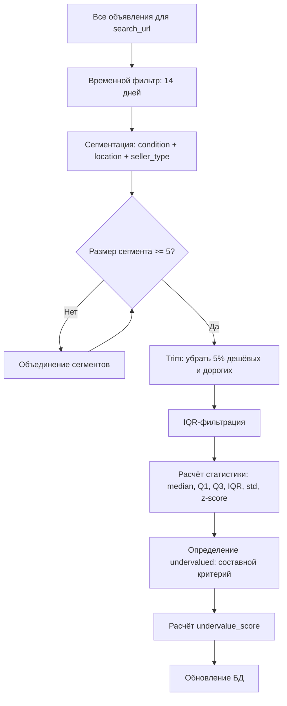
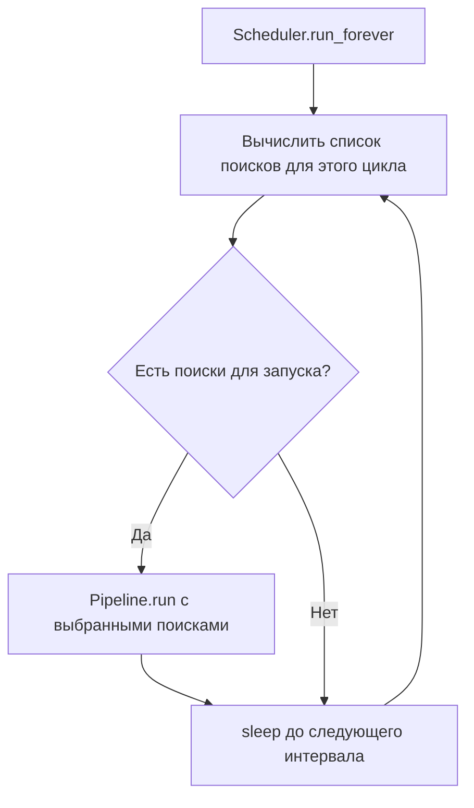

# План улучшений Avito Monitor

## Текущее состояние архитектуры

### Анализ проблем

**PriceAnalyzer** ([`analyzer.py`](app/analysis/analyzer.py)):
- Нет фильтрации аномалий — все цены участвуют в расчёте медианы, включая выбросы
- Нет сегментации — «новый в Москве» сравнивается с «б/у в Екатеринбурге»
- Нет временного фильтра — в анализе участвуют устаревшие объявления
- Простой порог `price < median * threshold` — не учитывает распределение цен
- [`MarketStats`](app/analysis/analyzer.py:16) содержит только базовые метрики: count, median, mean, q1, min, max

**Pipeline** ([`pipeline.py`](app/scheduler/pipeline.py)):
- Последовательная обработка всех `SEARCH_URLS` в одном цикле
- Нет планировщика — запуск через CLI `run` вручную или через cron
- [`MAX_ADS_PER_SEARCH_PER_RUN`](app/config/settings.py:65) = 3, но нет отдельного расписания
- Нет поддержки 20 поисков × 12 запусков в день

**Settings** ([`settings.py`](app/config/settings.py)):
- [`SEARCH_URLS`](app/config/settings.py:58) — простой список, без метаданных
- Нет параметров для фильтрации аномалий, сегментации, расписания
- [`UNDERVALUE_THRESHOLD`](app/config/settings.py:115) — единственный параметр анализа

**Models** ([`models.py`](app/storage/models.py)):
- [`Ad`](app/storage/models.py:131) — нет полей `seller_type`, `category`
- Нет модели для хранения рассчитанной сегментированной статистики
- Нет полей для хранения IQR/z-score метрик

---

## Раздел 1: Фильтрация аномалий

### 1.1. Новые методы PriceAnalyzer

#### `filter_temporal(ads, max_age_days=14) -> list[Ad]`
Временной фильтр — оставляет только объявления, у которых [`publication_date`](app/storage/models.py:169) или [`first_seen_at`](app/storage/models.py:175) не старше `max_age_days`.

```
cutoff_date = now - timedelta(days=max_age_days)
filtered = [ad for ad in ads if ad.publication_date >= cutoff_date 
            or ad.first_seen_at >= cutoff_date]
```

#### `segment_ads(ads) -> dict[str, list[Ad]]`
Сегментация объявлений по ключу `{condition}_{location}_{seller_type}`.

Правила сегментации:
- **condition**: значение из [`Ad.condition`](app/storage/models.py:168) — «Новое», «Б/у», или «Не указано»
- **location**: город/регион из [`Ad.location`](app/storage/models.py:166) — нормализовать до города (извлечь первый компонент: «Москва» из «Москва, Арбат»)
- **seller_type**: определяется по [`Ad.seller_name`](app/storage/models.py:167) или новому полю `seller_type`

Ключ сегмента: `"Новое_Москва_частное"` → группа объявлений для сравнения.

Минимальный размер сегмента: если в сегменте < 5 объявлений — объединять по менее гранулярному ключу (убирать seller_type, затем location).

#### `filter_iqr(prices: np.array, k=1.5) -> np.array`
Фильтрация выбросов методом межквартильного размаха.

```
Q1 = np.percentile(prices, 25)
Q3 = np.percentile(prices, 75)
IQR = Q3 - Q1
lower_bound = Q1 - k * IQR
upper_bound = Q3 + k * IQR
filtered = prices[(prices >= lower_bound) & (prices <= upper_bound)]
```

Где `k=1.5` — стандартное значение (настраиваемое).

#### `filter_trim_percent(prices: np.array, trim_percent=0.05) -> np.array`
Отбрасывание `trim_percent` самых дешёвых и самых дорогих.

```
n = len(prices)
lower_idx = int(n * trim_percent)
upper_idx = n - lower_idx
sorted_prices = np.sort(prices)
trimmed = sorted_prices[lower_idx:upper_idx]
```

#### `calculate_zscore(prices: np.array) -> np.array`
Расчёт z-score для каждого объявления.

```
mean = np.mean(prices)
std = np.std(prices)
z_scores = (prices - mean) / std
```

#### `detect_undervalued_v2(ads, market_stats) -> list[UndervaluedAd]`
Новый алгоритм определения недооценённых объявлений.

### 1.2. Новый алгоритм «undervalued»

Текущий критерий в [`detect_undervalued()`](app/analysis/analyzer.py:139):
```
price < median * undervalue_threshold  # threshold = 0.8
```

**Новый составной критерий:**

Объявление считается недооценённым, если выполняется **любое** из условий:

1. **IQR-аномалия**: `price < Q1 - 1.5 * IQR` (нижний «ус» boxplot)
2. **Z-score**: `z_score < -z_threshold` (где `z_threshold` по умолчанию = 1.5)
3. **Процент от медианы**: `price < median * threshold` (текущий метод, как fallback)

**И при этом НЕ выполняется** ни одно из условий исключения:
- Цена > 0 и цена не None
- Объявление не является дубликатом
- Количество объявлений в сегменте >= 5 (статистически значимо)

**Комбинированный `undervalue_score`:**
```
score = w1 * iqr_score + w2 * zscore_score + w3 * median_deviation_score
```
Где:
- `iqr_score = max(0, (Q1 - price) / IQR)` — нормализованное отклонение от Q1
- `zscore_score = max(0, -z_score / z_threshold)` — нормализованный z-score
- `median_deviation_score = max(0, (median - price) / median)` — отклонение от медианы
- `w1 = 0.4, w2 = 0.3, w3 = 0.3` — веса (настраиваемые)

### 1.3. Новые поля MarketStats

Расширить [`MarketStats`](app/analysis/analyzer.py:16) следующими полями:

| Поле | Тип | Описание |
|------|-----|----------|
| `q3_price` | `float \| None` | Третий квартиль (75-й перцентиль) |
| `iqr` | `float \| None` | Межквартильный размах: Q3 - Q1 |
| `std_dev` | `float \| None` | Стандартное отклонение |
| `lower_fence` | `float \| None` | Нижняя граница IQR: Q1 - 1.5 * IQR |
| `upper_fence` | `float \| None` | Верхняя граница IQR: Q3 + 1.5 * IQR |
| `trimmed_mean` | `float \| None` | Среднее после удаления 5% выбросов |
| `segment_key` | `str` | Ключ сегмента |
| `original_count` | `int` | Количество до фильтрации |
| `filtered_count` | `int` | Количество после фильтрации |

### 1.4. Обновлённый `analyze_and_mark()`

Новый поток анализа:



---

## Раздел 2: Масштабирование поиска

### 2.1. Целевая нагрузка

| Параметр | Текущее | Целевое |
|----------|---------|---------|
| Количество поисков | До 3 | До 20 |
| Запусков в день | 1 | 12 (каждые 2 часа) |
| Карточек на поиск | 3 | 3 |
| Итого карточек/день | ~9 | ~720 |

### 2.2. Новые параметры настроек

Добавить в [`Settings`](app/config/settings.py:35):

| Параметр | Тип | По умолчанию | Описание |
|----------|-----|-------------|----------|
| `SCHEDULE_INTERVAL_HOURS` | `int` | `2` | Интервал между запусками (часы) |
| `MAX_CONCURRENT_SEARCHES` | `int` | `3` | Максимум параллельных поисков |
| `SEARCH_BATCH_DELAY_MIN` | `float` | `30.0` | Минимальная задержка между батчами поисков (сек) |
| `SEARCH_BATCH_DELAY_MAX` | `float` | `60.0` | Максимальная задержка между батчами поисков (сек) |
| `MAX_ADS_PER_SEARCH_PER_RUN` | `int` | `3` | Без изменений, но убрать `le=10` → `le=50` |
| `ANOMALY_TRIM_PERCENT` | `float` | `0.05` | Доля отбрасываемых выбросов (5%) |
| `ANOMALY_IQR_MULTIPLIER` | `float` | `1.5` | Множитель IQR для определения выбросов |
| `ANOMALY_ZSCORE_THRESHOLD` | `float` | `1.5` | Порог z-score для аномалий |
| `ANALYSIS_MAX_AGE_DAYS` | `int` | `14` | Максимальный возраст объявлений для анализа |
| `MIN_SEGMENT_SIZE` | `int` | `5` | Минимальный размер сегмента для анализа |
| `UNDERVALUE_WEIGHTS` | `str` | `"0.4,0.3,0.3"` | Веса для составного undervalue_score |

### 2.3. Модификация Pipeline

#### 2.3.1. Пакетная обработка поисков

Вместо последовательного обхода всех 20 поисков — разбивать на батчи по [`MAX_CONCURRENT_SEARCHES`](app/config/settings.py:65):

```mermaid
flowchart LR
    subgraph Batch 1
        S1[Search 1]
        S2[Search 2]
        S3[Search 3]
    end
    subgraph Batch 2
        S4[Search 4]
        S5[Search 5]
        S6[Search 6]
    end
    subgraph Batch 7
        S19[Search 19]
        S20[Search 20]
    end
    Batch 1 -->|delay 30-60s| Batch 2
    Batch 2 -->|delay 30-60s| Batch 3
    Batch 3 -->|...| Batch 7
```

Модификация [`_process_search()`](app/scheduler/pipeline.py:157):
- Обернуть в `asyncio.gather()` с лимитом семафора
- Добавить задержку между батчами

#### 2.3.2. Планировщик запусков

Добавить новый класс `Scheduler` в `app/scheduler/scheduler.py`:



Логика:
- Каждый цикл — это `Pipeline.run()` для подмножества поисков
- Интервал: `SCHEDULE_INTERVAL_HOURS` (2 часа)
- Поиски распределяются равномерно по циклам (round-robin)

#### 2.3.3. Ограничение карточек

Текущее ограничение [`MAX_ADS_PER_SEARCH_PER_RUN`](app/config/settings.py:65) = 3 уже работает. Для масштабирования:
- Оставить 3 карточки на поиск за один запуск
- При 20 поисках × 3 карточки = 60 карточек за цикл
- При 12 циклах в день = 720 карточек/день

### 2.4. Управление поисками через БД

Перейти от хранения поисков в `.env` к управлению через БД:

- Использовать существующую модель [`TrackedSearch`](app/storage/models.py:30)
- Добавить CLI-команды: `add-search`, `remove-search`, `list-searches`
- Pipeline читает поиски из БД через [`get_active_searches()`](app/storage/repository.py:84)

---

## Раздел 3: Изменения в моделях данных

### 3.1. Новые поля в модели `Ad`

| Поле | Тип | Описание |
|------|-----|----------|
| `seller_type` | `String(32), nullable=True` | Тип продавца: «частное», «магазин», «компания» |
| `z_score` | `Float, nullable=True` | Z-score цены относительно сегмента |
| `iqr_outlier` | `Boolean, default=False` | Является ли цена IQR-выбросом |
| `segment_key` | `String(256), nullable=True` | Ключ сегмента, в котором анализировалось |
| `analysis_run_id` | `Integer, FK, nullable=True` | Ссылка на прогон анализа |

### 3.2. Новая модель `AnalysisRun`

```python
class AnalysisRun(Base):
    __tablename__ = "analysis_runs"
    
    id: Mapped[int] = mapped_column(Integer, primary_key=True)
    search_url: Mapped[str] = mapped_column(String(2048))
    segment_key: Mapped[str] = mapped_column(String(256))
    total_ads: Mapped[int] = mapped_column(Integer)
    filtered_ads: Mapped[int] = mapped_column(Integer)
    median_price: Mapped[float] = mapped_column(Float)
    mean_price: Mapped[float] = mapped_column(Float)
    q1_price: Mapped[float] = mapped_column(Float)
    q3_price: Mapped[float] = mapped_column(Float)
    iqr: Mapped[float] = mapped_column(Float)
    std_dev: Mapped[float] = mapped_column(Float)
    lower_fence: Mapped[float] = mapped_column(Float)
    upper_fence: Mapped[float] = mapped_column(Float)
    trimmed_mean: Mapped[float] = mapped_column(Float)
    undervalue_threshold_used: Mapped[float] = mapped_column(Float)
    created_at: Mapped[datetime] = mapped_column(DateTime)
```

### 3.3. Новые поля в `TrackedSearch`

| Поле | Тип | Описание |
|------|-----|----------|
| `schedule_interval_hours` | `Integer, default=2` | Интервал запуска для данного поиска |
| `last_run_at` | `DateTime, nullable=True` | Время последнего запуска |
| `priority` | `Integer, default=5` | Приоритет (1-10, ниже = важнее) |

### 3.4. Миграции

Использовать Alembic для миграций:

1. **Migration 001**: Добавить поля `seller_type`, `z_score`, `iqr_outlier`, `segment_key` в `ads`
2. **Migration 002**: Создать таблицу `analysis_runs`
3. **Migration 003**: Добавить поля `schedule_interval_hours`, `last_run_at`, `priority` в `tracked_searches`

---

## Раздел 4: Порядок реализации

### Этап 1: Фильтрация аномалий (базовая)

| Шаг | Файл | Изменение |
|-----|------|-----------|
| 1.1 | [`app/config/settings.py`](app/config/settings.py) | Добавить параметры: `ANOMALY_TRIM_PERCENT`, `ANOMALY_IQR_MULTIPLIER`, `ANOMALY_ZSCORE_THRESHOLD`, `ANALYSIS_MAX_AGE_DAYS`, `MIN_SEGMENT_SIZE`, `UNDERVALUE_WEIGHTS` |
| 1.2 | [`app/analysis/analyzer.py`](app/analysis/analyzer.py) | Расширить `MarketStats` новыми полями: `q3_price`, `iqr`, `std_dev`, `lower_fence`, `upper_fence`, `trimmed_mean`, `segment_key`, `original_count`, `filtered_count` |
| 1.3 | [`app/analysis/analyzer.py`](app/analysis/analyzer.py) | Добавить метод `filter_temporal()` — временной фильтр |
| 1.4 | [`app/analysis/analyzer.py`](app/analysis/analyzer.py) | Добавить метод `segment_ads()` — сегментация по condition + location + seller_type |
| 1.5 | [`app/analysis/analyzer.py`](app/analysis/analyzer.py) | Добавить метод `filter_iqr()` — IQR-фильтрация |
| 1.6 | [`app/analysis/analyzer.py`](app/analysis/analyzer.py) | Добавить метод `filter_trim_percent()` — обрезка процентов |
| 1.7 | [`app/analysis/analyzer.py`](app/analysis/analyzer.py) | Добавить метод `calculate_zscore()` — расчёт z-score |
| 1.8 | [`app/analysis/analyzer.py`](app/analysis/analyzer.py) | Реализовать `detect_undervalued_v2()` — составной критерий |
| 1.9 | [`app/analysis/analyzer.py`](app/analysis/analyzer.py) | Обновить `calculate_market_stats()` — расчёт новых метрик |
| 1.10 | [`app/analysis/analyzer.py`](app/analysis/analyzer.py) | Обновить `analyze_and_mark()` — новый поток анализа с сегментацией |

### Этап 2: Изменения в моделях данных

| Шаг | Файл | Изменение |
|-----|------|-----------|
| 2.1 | [`app/storage/models.py`](app/storage/models.py) | Добавить поля `seller_type`, `z_score`, `iqr_outlier`, `segment_key` в `Ad` |
| 2.2 | [`app/storage/models.py`](app/storage/models.py) | Создать модель `AnalysisRun` |
| 2.3 | [`app/storage/models.py`](app/storage/models.py) | Добавить поля `schedule_interval_hours`, `last_run_at`, `priority` в `TrackedSearch` |
| 2.4 | [`app/storage/repository.py`](app/storage/repository.py) | Добавить метод `get_ads_for_segment()` — получение объявлений по сегменту |
| 2.5 | [`app/storage/repository.py`](app/storage/repository.py) | Добавить метод `create_analysis_run()` — сохранение результатов анализа |
| 2.6 | [`app/storage/repository.py`](app/storage/repository.py) | Добавить метод `get_searches_due_for_run()` — поиски, готовые к запуску |
| 2.7 | `alembic/` | Настроить Alembic, создать миграции |

### Этап 3: Масштабирование поиска

| Шаг | Файл | Изменение |
|-----|------|-----------|
| 3.1 | [`app/config/settings.py`](app/config/settings.py) | Добавить параметры: `SCHEDULE_INTERVAL_HOURS`, `MAX_CONCURRENT_SEARCHES`, `SEARCH_BATCH_DELAY_MIN`, `SEARCH_BATCH_DELAY_MAX` |
| 3.2 | [`app/scheduler/pipeline.py`](app/scheduler/pipeline.py) | Модифицировать `run()` — пакетная обработка поисков с семафором |
| 3.3 | [`app/scheduler/pipeline.py`](app/scheduler/pipeline.py) | Модифицировать `_analyze_and_notify()` — вызов обновлённого анализатора |
| 3.4 | `app/scheduler/scheduler.py` | Создать класс `Scheduler` — циклический запуск с интервалом |
| 3.5 | [`app/scheduler/cli.py`](app/scheduler/cli.py) | Добавить команду `schedule` — запуск планировщика |
| 3.6 | [`app/scheduler/cli.py`](app/scheduler/cli.py) | Добавить команды `add-search`, `remove-search`, `list-searches` |
| 3.7 | [`app/parser/ad_parser.py`](app/parser/ad_parser.py) | Добавить извлечение `seller_type` из карточки объявления |

### Этап 4: Тестирование и интеграция

| Шаг | Файл | Изменение |
|-----|------|-----------|
| 4.1 | `tests/test_analyzer.py` | Юнит-тесты для `filter_temporal`, `segment_ads`, `filter_iqr`, `filter_trim_percent`, `calculate_zscore`, `detect_undervalued_v2` |
| 4.2 | `tests/test_pipeline.py` | Интеграционные тесты для пакетной обработки |
| 4.3 | `tests/test_scheduler.py` | Тесты для планировщика |
| 4.4 | [`.env.example`](.env.example) | Обновить пример конфигурации новыми параметрами |
| 4.5 | [`docs/architecture.md`](docs/architecture.md) | Обновить документацию архитектуры |

---

## Приложение: Формулы

### IQR (Interquartile Range)
```
Q1 = percentile(prices, 25)
Q3 = percentile(prices, 75)
IQR = Q3 - Q1
Lower Fence = Q1 - k * IQR    (k = 1.5 по умолчанию)
Upper Fence = Q3 + k * IQR
Выброс: price < Lower Fence ИЛИ price > Upper Fence
```

### Z-Score
```
z = (price - μ) / σ
Где:
  μ = mean(prices)
  σ = std(prices)
Аномалия: |z| > threshold (threshold = 1.5 по умолчанию)
Для undervalued: z < -threshold
```

### Trimmed Mean
```
sorted = sort(prices)
n = len(sorted)
trim_count = int(n * trim_percent)   (trim_percent = 0.05)
trimmed = sorted[trim_count : n - trim_count]
trimmed_mean = mean(trimmed)
```

### Составной Undervalue Score
```
iqr_score = max(0, (Q1 - price) / IQR)           если IQR > 0
zscore_score = max(0, -z_score / z_threshold)     если z_score < 0
median_score = max(0, (median - price) / median)  если price < median

undervalue_score = w1 * iqr_score + w2 * zscore_score + w3 * median_score
Где w1=0.4, w2=0.3, w3=0.3 (настраиваемые)

Объявление undervalued если:
  undervalue_score > 0  И  (iqr_score > 0 ИЛИ zscore_score > 0)
```
