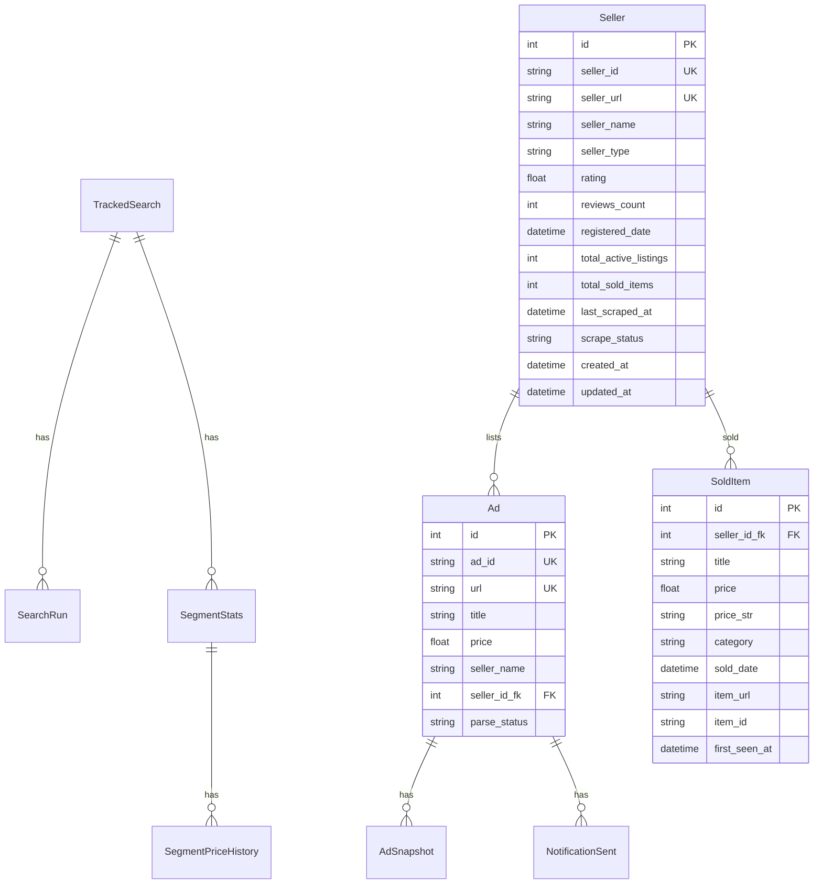
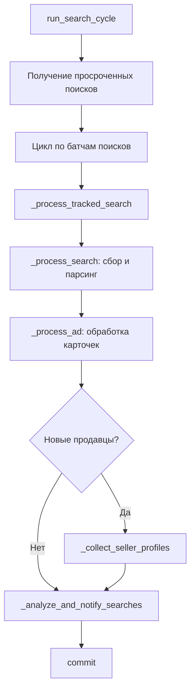
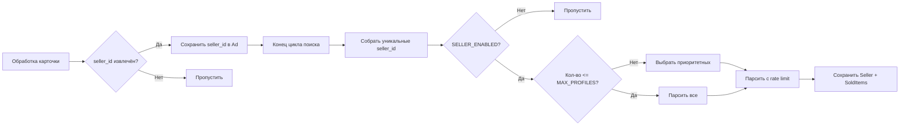

# Архитектура: Парсинг профилей продавцов и проданных товаров

> **Версия:** 1.0  
> **Дата:** 2026-04-17  
> **Статус:** Проектирование

---

## 1. Обзор

Документ описывает архитектуру нового функционала для сбора данных о проданных товарах со страниц профилей продавцов Avito. Функционал позволяет:

- Извлекать `seller_id` и `seller_url` из карточек объявлений
- Парсить страницу профиля продавца с вкладкой проданных товаров
- Накапливать статистику продаж для аналитики

### 1.1 Текущее состояние

| Компонент | Текущий статус |
|---|---|
| [`Ad`](app/storage/models.py:152) | Содержит `seller_name: str` — текстовое поле, нет связи с продавцом |
| [`AdData`](app/parser/ad_parser.py:19) | Извлекает `seller_name` через CSS-селекторы, нет `seller_id` |
| [`AvitoCollector`](app/collector/collector.py:23) | Умеет собирать только поисковые страницы и карточки |
| [`Pipeline`](app/scheduler/pipeline.py:33) | Цикл: поиск → карточки → анализ → уведомления |

### 1.2 Целевое состояние

Добавить этап сбора данных о продавцах **после обработки карточек объявлений**, но **до аналитики**. Это минимально влияет на существующий поток и не блокирует основной пайплайн при ошибках.

---

## 2. Новые модели данных

### 2.1 Модель `Seller`

Новая таблица `sellers` — реестр уникальных продавцов Avito.

```python
class Seller(Base):
    """Продавец Avito."""
    __tablename__ = "sellers"

    id: Mapped[int] = mapped_column(Integer, primary_key=True, autoincrement=True)
    seller_id: Mapped[str] = mapped_column(
        String(64), unique=True, nullable=False, index=True,
        comment="Идентификатор продавца Avito из URL профиля",
    )
    seller_url: Mapped[str] = mapped_column(
        String(2048), unique=True, nullable=False,
        comment="URL профиля продавца: https://www.avito.ru/user/USER_ID/profile",
    )
    seller_name: Mapped[str | None] = mapped_column(
        String(256), nullable=True,
        comment="Имя продавца (обновляется при каждом парсинге)",
    )
    seller_type: Mapped[str | None] = mapped_column(
        String(128), nullable=True,
        comment="Тип продавца: частный, магазин, компания",
    )
    rating: Mapped[float | None] = mapped_column(
        Float, nullable=True,
        comment="Рейтинг продавца",
    )
    reviews_count: Mapped[int | None] = mapped_column(
        Integer, nullable=True,
        comment="Количество отзывов",
    )
    registered_date: Mapped[datetime.datetime | None] = mapped_column(
        DateTime(timezone=True), nullable=True,
        comment="Дата регистрации на Avito",
    )
    total_active_listings: Mapped[int | None] = mapped_column(
        Integer, nullable=True,
        comment="Количество активных объявлений",
    )
    total_sold_items: Mapped[int | None] = mapped_column(
        Integer, nullable=True,
        comment="Общее количество проданных товаров (с вкладки)",
    )
    last_scraped_at: Mapped[datetime.datetime | None] = mapped_column(
        DateTime(timezone=True), nullable=True,
        comment="Время последнего парсинга профиля",
    )
    scrape_status: Mapped[str] = mapped_column(
        String(20), default="pending",
        comment="Статус парсинга: pending/parsed/failed",
    )
    last_error: Mapped[str | None] = mapped_column(
        Text, nullable=True,
        comment="Текст последней ошибки парсинга",
    )
    created_at: Mapped[datetime.datetime] = mapped_column(
        DateTime(timezone=True), default=_utcnow,
    )
    updated_at: Mapped[datetime.datetime] = mapped_column(
        DateTime(timezone=True), default=_utcnow, onupdate=_utcnow,
    )

    # Relationships
    sold_items: Mapped[list[SoldItem]] = relationship(
        "SoldItem", back_populates="seller",
        cascade="all, delete-orphan", passive_deletes=True,
    )
    ads: Mapped[list[Ad]] = relationship(
        "Ad", back_populates="seller",
    )
```

**Индексы:**
- `UNIQUE(seller_id)` — уникальный идентификатор продавца
- `UNIQUE(seller_url)` — уникальный URL профиля
- `INDEX(seller_id)` — быстрый поиск по ID
- `INDEX(last_scraped_at)` — для выборки продавцов, которых пора обновить

### 2.2 Модель `SoldItem`

Новая таблица `sold_items` — проданные товары продавца.

```python
class SoldItem(Base):
    """Проданный товар продавца Avito."""
    __tablename__ = "sold_items"

    id: Mapped[int] = mapped_column(Integer, primary_key=True, autoincrement=True)
    seller_id_fk: Mapped[int] = mapped_column(
        Integer,
        ForeignKey("sellers.id", ondelete="CASCADE"),
        nullable=False, index=True,
    )
    title: Mapped[str | None] = mapped_column(
        String(512), nullable=True,
        comment="Название проданного товара",
    )
    price: Mapped[float | None] = mapped_column(
        Float, nullable=True,
        comment="Цена продажи",
    )
    price_str: Mapped[str | None] = mapped_column(
        String(128), nullable=True,
        comment="Сырая строка цены",
    )
    category: Mapped[str | None] = mapped_column(
        String(256), nullable=True,
        comment="Категория товара",
    )
    sold_date: Mapped[datetime.datetime | None] = mapped_column(
        DateTime(timezone=True), nullable=True,
        comment="Дата продажи (если доступна)",
    )
    item_url: Mapped[str | None] = mapped_column(
        String(2048), nullable=True,
        comment="URL проданного товара (если доступен)",
    )
    item_id: Mapped[str | None] = mapped_column(
        String(64), nullable=True,
        comment="ID товара на Avito",
    )
    first_seen_at: Mapped[datetime.datetime] = mapped_column(
        DateTime(timezone=True), default=_utcnow,
        comment="Когда впервые обнаружен в профиле продавца",
    )

    # Relationships
    seller: Mapped[Seller] = relationship("Seller", back_populates="sold_items")
```

**Индексы:**
- `INDEX(seller_id_fk)` — быстрый поиск товаров продавца
- `UNIQUE(seller_id_fk, item_id)` — дедупликация: один товар у одного продавца
- `INDEX(sold_date)` — аналитика по датам
- `INDEX(category)` — аналитика по категориям

### 2.3 Диаграмма связей моделей



---

## 3. Изменения в существующих моделях

### 3.1 Добавление FK в `Ad`

В модель [`Ad`](app/storage/models.py:152) добавляется опциональный внешний ключ на `Seller`:

```python
# Новое поле в Ad
seller_id_fk: Mapped[int | None] = mapped_column(
    Integer,
    ForeignKey("sellers.id", ondelete="SET NULL"),
    nullable=True,
    comment="FK на Seller. NULL для обратной совместимости.",
)

# Новая связь
seller: Mapped[Seller | None] = relationship("Seller", back_populates="ads")
```

**Обратная совместимость:** Поле `seller_id_fk` — nullable. Существующие записи `Ad` будут иметь `seller_id_fk = NULL`. Старое поле `seller_name` сохраняется для обратной совместимости и как fallback.

### 3.2 Порядок миграции

1. Создать таблицу `sellers`
2. Создать таблицу `sold_items`
3. Добавить колонку `seller_id_fk` в таблицу `ads` (nullable, без NOT NULL constraint)
4. Обратная миграция: удалить колонку, затем таблицы

---

## 4. Новый парсер: `seller_parser.py`

### 4.1 Dataclass `SellerProfileData`

```python
# app/parser/seller_parser.py

@dataclass
class SellerProfileData:
    """Результат парсинга профиля продавца."""
    seller_id: str
    seller_url: str
    seller_name: str | None
    seller_type: str | None
    rating: float | None
    reviews_count: int | None
    registered_date: datetime.datetime | None
    total_active_listings: int | None
    sold_items: list[SoldItemData]


@dataclass
class SoldItemData:
    """Результат парсинга одного проданного товара."""
    title: str | None
    price: float | None
    price_str: str | None
    category: str | None
    sold_date: datetime.datetime | None
    item_url: str | None
    item_id: str | None
```

### 4.2 Функция `parse_seller_profile()`

```python
def parse_seller_profile(html: str, url: str) -> SellerProfileData:
    """Парсит HTML страницы профиля продавца Avito.

    Извлекает данные продавца и список проданных товаров.
    """
```

### 4.3 CSS-селекторы для профиля продавца

> **Важно:** Селекторы Avito могут меняться. Проектируем с fallback-стратегией как в [`ad_parser.py`](app/parser/ad_parser.py).

**Данные продавца:**

| Поле | Основной селектор | Fallback-селекторы |
|---|---|---|
| `seller_name` | `[data-marker="profile/name"]` | `h1`, `[class*="profile-name"]` |
| `seller_type` | `[data-marker="profile/type"]` | `[class*="seller-type"]` |
| `rating` | `[data-marker="profile/rating"]` | `[class*="rating-value"]` |
| `reviews_count` | `[data-marker="profile/reviews"]` | `[class*="reviews-count"]` |
| `registered_date` | `[data-marker="profile/registered"]` | текст с «На Avito с» |
| `total_active_listings` | `[data-marker="profile/active-listings"]` | текст с «объявлен» |

**Проданные товары (вкладка «Проданные»):**

| Поле | Основной селектор | Fallback-селекторы |
|---|---|---|
| Список товаров | `[data-marker="profile/sold-items"]` | `[class*="sold-items"]`, `[class*="items-list"]` |
| Название товара | `[data-marker="sold-item/title"]` | `a[class*="title"]`, `h3` внутри карточки |
| Цена | `[data-marker="sold-item/price"]` | `[class*="price"]` внутри карточки |
| Категория | `[data-marker="sold-item/category"]` | текст рядом с названием |
| Дата продажи | `[data-marker="sold-item/date"]` | `[class*="date"]` внутри карточки |
| URL товара | `a[href]` внутри карточки | — |

### 4.4 Извлечение `seller_id` из URL

```python
def extract_seller_id_from_url(url: str) -> str:
    """Извлекает seller_id из URL профиля.

    Форматы:
        https://www.avito.ru/user/USER_ID/profile
        https://www.avito.ru/user/USER_ID/profile?tab=sold
    """
    match = re.search(r'/user/([^/]+)/profile', url)
    if match:
        return match.group(1)
    raise ValueError(f"Cannot extract seller_id from URL: {url}")
```

---

## 5. Изменения в `ad_parser.py`

### 5.1 Новые поля в `AdData`

В [`AdData`](app/parser/ad_parser.py:19) добавляются:

```python
@dataclass
class AdData:
    # ... существующие поля ...
    ad_id: str
    url: str
    title: str | None
    price: float | None
    price_str: str | None
    location: str | None
    seller_name: str | None
    condition: str | None
    publication_date: datetime.datetime | None
    description: str | None

    # Новые поля
    seller_id: str | None = None
    seller_url: str | None = None
```

### 5.2 Новые селекторы в `parse_ad_page()`

В функцию [`parse_ad_page()`](app/parser/ad_parser.py:47) добавляется извлечение:

```python
# --- seller_url (ссылка на профиль продавца) ---
seller_url = _safe_extract_attribute(soup, "seller_url", [
    '[data-marker="seller-info/link"]',
    'a[href*="/user/"]',
    '[class*="seller-info"] a[href]',
], attr="href")

# --- seller_id (из seller_url) ---
seller_id = None
if seller_url:
    try:
        seller_id = extract_seller_id_from_url(seller_url)
    except ValueError:
        log.warning("cannot_extract_seller_id", seller_url=seller_url)
```

Потребуется новая вспомогательная функция `_safe_extract_attribute()` — аналог [`_safe_extract()`](app/parser/ad_parser.py:160), но извлекающая атрибут вместо текста.

---

## 6. Изменения в коллекторе

### 6.1 Новый метод `collect_seller_page()`

В [`AvitoCollector`](app/collector/collector.py:23) добавляется:

```python
# Селекторы ожидания для страницы профиля продавца
_SELLER_SELECTORS: list[str] = [
    '[data-marker="profile/name"]',
    '[class*="profile-name"]',
    'h1',
]

async def collect_seller_page(
    self,
    url: str,
    context: "BrowserContext | None" = None,
) -> tuple[str, str]:
    """Открыть страницу профиля продавца и вернуть (html, saved_path).

    Отличия от collect_ad_page:
    - Использует _SELLER_SELECTORS для ожидания загрузки
    - Сохраняет HTML в data/raw_html/seller/
    - Использует отдельный seller_rate_limiter
    """
```

### 6.2 Rate limiter для профилей продавцов

В конструктор [`AvitoCollector.__init__()`](app/collector/collector.py:48) добавляется:

```python
def __init__(
    self,
    browser_manager: BrowserManager,
    settings: Settings,
    rate_limiter: RateLimiter | None = None,
    search_rate_limiter: RateLimiter | None = None,
    ad_rate_limiter: RateLimiter | None = None,
    seller_rate_limiter: RateLimiter | None = None,  # Новый
) -> None:
    # ...
    self._seller_rate_limiter = seller_rate_limiter
```

Внутри `collect_seller_page()` приоритет: `seller_rate_limiter` → `rate_limiter`.

---

## 7. Изменения в репозитории

### 7.1 Новые методы для `Seller`

В [`Repository`](app/storage/repository.py:27) добавляются:

```python
# --- Seller CRUD ---

def get_or_create_seller(self, seller_id: str, seller_url: str) -> tuple[Seller, bool]:
    """Возвращает существующего или создаёт нового продавца."""

def get_seller_by_seller_id(self, seller_id: str) -> Seller | None:
    """Возвращает продавца по Avito seller_id."""

def update_seller(self, seller_id: str, **kwargs) -> None:
    """Обновляет поля продавца."""

def get_sellers_due_for_scrape(
    self,
    max_age_hours: float = 24.0,
    limit: int = 10,
) -> list[Seller]:
    """Возвращает продавцов, которых пора парсить.

    Критерии:
    - last_scraped_at IS NULL (никогда не парсили)
    - ИЛИ last_scraped_at < now - max_age_hours
    - scrape_status != 'failed' (не пытаться повторно в этом цикле)
    - LIMIT для ограничения количества
    """

def link_ad_to_seller(self, ad_id: str, seller_id_fk: int) -> None:
    """Привязывает объявление к продавцу по FK."""
```

### 7.2 Новые методы для `SoldItem`

```python
# --- SoldItem CRUD ---

def add_sold_item(
    self,
    seller_db_id: int,
    item_data: SoldItemData,
) -> tuple[SoldItem, bool]:
    """Добавляет проданный товар. Возвращает (item, created).
    Дедупликация по (seller_id_fk, item_id)."""

def add_sold_items_batch(
    self,
    seller_db_id: int,
    items: list[SoldItemData],
) -> int:
    """Массовое добавление проданных товаров.
    Возвращает количество новых (созданных) записей."""

def get_sold_items_for_seller(
    self,
    seller_id: str,
    limit: int = 100,
) -> list[SoldItem]:
    """Возвращает проданные товары продавца."""

def get_seller_sales_stats(self, seller_id: str) -> dict:
    """Возвращает агрегированную статистику продаж продавца."""
```

---

## 8. Изменения в пайплайне

### 8.1 Точка интеграции

Сбор данных о продавцах вставляется **после обработки карточек объявлений** и **до аналитики** в методе [`run_search_cycle()`](app/scheduler/pipeline.py:194):



### 8.2 Новый метод `_collect_seller_profiles()`

```python
async def _collect_seller_profiles(
    self,
    collector: AvitoCollector,
    repo: Repository,
    *,
    context: "BrowserContext | None" = None,
) -> None:
    """Собрать данные о профилях продавцов, обнаруженных в текущем цикле.

    Алгоритм:
    1. Получить список уникальных seller_id из обработанных объявлений
       (у которых seller_id_fk IS NULL и seller_id IS NOT NULL).
    2. Ограничить количество: SELLER_MAX_PROFILES_PER_CYCLE.
    3. Для каждого продавца:
       a. Создать/получить запись Seller в БД.
       b. Собрать страницу профиля через collector.collect_seller_page().
       c. Распарсить через parse_seller_profile().
       d. Сохранить данные продавца и проданные товары.
       e. Привязать объявления к продавцу (seller_id_fk).
    4. Задержка между профилями: SELLER_DELAY_SECONDS.
    """
```

### 8.3 Модификация `_process_ad()`

В [`_process_ad()`](app/scheduler/pipeline.py:831) после парсинга карточки добавить сохранение `seller_id` и `seller_url`:

```python
# После строки repo.update_ad(ad_id, ...) добавить:
repo.update_ad(
    ad_id,
    title=ad_data.title,
    price=ad_data.price,
    location=ad_data.location,
    seller_name=ad_data.seller_name,
    condition=ad_data.condition,
    publication_date=ad_data.publication_date,
    parse_status="parsed",
    # Новые поля:
    seller_id_text=ad_data.seller_id,  # Временное хранение до привязки FK
    seller_url=ad_data.seller_url,
)
```

> **Примечание:** `seller_id` и `seller_url` сохраняются в БД как промежуточные данные. Привязка FK `seller_id_fk` выполняется позже в `_collect_seller_profiles()`.

### 8.4 Статистика пайплайна

В [`self.stats`](app/scheduler/pipeline.py:52) добавить:

```python
self.stats: dict[str, int] = {
    # ... существующие ...
    "sellers_scraped": 0,
    "sellers_new": 0,
    "sold_items_new": 0,
}
```

---

## 9. Изменения в настройках

### 9.1 Новые параметры в [`Settings`](app/config/settings.py:35)

```python
# === Настройки парсинга профилей продавцов ===
SELLER_ENABLED: bool = Field(
    default=True,
    description="Включить парсинг профилей продавцов",
)
SELLER_RATE_LIMIT_PER_MINUTE: int = Field(
    default=3,
    ge=1,
    le=10,
    description="Максимум запросов к профилям продавцов в минуту",
)
SELLER_MAX_PROFILES_PER_CYCLE: int = Field(
    default=5,
    ge=1,
    le=20,
    description="Макс. профилей продавцов за один цикл",
)
SELLER_DELAY_SECONDS: float = Field(
    default=15.0,
    ge=5.0,
    description="Задержка между профилями продавцов (сек)",
)
SELLER_SCRAPE_INTERVAL_HOURS: float = Field(
    default=24.0,
    ge=1.0,
    description="Интервал повторного парсинга профиля продавца (часы)",
)
SELLER_MAX_SOLD_ITEMS_PER_PROFILE: int = Field(
    default=50,
    ge=1,
    le=200,
    description="Макс. проданных товаров для сохранения за один парсинг",
)
```

---

## 10. Стратегия парсинга

### 10.1 Когда парсить профили продавцов

**Стратегия: ленивый парсинг с ограничением частоты.**



**Приоритеты выбора продавцов для парсинга:**

1. **Новые продавцы** — `last_scraped_at IS NULL` — наивысший приоритет
2. **Устаревшие** — `last_scraped_at < now - SELLER_SCRAPE_INTERVAL_HOURS`
3. **Не более** `SELLER_MAX_PROFILES_PER_CYCLE` за один цикл

### 10.2 Почему не каждый цикл

- **Rate limiting Avito:** Профили продавцов — менее приоритетны, чем карточки объявлений
- **Нагрузка:** Каждый профиль = дополнительный HTTP-запрос
- **Стабильность данных:** Профиль продавца меняется реже, чем цены объявлений
- **Достаточно** обновлять профиль раз в 24 часа

### 10.3 Обработка ошибок

- Ошибка парсинга профиля **не блокирует** основной пайплайн
- `scrape_status = 'failed'` — продавец пропускается до следующего интервала
- Логирование ошибки в `last_error`
- Не более 3 последовательных failures → увеличение интервала

---

## 11. Аналитика на основе данных о продажах

### 11.1 Новые метрики для продавца

| Метрика | Формула | Применение |
|---|---|---|
| Средняя цена продажи | `AVG(sold_items.price)` WHERE seller_id = X | Оценка ценового уровня продавца |
| Медианная цена продажи | `PERCENTILE(0.5)` цены продаж | Устойчивая оценка |
| Количество продаж за период | `COUNT(sold_items)` WHERE sold_date >= now - N дней | Объём продаж |
| Оборот продавца | `SUM(sold_items.price)` за период | Финансовая активность |
| Скорость продаж | `COUNT / DAYS` в периоде | Ликвидность товаров продавца |
| Среднее время продажи | Разница между датой публикации и sold_date | Оборачиваемость |

### 11.2 Интеграция с существующей аналитикой

Данные о продажах продавца могут обогатить существующий анализ в [`SegmentAnalyzer`](app/analysis/segment_analyzer.py):

1. **Оценка ликвидности:** Если продавец продаёт много товаров в этой категории — его цены можно использовать как ориентир ликвидной цены
2. **Детекция перекупщиков:** Высокий оборот + много продаж → вероятно перекупщик → его цены могут искажать статистику
3. **Валидация `is_disappeared_quickly`:** Если товар исчез и при этом есть запись в `sold_items` у продавца — это подтверждённая продажа, а не просто удаление объявления

### 11.3 Новые методы аналитики

```python
# В Repository или новом SellerAnalyticsService

def get_seller_sales_summary(self, seller_id: str, days: int = 90) -> dict:
    """Агрегированная статистика продаж продавца."""

def get_category_sales_stats(self, category: str, days: int = 30) -> dict:
    """Статистика продаж по категории (по всем продавцам)."""

def get_top_sellers_by_sales(self, category: str | None = None, limit: int = 10) -> list[dict]:
    """Топ продавцов по количеству продаж."""

def compare_ad_price_to_seller_history(
    self, ad_price: float, seller_id: str, category: str | None = None,
) -> dict:
    """Сравнить цену объявления с историей продаж этого продавца."""
```

---

## 12. План реализации

### 12.1 Этап 1: Модели и миграция

- [ ] Создать модель `Seller` в [`models.py`](app/storage/models.py)
- [ ] Создать модель `SoldItem` в [`models.py`](app/storage/models.py)
- [ ] Добавить `seller_id_fk` в модель `Ad`
- [ ] Добавить `seller_id` и `seller_url` текстовые поля в `Ad` для промежуточного хранения
- [ ] Создать скрипт миграции `scripts/migrate_seller_sold_items.py`
- [ ] Обновить [`database.py`](app/storage/database.py) — `ensure_tables()` создаст новые таблицы

### 12.2 Этап 2: Парсеры

- [ ] Создать [`app/parser/seller_parser.py`](app/parser/seller_parser.py) с `SellerProfileData`, `SoldItemData`, `parse_seller_profile()`
- [ ] Добавить `seller_id`, `seller_url` в [`AdData`](app/parser/ad_parser.py:19)
- [ ] Добавить извлечение `seller_url` и `seller_id` в [`parse_ad_page()`](app/parser/ad_parser.py:47)
- [ ] Добавить `_safe_extract_attribute()` в [`ad_parser.py`](app/parser/ad_parser.py)
- [ ] Добавить `extract_seller_id_from_url()` в [`helpers.py`](app/utils/helpers.py)

### 12.3 Этап 3: Коллектор

- [ ] Добавить `collect_seller_page()` в [`AvitoCollector`](app/collector/collector.py:23)
- [ ] Добавить `seller_rate_limiter` в конструктор
- [ ] Добавить `_SELLER_SELECTORS` для ожидания загрузки

### 12.4 Этап 4: Репозиторий

- [ ] Добавить CRUD-методы для `Seller` в [`Repository`](app/storage/repository.py:27)
- [ ] Добавить CRUD-методы для `SoldItem`
- [ ] Добавить `link_ad_to_seller()`
- [ ] Добавить `get_sellers_due_for_scrape()`

### 12.5 Этап 5: Пайплайн

- [ ] Добавить настройки в [`Settings`](app/config/settings.py:35)
- [ ] Добавить `_collect_seller_profiles()` в [`Pipeline`](app/scheduler/pipeline.py:33)
- [ ] Интегрировать вызов в [`run_search_cycle()`](app/scheduler/pipeline.py:194)
- [ ] Обновить `self.stats` новыми метриками
- [ ] Модифицировать [`_process_ad()`](app/scheduler/pipeline.py:831) для сохранения seller_id

### 12.6 Этап 6: Аналитика (опционально, второй приоритет)

- [ ] Создать `app/analysis/seller_analyzer.py` с методами аналитики
- [ ] Интегрировать данные о продажах в [`SegmentAnalyzer`](app/analysis/segment_analyzer.py)
- [ ] Добавить метрики продавца в уведомления

---

## 13. Риски и ограничения

### 13.1 Технические риски

| Риск | Вероятность | Влияние | Митигация |
|---|---|---|---|
| Изменение CSS-селекторов Avito | Высокая | Среднее | Fallback-селекторы, логирование, ручное обновление |
| Блокировка за частые запросы к профилям | Средняя | Высокое | Отдельный rate limiter, низкая частота, задержки |
| Отсутствие вкладки «Проданные» у некоторых продавцов | Высокая | Низкое | Graceful handling — пустой список sold_items |
| Большие объёмы данных при активных продавцах | Низкая | Среднее | Лимит `SELLER_MAX_SOLD_ITEMS_PER_PROFILE` |

### 13.2 Ограничения

1. **Не все продавцы имеют публичный профиль** — некоторые скрывают информацию
2. **Дата продажи не всегда доступна** — Avito может не показывать точную дату
3. **Проданные товары могут быть не видны** — зависит от настроек приватности продавца
4. **CSS-селекторы требуют верификации** — необходимо протестировать на реальных страницах

---

## 14. Файловая структура изменений

```
app/
├── parser/
│   ├── ad_parser.py          # ИЗМЕНЕНИЕ: +seller_id, +seller_url в AdData
│   └── seller_parser.py      # НОВЫЙ: парсер профиля продавца
├── collector/
│   └── collector.py          # ИЗМЕНЕНИЕ: +collect_seller_page()
├── storage/
│   ├── models.py             # ИЗМЕНЕНИЕ: +Seller, +SoldItem, +seller_id_fk в Ad
│   ├── repository.py         # ИЗМЕНЕНИЕ: +CRUD для Seller и SoldItem
│   └── database.py           # БЕЗ ИЗМЕНЕНИЙ (ensure_tables подхватит новые модели)
├── scheduler/
│   └── pipeline.py           # ИЗМЕНЕНИЕ: +_collect_seller_profiles()
├── config/
│   └── settings.py           # ИЗМЕНЕНИЕ: +SELLER_* настройки
├── analysis/
│   └── seller_analyzer.py    # НОВЫЙ: аналитика по продавцам (этап 6)
└── utils/
    └── helpers.py            # ИЗМЕНЕНИЕ: +extract_seller_id_from_url()

scripts/
└── migrate_seller_sold_items.py  # НОВЫЙ: скрипт миграции
```
