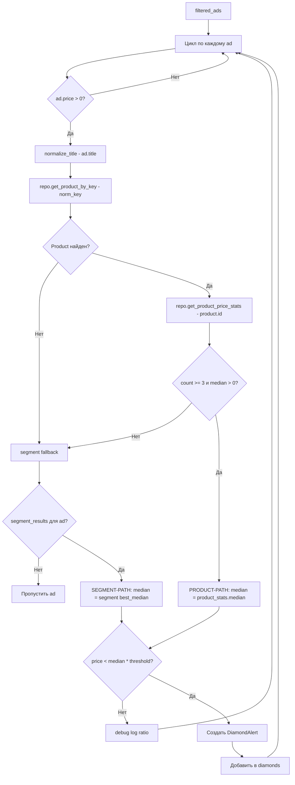

# План: Product-first детекция «бриллиантов»

## Контекст проблемы

Текущий поток детекции в [`_run_category_search_pipeline()`](app/scheduler/pipeline.py:2061) итерируется по `segment_results` (dict segment_key → stats). Поскольку `segment_results` пустые (0 записей), цикл не выполняется и ни один «бриллиант» не детектируется.

При этом в БД есть 404 продукта, 55 из которых имеют ≥3 снапшота — достаточно для расчёта медианы.

## Диаграмма нового потока



## Изменения по файлам

### 1. `app/config/settings.py` — Добавить настройки детекции

**После строки 161** (после `MEDIAN_DISCOUNT_THRESHOLD`) добавить:

```python
    # === Настройки детекции бриллиантов ===
    DIAMOND_DISCOUNT_THRESHOLD: float = Field(
        default=0.85,
        gt=0.5,
        le=1.0,
        description="Порог price/median для детекции бриллиантов (0.85 = 15% ниже медианы)",
    )
    DIAMOND_MIN_SNAPSHOTS: int = Field(
        default=3,
        ge=2,
        le=20,
        description="Минимум снапшотов продукта для использования product-level медианы",
    )
    DIAMOND_FAST_SALE_THRESHOLD: float = Field(
        default=0.8,
        gt=0.5,
        le=1.0,
        description="Порог для медианы быстрых продаж (segment fallback)",
    )
```

**Обоснование**: Выносим magic numbers в конфигурацию. Значение 0.85 вместо 0.7 — менее агрессивный порог, который позволит детектировать больше кандидатов.

### 2. `app/scheduler/pipeline.py` — Переписать блок детекции (строки 2061–2089)

**Заменить блок «7. Детекция бриллиантов»** (строки 2061–2089) на:

```python
        # 7. Детекция «бриллиантов» — product-first подход
        diamonds: list[DiamondAlert] = []
        discount_threshold = self.settings.DIAMOND_DISCOUNT_THRESHOLD
        min_snapshots = self.settings.DIAMOND_MIN_SNAPSHOTS
        fast_sale_threshold = self.settings.DIAMOND_FAST_SALE_THRESHOLD

        product_hits = 0
        segment_hits = 0
        no_data_count = 0

        for ad in filtered_ads:
            if ad.price is None or ad.price <= 0:
                continue

            effective_median: float | None = None
            effective_reason: str = "none"
            product_key: str | None = None
            sample_size = 0

            # --- ПРИОРИТЕТ 1: Product-level медиана ---
            if ad.title:
                try:
                    from app.analysis.product_normalizer import normalize_title
                    norm = normalize_title(ad.title)
                    product_key = norm.normalized_key
                    product = repo.get_product_by_key(product_key)
                    if product is not None:
                        stats = repo.get_product_price_stats(product.id)
                        p_count = stats.get("count", 0)
                        p_median = stats.get("median")
                        if p_count >= min_snapshots and p_median is not None and p_median > 0:
                            effective_median = float(p_median)
                            effective_reason = (
                                f"product_median ({p_median:,.0f}₽) "
                                f"по {p_count} записям, key={product_key}"
                            )
                            sample_size = p_count
                            product_hits += 1
                except Exception as exc:
                    self.logger.debug(
                        "diamond_product_lookup_failed",
                        ad_id=ad.ad_id,
                        error=str(exc),
                    )

            # --- ПРИОРИТЕТ 2: Segment-level fallback ---
            if effective_median is None:
                seg_key_str = segment_analyzer.build_segment_key(ad).to_string()
                seg_stats = segment_results.get(seg_key_str)
                if seg_stats is not None:
                    best_median, reason = segment_analyzer.get_best_median(seg_stats)
                    if best_median > 0:
                        effective_median = best_median
                        effective_reason = reason
                        sample_size = seg_stats.get("sample_size", 0)
                        segment_hits += 1

            # --- Нет данных — пропускаем ---
            if effective_median is None or effective_median <= 0:
                no_data_count += 1
                continue

            # --- Проверка порога ---
            ratio = ad.price / effective_median

            self.logger.debug(
                "diamond_candidate_ratio",
                ad_id=ad.ad_id,
                price=ad.price,
                median=effective_median,
                ratio=round(ratio, 3),
                threshold=discount_threshold,
                source=effective_reason,
                product_key=product_key,
            )

            if ratio >= discount_threshold:
                continue  # Не бриллиант

            # --- Создание DiamondAlert ---
            discount_percent = (1 - ratio) * 100
            segment_key = CategorySegmentKey(
                category=getattr(ad, "ad_category", "unknown") or "unknown",
                brand=getattr(ad, "brand", "unknown") or "unknown",
                model=getattr(ad, "extracted_model", "unknown") or "unknown",
                condition=getattr(ad, "condition", "unknown") or "unknown",
                location=getattr(ad, "location", "unknown") or "unknown",
            )

            reason_msg = (
                f"цена {ad.price:,.0f}₽ < {effective_reason} "
                f"× {discount_threshold} (ratio={ratio:.2f}, "
                f"скидка={discount_percent:.1f}%)"
            )

            self.logger.info(
                "diamond_detected",
                ad_id=ad.ad_id,
                price=ad.price,
                effective_median=effective_median,
                ratio=round(ratio, 3),
                discount_percent=round(discount_percent, 1),
                product_key=product_key,
                source=effective_reason,
            )

            diamonds.append(DiamondAlert(
                ad=ad,
                segment_key=segment_key,
                segment_stats=None,
                price=ad.price,
                median_price=effective_median,
                discount_percent=discount_percent,
                sample_size=sample_size,
                reason=reason_msg,
                is_rare_segment=False,
            ))

        self.logger.info(
            "category_search_diamonds_detected",
            search_id=search.id,
            diamonds_count=len(diamonds),
            product_hits=product_hits,
            segment_hits=segment_hits,
            no_data_count=no_data_count,
            total_candidates=len(filtered_ads),
        )

        return diamonds
```

### 3. `app/scheduler/pipeline.py` — Удалить метод `_check_diamond_candidate`

**Удалить строки 2091–2243** (метод `_check_diamond_candidate` целиком).

Этот метод больше не нужен — вся логика инлайн в новом блоке детекции. Метод был вызван только из одного места (цикл в `_run_category_search_pipeline`), которое мы переписываем.

### 4. `app/analysis/segment_analyzer.py` — Обновить `detect_diamonds()` для использования settings

**В методе `detect_diamonds()`** (строка 1066) заменить хардкод `0.7` на чтение из settings:

Строка 1076:
```python
# БЫЛО:
discount_threshold = self._get_setting("CATEGORY_DISCOUNT_THRESHOLD", 0.7)

# СТАЛО:
discount_threshold = self._get_setting("DIAMOND_DISCOUNT_THRESHOLD", 0.85)
```

Аналогично в `_detect_rare_diamond()` (строка 1205):
```python
# БЫЛО:
discount_threshold = self._get_setting("CATEGORY_DISCOUNT_THRESHOLD", 0.7)

# СТАЛО:
discount_threshold = self._get_setting("DIAMOND_DISCOUNT_THRESHOLD", 0.85)
```

### 5. `.env.example` — Добавить переменные окружения

Добавить в конец секции анализа:
```
# Diamond detection
DIAMOND_DISCOUNT_THRESHOLD=0.85
DIAMOND_MIN_SNAPSHOTS=3
DIAMOND_FAST_SALE_THRESHOLD=0.8
```

## Последовательность правок для code-mode

1. **`app/config/settings.py`** — добавить 3 новых поля после `MEDIAN_DISCOUNT_THRESHOLD` (строка ~161)
2. **`app/scheduler/pipeline.py`** — заменить блок детекции (строки 2061–2089) на новый product-first код
3. **`app/scheduler/pipeline.py`** — удалить метод `_check_diamond_candidate` (строки 2091–2243)
4. **`app/analysis/segment_analyzer.py`** — заменить `CATEGORY_DISCOUNT_THRESHOLD` на `DIAMOND_DISCOUNT_THRESHOLD` в двух местах (строки 1076 и 1205)
5. **`.env.example`** — добавить новые переменные

## Что НЕ меняется

- [`SegmentAnalyzer.analyze_segments()`](app/analysis/segment_analyzer.py:753) — продолжает работать как раньше, заполняет segment_results
- [`SegmentAnalyzer.build_segment_key()`](app/analysis/segment_analyzer.py:130) — используется для fallback
- [`SegmentAnalyzer.get_best_median()`](app/analysis/segment_analyzer.py:351) — используется для fallback
- [`DiamondAlert`](app/analysis/segment_analyzer.py:79) — структура не меняется
- [`Repository.get_product_by_key()`](app/storage/repository.py:2205) — без изменений
- [`Repository.get_product_price_stats()`](app/storage/repository.py:2147) — без изменений
- [`normalize_title()`](app/analysis/product_normalizer.py:180) — без изменений

## Ключевые отличия от текущего кода

| Аспект | Было | Стало |
|--------|------|-------|
| Вход в детекцию | Через цикл по segment_results | Через цикл по filtered_ads |
| Приоритет источника | Segment → Product fallback | Product → Segment fallback |
| Порог | 0.7 (30% ниже) | 0.85 (15% ниже), настраиваемый |
| Минимум данных | Неявно 3 | Явно DIAMOND_MIN_SNAPSHOTS=3 |
| Debug logging | Только при детекции | Для каждого кандидата с ratio |
| Метрики | Только diamonds_count | + product_hits, segment_hits, no_data_count |
