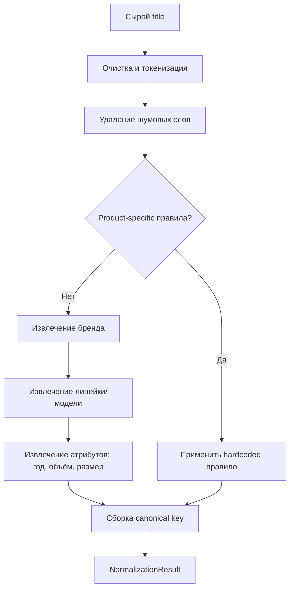
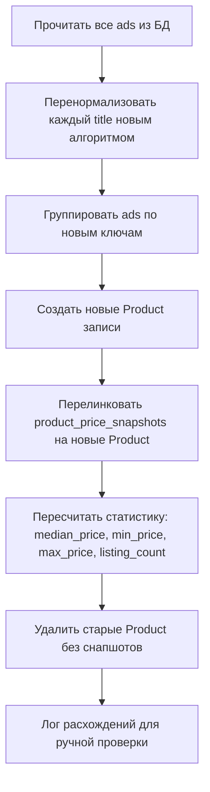

# План: Улучшенный нормализатор товаров v2

> **Дата**: 2026-04-18
> **Статус**: Черновик
> **Связанные файлы**: [`product_normalizer.py`](app/analysis/product_normalizer.py), [`accessory_filter.py`](app/analysis/accessory_filter.py), [`settings.py`](app/config/settings.py), [`models.py`](app/storage/models.py)

## 1. Анализ текущих проблем

### 1.1. Диагностика текущего кода

Текущий нормализатор [`normalize_title()`](app/analysis/product_normalizer.py:180) имеет следующие архитектурные дефекты:

**А. Шумовые слова неполны** — [`NOISE_WORDS`](app/analysis/product_normalizer.py:147) не покрывает:
- "в наличие" / "в наличии" — попадает в ключ как `в_наличие`
- Цвета: "голубой", "розовый", "фиолетовый", "бирюзовый", "графитовый", "серебристый", "темно-серый"
- Состояния: "идеальное", "хорошее", "как новый", "как новые"
- Коммерческие: "цвета", "размеры", "выбор", "в наличии", "под заказ", "оригинал"
- Размеры: "xl", "xxl", "l", "m", "s" — в контексте одежды
- "рст" (Ростест), "евротест", "сша", "глобал"
- "пульт", "кабель", "блок питания", "зарядка" — аксессуары

**Б. `_extract_model()` слишком generic** — [`_extract_model()`](app/analysis/product_normalizer.py:265):
- Fallback `alpha_num` паттерн `r"\b([a-z]+\d[\da-z]*|\d+[a-z][\da-z]*)\b"` хватает любой токен с буквами и цифрами
- Это порождает ключи типа `shield_15`, `u8`, `q2` — бессмысленные обрывки
- Нет понятия "полноты модели" — модель должна включать ВСЕ значимые слова из названия продукта

**В. Нет product-specific правил** — для известных товаров типа "NVIDIA Shield TV Pro 2019" нет жёстких правил, и разные варианты написания дают разные ключи

**Г. Бренды теряются** — [`_extract_brand()`](app/analysis/product_normalizer.py:255) ищет только по точному совпадению слова, не учитывая:
- "nvidia shield" → бренд nvidia, но "shield" без "nvidia" не распознаётся
- "apple tv" → бренд apple, но "tv" без apple не распознаётся

### 1.2. Примеры проблемных ключей

| Заголовок объявления | Текущий ключ | Проблема | Ожидаемый ключ |
|---|---|---|---|
| NVIDIA Shield TV Pro 2019 16GB | `nvidia_shield_15` или `pro_2019` | Фрагментация | `nvidia_shield_tv_pro_2019` |
| NVIDIA Shield TV Pro 2019 в наличии | `nvidia_shield_tv_pro_в_наличие` | Шум в ключе | `nvidia_shield_tv_pro_2019` |
| JBL PartyBox 520 | `jbl` | Слишком generic | `jbl_partybox_520` |
| JBL Charge 5 | `jbl` | Слишком generic | `jbl_charge_5` |
| Телевизор Samsung UE55TU8000 | `samsung_ue55tu8000` | OK, но без бренда в ключе | `samsung_ue55tu8000` |
| Телевизор 55 дюймов | `телевизор` | Нет модели | `tv_55` или generic |
| Велосипед Stels Navigator 500 MD | `stels_navigator_500` | OK | `stels_navigator_500_md` |

---

## 2. Архитектура нового нормализатора

### 2.1. Общий пайплайн нормализации



### 2.2. Структура файлов

```
app/analysis/
├── product_normalizer.py      # Точка входа — normalize_title()
├── normalizer_data.py         # Данные: бренды, шумовые слова, product rules
└── ...
```

Вынос данных в отдельный файл [`normalizer_data.py`](app/analysis/normalizer_data.py) для:
- Чистоты кода нормализатора
- Удобства обновления словарей
- Возможности загрузки из внешних источников в будущем

### 2.3. Алгоритм нормализации — этапы

#### Этап 1: Очистка и токенизация

```python
def _clean_and_tokenize(title: str) -> list[str]:
    """Очистка заголовка и разбиение на токены."""
    # 1. Удалить спецсимволы кроме дефисов
    # 2. Заменить дефисы на пробелы (для унификации)
    # 3. Привести к нижнему регистру
    # 4. Разбить на токены
    # 5. Удалить пустые токены
```

#### Этап 2: Удаление шумовых слов

```python
def _remove_noise(tokens: list[str]) -> list[str]:
    """Удалить шумовые слова из списка токенов."""
    # Проход по токенам, удаление тех, что есть в NOISE_WORDS_SET
    # Также удаление коротких чисел (< 2 цифр), не являющихся годами
```

#### Этап 3: Product-specific правила (приоритетный путь)

```python
def _apply_product_rules(tokens: list[str]) -> str | None:
    """Проверить, подходит ли заголовок под известный продукт."""
    # Проверка по PRODUCT_RULES — список паттернов с жёстким маппингом на ключ
```

#### Этап 4: Извлечение бренда

```python
def _extract_brand(tokens: list[str]) -> tuple[str | None, list[str]]:
    """Извлечь бренд и вернуть оставшиеся токены."""
    # Поиск по BRAND_ALIASES (расширенный)
    # Поиск по BRAND_NAMES_SET (точное совпадение)
    # Если бренд найден — удалить его токены из списка
```

#### Этап 5: Извлечение модели/линейки

```python
def _extract_model(tokens: list[str], brand: str | None) -> str | None:
    """Извлечь модель из оставшихся токенов."""
    # Приоритет 1: BRAND_MODEL_PATTERNS[brand] — специфичные для бренда паттерны
    # Приоритет 2: Общие паттерны (alpha-numeric комбинации)
    # Важно: модель должна включать ВСЕ значимые слова, а не только первое alpha-num
```

#### Этап 6: Извлечение атрибутов

```python
def _extract_attributes(tokens: list[str]) -> dict:
    """Извлечь год, объём памяти, размер экрана."""
    # Год: 4 цифры, 2017-2025
    # Объём: N gb/tb
    # Размер экрана: N дюймов/" 
```

#### Этап 7: Сборка canonical key

```python
def _build_key(brand, model, attributes) -> str:
    """Собрать canonical key из компонентов."""
    # Формат: brand_model[_year][_capacity]
    # Если brand и model оба None — fallback на очищенный title (обрезанный)
```

---

## 3. Словарь шумовых слов

### 3.1. Полный список для [`NOISE_WORDS_SET`](app/analysis/normalizer_data.py)

```python
NOISE_WORDS_SET: frozenset[str] = frozenset({
    # === Состояние ===
    "новый", "новая", "новое", "новые", "нов", "нова",
    "б/у", "бу", "б.у", "б/у.",
    "идеал", "идеальное", "идеальный", "идеальная", "идеально",
    "отличн", "отличное", "отличный", "отличная", "отлично",
    "хорош", "хорошее", "хороший", "хорошая", "хорошо",
    "удовлетворительное", "рабочий", "рабочая", "рабочее",
    "состояние", "сост",
    "как", "нов", "практически",  # "как новый"
    "работает", "проверен", "проверенный",
    "тест", "тестиров", "без дефектов", "целый", "целая",
    "не вскрывал", "не использов", "без следов",
    "sealed", "new", "used", "refurbished", "like new", "mint",
    "opened", "unopened", "locked", "unlocked", "box",

    # === Коммерческие ===
    "в наличии", "вналичии", "в наличие",
    "под заказ", "подзаказ",
    "скидк", "скидка", "скидки", "акция",
    "торг", "торгуюсь", "обмен", "меняю",
    "доставка", "самовывоз", "отправк", "отправляю",
    "оптом", "розниц", "розница",
    "купить", "продать", "продаю", "куплю", "продажа",
    "срочно", "быстро", "дешево", "недорого", "выгодно",
    "цена", "цен", "руб", "рублей", "₽",
    "оригинал", "копия", "реплика", "подделк", "лицензия",
    "гарантия", "гаранти", "гарант", "по гарантии",
    "чек", "документ", "докум", "комплект", "коробк",
    "упаковк", "заводск",

    # === Цвета ===
    "черный", "чёрный", "черная", "чёрная", "черное", "чёрное",
    "белый", "белая", "белое", "белые",
    "серый", "серая", "серое", "серые",
    "золотой", "золотая", "золотое",
    "красный", "красная", "красное",
    "синий", "синяя", "синее",
    "зеленый", "зелёный", "зеленая", "зелёная",
    "голубой", "голубая",
    "розовый", "розовая",
    "фиолетовый", "фиолетовая",
    "бирюзовый", "бирюзовая",
    "графитовый", "графит",
    "серебристый", "серебро", "серебристая",
    "темно", "тёмно",  # "темно-серый"
    "бордовый", "коричневый", "оранжевый", "желтый", "жёлтый",
    "персиковый", "бежевый", "хаки", "камуфляж",
    "color", "цвет", "цвета", "цветов", "расцветк",

    # === Города и регионы ===
    "россия", "москва", "спб", "казань", "новосибирск",
    "екб", "тюмень", "челябинск", "екатеринбург", "самара",
    "ростов", "краснодар", "нижний", "новгород", "воронеж",
    "мск", "spb",

    # === Прочий шум ===
    "рст", "ростест", "евротест", "сша", "глобал", "global",
    "eac", "certified", "реестр",
    "шт", "штука", "комплектация",
    "класс", "выбор", "размер", "размеры",
    "модель", "арт", "артикул",
    "подходит", "совместим", "универсальный",
    "пульт", "кабель", "зарядка", "блок", "питания",  # аксессуары
    "чехол", "крышка", "подставка", "кронштейн", "крепление",
    "ремешок", "браслет", "стекло", "пленка", "плёнка",
    "адаптер", "переходник", "удлинитель",
    "лучшая", "лучший", "лучшее", "популярный", "топ",
    "оригинальный", "оригинальная",
    "телевизор", "телевизоры",  # generic слова категорий
    "колонка", "колонки", "саундбар",
    "велосипед", "велосипеды",
    "приставка", "приставки",
    "телефон", "смартфон",
    "наушники",
    "ноутбук", "планшет",
    "часы",
    "камера", "видеокамера",
    "монитор",
    "принтер",
    "роутер",
    "и", "в", "на", "с", "за", "из", "по", "от", "до", "для", "к", "у", "о",
    "the", "a", "an", "in", "on", "at", "for", "with", "from", "to", "of",
    "is", "are", "was", "were", "be", "been", "being",
    "and", "or", "not", "no", "yes",
    "with", "without", "plus", "mini", "max", "pro", "lite", "ultra",
})
```

> **Важно**: Слова "pro", "mini", "max", "lite", "ultra", "plus" добавлены в шумовые **ОСНОВАТЕЛЬНО** — они НЕ должны быть шумовыми. Эти слова являются частью моделей и должны обрабатываться на этапе извлечения модели, а не удаляться как шум. Они убраны из шумовых слов.

### 3.2. Исправленный подход к шумовым словам

Шумовые слова делятся на две категории:
1. **Удаляемые всегда** — цвета, города, состояния, коммерческие слова
2. **Удаляемые только если не являются частью модели** — "pro", "mini", "max" и т.д.

Для категории 2 — эти слова НЕ добавляются в `NOISE_WORDS_SET`. Вместо этого они обрабатываются на этапе извлечения модели.

---

## 4. Словарь брендов

### 4.1. Расширенный [`BRAND_ALIASES`](app/analysis/normalizer_data.py)

```python
BRAND_ALIASES: dict[str, str] = {
    # === Apple ===
    "iphone": "apple", "айфон": "apple", "айфон": "apple",
    "ipad": "apple", "айпад": "apple",
    "macbook": "apple", "макбук": "apple",
    "airpods": "apple", "эйрподс": "apple",
    "apple": "apple", "appletv": "apple",
    "imac": "apple", "mac": "apple",
    "watch": "apple",  # "Apple Watch" — только в контексте apple

    # === Samsung ===
    "samsung": "samsung", "самсунг": "samsung",
    "galaxy": "samsung", "galaxys": "samsung",
    "the frame": "samsung", "frame": "samsung",

    # === LG ===
    "lg": "lg", "элджи": "lg",

    # === Sony ===
    "sony": "sony", "сони": "sony",
    "playstation": "sony", "ps5": "sony", "ps4": "sony", "ps": "sony",
    "bravia": "sony",
    "xperia": "sony",

    # === Xiaomi ===
    "xiaomi": "xiaomi", "сяоми": "xiaomi", "redmi": "xiaomi",
    "poco": "xiaomi", "mi": "xiaomi",

    # === Huawei / Honor ===
    "huawei": "huawei", "хуавей": "huawei",
    "honor": "honor", "хонор": "honor",

    # === NVIDIA ===
    "nvidia": "nvidia", "видеокарта": "nvidia",  # осторожно с видеокартой
    "geforce": "nvidia", "rtx": "nvidia", "gtx": "nvidia",
    "shield": "nvidia",  # "Shield" → NVIDIA в контексте ТВ-приставок

    # === Google ===
    "google": "google", "pixel": "google", "chromecast": "google",
    "nest": "google",

    # === Аудио ===
    "jbl": "jbl",
    "marshall": "marshall", "маршалл": "marshall",
    "yamaha": "yamaha", "ямаха": "yamaha",
    "sony": "sony",
    "bose": "bose",
    "sennheiser": "sennheiser",
    "bang": "bangolufsen", "olufsen": "bangolufsen",  # Bang & Olufsen
    "harman": "harman", "kardon": "harman",  # Harman Kardon
    "samsung": "samsung",
    "jvc": "jvc",
    "pioneer": "pioneer",
    "kenwood": "kenwood",
    "denon": "denon",
    "onkyo": "onkyo",
    "creative": "creative",
    "logitech": "logitech",
    "razer": "razer",
    "krk": "krk",
    "fender": "fender",
    "behringer": "behringer",

    # === ТВ ===
    "hisense": "hisense", "хайсенс": "hisense",
    "tcl": "tcl",
    "philips": "philips", "филипс": "philips",
    "toshiba": "toshiba",
    "sharp": "sharp",
    "supra": "supra",
    "dexp": "dexp",
    "haier": "haier",
    "kion": "kion",
    "skyworth": "skyworth",

    # === Велосипеды ===
    "stels": "stels", "стелс": "stels",
    "trek": "trek",
    "merida": "merida",
    "forward": "forward", "форвард": "forward",
    "altair": "altair", "альтаир": "altair",
    "author": "author",
    "giant": "giant",
    "specialized": "specialized",
    "scott": "scott",
    "cube": "cube",
    "cannondale": "cannondale",
    "norco": "norco",
    "santa": "santacruz", "cruz": "santacruz",
    "bianchi": "bianchi",
    "orbea": "orbea",
    "focus": "focus",
    "lapierre": "lapierre",
    "kross": "kross",
    "outleap": "outleap",
    "format": "format",
    "triad": "triad",
    "shulz": "shulz", "шульц": "shulz",
    "stern": "stern",

    # === ТВ-приставки ===
    "nvidia": "nvidia",
    "apple": "apple",
    "google": "google",
    "xiaomi": "xiaomi",
    "beelink": "beelink",
    "minix": "minix",
    "tanix": "tanix",
    "tx3": "tx3",
    "tx5": "tx5",
    "x96": "x96",
    "mecool": "mecool",

    # === Ноутбуки / ПК ===
    "asus": "asus", "acer": "acer", "lenovo": "lenovo",
    "hp": "hp", "dell": "dell", "msi": "msi",
    "gigabyte": "gigabyte", "huawei": "huawei",
    "thinkpad": "lenovo", "ideapad": "lenovo",
    "legion": "lenovo",
    "predator": "acer", "nitro": "acer",
    "rog": "asus", "zenbook": "asus", "vivobook": "asus",
    "omen": "hp", "pavilion": "hp", "elitebook": "hp",
    "inspiron": "dell", "xps": "dell", "alienware": "dell",
    "macbook": "apple",

    # === Фото/Видео ===
    "canon": "canon", "nikon": "nikon", "sony": "sony",
    "gopro": "gopro", "gopro": "gopro",
    "dji": "dji", "fuji": "fujifilm", "fujifilm": "fujifilm",
    "olympus": "olympus", "panasonic": "panasonic", "lumix": "panasonic",
    "leica": "leica",

    # === Инструменты ===
    "bosch": "bosch", "бош": "bosch",
    "makita": "makita", "макита": "makita",
    "dewalt": "dewalt",
    "metabo": "metabo",
    "ryobi": "ryobi",
    " Milwaukee": "milwaukee",
    "зубр": "zubr", "zubr": "zubr",
    "интерскол": "interskol", "interskol": "interskol",

    # === Пылессы / Бытовая техника ===
    "dyson": "dyson", "дайсон": "dyson",
    "philips": "philips",
    "braun": "braun",
    "panasonic": "panasonic",
    "xiaomi": "xiaomi",
    "tefal": "tefal",
    "bork": "bork",
    "kitfort": "kitfort",

    # === Другие ===
    "nintendo": "nintendo",
    "xbox": "microsoft", "microsoft": "microsoft",
    "oneplus": "oneplus",
    "oppo": "oppo",
    "vivo": "vivo",
    "realme": "realme",
    "nothing": "nothing",
    "fairphone": "fairphone",
    "anker": "anker",
    "baseus": "baseus",
    "ugreen": "ugreen",
}
```

### 4.2. Бренды по категориям

Для контекстного извлечения бренда (когда бренд не указан явно):

```python
CATEGORY_BRANDS: dict[str, list[str]] = {
    "телевизоры": [
        "samsung", "lg", "hisense", "tcl", "sony", "philips",
        "xiaomi", "acer", "toshiba", "sharp", "supra", "dexp",
        "haier", "kion", "skyworth",
    ],
    "саундбары": [
        "jbl", "sony", "samsung", "yamaha", "marshall", "bose",
        "lg", "philips", "pioneer", "denon", "onkyo", "creative",
    ],
    "велосипеды": [
        "stels", "trek", "merida", "forward", "altair", "author",
        "giant", "specialized", "scott", "cube", "cannondale",
        "norco", "bianchi", "orbea", "focus", "lapierre",
        "kross", "outleap", "format", "triad", "shulz", "stern",
    ],
    "тв приставки": [
        "nvidia", "apple", "google", "xiaomi", "beelink",
        "minix", "tanix", "mecool",
    ],
}
```

---

## 5. Product-specific правила

### 5.1. Структура [`PRODUCT_RULES`](app/analysis/normalizer_data.py)

```python
@dataclass
class ProductRule:
    """Правило для известного продукта."""
    pattern: re.Pattern[str]  # Паттерн для распознавания
    canonical_key: str        # Канонический ключ
    brand: str                # Бренд
    model: str                # Модель

PRODUCT_RULES: list[ProductRule] = [
    # === NVIDIA Shield ===
    ProductRule(
        pattern=re.compile(
            r"nvidia\s+shield\s+(?:tv\s+)?pro\s+2019",
            re.I,
        ),
        canonical_key="nvidia_shield_tv_pro_2019",
        brand="nvidia",
        model="shield_tv_pro_2019",
    ),
    ProductRule(
        pattern=re.compile(
            r"nvidia\s+shield\s+(?:tv\s+)?(?:2019|tube)",
            re.I,
        ),
        canonical_key="nvidia_shield_tv_2019",
        brand="nvidia",
        model="shield_tv_2019",
    ),
    ProductRule(
        pattern=re.compile(
            r"nvidia\s+shield\s+(?:tv\s+)?pro",
            re.I,
        ),
        canonical_key="nvidia_shield_tv_pro_2019",
        brand="nvidia",
        model="shield_tv_pro_2019",
    ),
    ProductRule(
        pattern=re.compile(
            r"nvidia\s+shield\s+tv\b",
            re.I,
        ),
        canonical_key="nvidia_shield_tv_2019",
        brand="nvidia",
        model="shield_tv_2019",
    ),
    ProductRule(
        pattern=re.compile(
            r"nvidia\s+shield\b",
            re.I,
        ),
        canonical_key="nvidia_shield_tv",
        brand="nvidia",
        model="shield_tv",
    ),

    # === Apple TV ===
    ProductRule(
        pattern=re.compile(r"apple\s*tv\s*4k", re.I),
        canonical_key="apple_tv_4k",
        brand="apple",
        model="apple_tv_4k",
    ),
    ProductRule(
        pattern=re.compile(r"apple\s*tv\b", re.I),
        canonical_key="apple_tv",
        brand="apple",
        model="apple_tv",
    ),

    # === Google Chromecast ===
    ProductRule(
        pattern=re.compile(r"chromecast\s*(?:with\s*)?google\s*tv\s*4k", re.I),
        canonical_key="google_chromecast_4k",
        brand="google",
        model="chromecast_4k",
    ),
    ProductRule(
        pattern=re.compile(r"chromecast\b", re.I),
        canonical_key="google_chromecast",
        brand="google",
        model="chromecast",
    ),

    # === Samsung The Frame ===
    ProductRule(
        pattern=re.compile(r"(?:samsung\s+)?(?:the\s+)?frame\b", re.I),
        canonical_key="samsung_the_frame",
        brand="samsung",
        model="the_frame",
    ),

    # === Samsung SWA ===
    ProductRule(
        pattern=re.compile(r"swa\s*[-]?\s*8500s?", re.I),
        canonical_key="samsung_swa_8500s",
        brand="samsung",
        model="swa_8500s",
    ),
    ProductRule(
        pattern=re.compile(r"swa\s*[-]?\s*9100s?", re.I),
        canonical_key="samsung_swa_9100s",
        brand="samsung",
        model="swa_9100s",
    ),
]
```

### 5.2. Порядок проверки правил

Правила проверяются **до** общей нормализации. Порядок важен — более специфичные правила идут первыми:

1. `nvidia shield tv pro 2019` → проверяется первым
2. `nvidia shield tv 2019` → проверяется вторым
3. `nvidia shield tv pro` → без года
4. `nvidia shield tv` → базовая модель
5. `nvidia shield` → fallback

---

## 6. Улучшенный алгоритм извлечения модели

### 6.1. Проблема текущего подхода

Текущий [`_extract_model()`](app/analysis/product_normalizer.py:265) использует regex-паттерны, которые:
- Ловят первый попавшийся alpha-num токен
- Не учитывают контекст бренда
- Теряют значимые слова из модели

### 6.2. Новый подход: "жадная" модель

```python
def _extract_model_v2(tokens: list[str], brand: str | None) -> str | None:
    """Извлечь модель, сохраняя все значимые компоненты."""
    
    # 1. Если есть бренд-специфичные паттерны — применить их
    if brand and brand in BRAND_MODEL_PATTERNS:
        text = " ".join(tokens)
        for pattern, model_name in BRAND_MODEL_PATTERNS[brand]:
            match = pattern.search(text)
            if match:
                return model_name(match.group(0))
    
    # 2. Жадный подход: собрать все значимые токены
    # Значимые = содержат цифры ИЛИ являются известными модификаторами
    MODIFIERS = {"pro", "max", "mini", "ultra", "lite", "plus", "air",
                 "se", "fe", "ne", "xl", "xxl", "super", "neo", "edge"}
    
    model_parts = []
    for token in tokens:
        # Пропускаем бренд
        if brand and token in BRAND_ALIASES:
            continue
        # Пропускаем шум
        if token in NOISE_WORDS_SET:
            continue
        # Число-буквенная комбинация (модельный номер)
        if re.match(r'^[a-z]*\d+[a-z]*$', token, re.I):
            model_parts.append(token)
        # Известный модификатор
        elif token in MODIFIERS:
            model_parts.append(token)
        # Год (4 цифры)
        elif re.match(r'^20[12]\d$', token):
            model_parts.append(token)
    
    if model_parts:
        return "_".join(model_parts)
    
    # 3. Fallback: первый значимый токен
    for token in tokens:
        if token not in NOISE_WORDS_SET and len(token) >= 2:
            return token
    
    return None
```

### 6.3. Бренд-специфичные паттерны моделей

```python
BRAND_MODEL_PATTERNS: dict[str, list[tuple[re.Pattern, callable]]] = {
    "apple": [
        # iPhone 13 Pro Max → iphone_13_pro_max
        (re.compile(r"iphone\s*\d+\s*(?:pro(?:\s*max)?|max|mini|plus|se)?", re.I),
         lambda m: m.group(0).lower().replace(" ", "_")),
        # iPad Air 5 → ipad_air_5
        (re.compile(r"ipad\s*(?:air|mini|pro)?\s*\d*", re.I),
         lambda m: m.group(0).lower().replace(" ", "_")),
        # MacBook Air M2 → macbook_air_m2
        (re.compile(r"macbook\s*(?:air|pro)?\s*(?:m\d+)?", re.I),
         lambda m: m.group(0).lower().replace(" ", "_")),
        # Apple Watch Series 9 → watch_series_9
        (re.compile(r"watch\s*(?:series\s*\d+|se|ultra)?", re.I),
         lambda m: "watch_" + m.group(0).lower().replace(" ", "_").replace("watch_", "")),
        # AirPods Pro 2 → airpods_pro_2
        (re.compile(r"airpods\s*(?:pro|max)?\s*\d*", re.I),
         lambda m: m.group(0).lower().replace(" ", "_")),
    ],
    "samsung": [
        # Galaxy S21 Ultra → galaxy_s21_ultra
        (re.compile(r"galaxy\s*[szanm]\d+\s*(?:ultra|plus|fe|neo|edge|lite)?", re.I),
         lambda m: m.group(0).lower().replace(" ", "_")),
        # Galaxy Note 20 → galaxy_note_20
        (re.compile(r"galaxy\s*note\s*\d+\s*(?:ultra|plus|fe)?", re.I),
         lambda m: m.group(0).lower().replace(" ", "_")),
        # UE55TU8000 → ue55tu8000
        (re.compile(r"[a-z]{1,3}\d{2}[a-z]{1,3}\d{3,4}[a-z]*", re.I),
         lambda m: m.group(0).lower()),
    ],
    "jbl": [
        # JBL PartyBox 520 → partybox_520
        (re.compile(r"partybox\s*\d+", re.I),
         lambda m: m.group(0).lower().replace(" ", "_")),
        # JBL Charge 5 → charge_5
        (re.compile(r"charge\s*\d+", re.I),
         lambda m: m.group(0).lower().replace(" ", "_")),
        # JBL Flip 6 → flip_6
        (re.compile(r"flip\s*\d+", re.I),
         lambda m: m.group(0).lower().replace(" ", "_")),
        # JBL Boombox 3 → boombox_3
        (re.compile(r"boombox\s*\d+", re.I),
         lambda m: m.group(0).lower().replace(" ", "_")),
        # JBL Tune 230NC → tune_230nc
        (re.compile(r"tune\s*\d+\w*", re.I),
         lambda m: m.group(0).lower().replace(" ", "_")),
        # JBL Live 660NC → live_660nc
        (re.compile(r"live\s*\d+\w*", re.I),
         lambda m: m.group(0).lower().replace(" ", "_")),
        # JBL Stage A170 → stage_a170
        (re.compile(r"stage\s*\w*\d+", re.I),
         lambda m: m.group(0).lower().replace(" ", "_")),
        # JBL Bar 9.1 → bar_9_1
        (re.compile(r"bar\s*[\d.]+", re.I),
         lambda m: m.group(0).lower().replace(" ", "_").replace(".", "_")),
    ],
    "stels": [
        # Stels Navigator 500 MD → navigator_500_md
        (re.compile(r"navigator\s*\d+\s*\w*", re.I),
         lambda m: m.group(0).lower().replace(" ", "_")),
        # Stels Pilot 710 → pilot_710
        (re.compile(r"pilot\s*\d+", re.I),
         lambda m: m.group(0).lower().replace(" ", "_")),
    ],
}
```

---

## 7. Примеры до/после

### 7.1. NVIDIA Shield

| # | Заголовок | Текущий ключ | Новый ключ |
|---|---|---|---|
| 1 | NVIDIA Shield TV Pro 2019 16GB | `nvidia_shield_15` | `nvidia_shield_tv_pro_2019` |
| 2 | NVIDIA Shield TV Pro 2019 в наличии | `nvidia_shield_tv_pro_в_наличие` | `nvidia_shield_tv_pro_2019` |
| 3 | Shield TV Pro 2019 16GB Новый | `pro_2019` | `nvidia_shield_tv_pro_2019` |
| 4 | NVIDIA Shield TV 2019 Tube | `nvidia_shield_15` | `nvidia_shield_tv_2019` |
| 5 | NVIDIA Shield TV Pro | `nvidia_shield_tv_pro` | `nvidia_shield_tv_pro_2019` |
| 6 | nvidia shield | `nvidia_shield` | `nvidia_shield_tv` |

### 7.2. JBL

| # | Заголовок | Текущий ключ | Новый ключ |
|---|---|---|---|
| 1 | JBL PartyBox 520 | `jbl` | `jbl_partybox_520` |
| 2 | JBL Charge 5 Bluetooth | `jbl` | `jbl_charge_5` |
| 3 | JBL Flip 6 | `jbl` | `jbl_flip_6` |
| 4 | JBL Boombox 3 | `jbl` | `jbl_boombox_3` |
| 5 | JBL Bar 9.1 | `jbl` | `jbl_bar_9_1` |
| 6 | JBL Tune 230NC | `jbl` | `jbl_tune_230nc` |

### 7.3. Телевизоры

| # | Заголовок | Текущий ключ | Новый ключ |
|---|---|---|---|
| 1 | Samsung UE55TU8000UXRU | `samsung_ue55tu8000` | `samsung_ue55tu8000` |
| 2 | Samsung The Frame 55 2022 | `samsung_the` | `samsung_the_frame` |
| 3 | LG OLED55C2 | `lg_oled55c2` | `lg_oled55c2` |
| 4 | Телевизор 55 дюймов | `телевизор` | `tv_55` |
| 5 | Hisense 55A6KE | `hisense_55a6ke` | `hisense_55a6ke` |

### 7.4. Велосипеды

| # | Заголовок | Текущий ключ | Новый ключ |
|---|---|---|---|
| 1 | Stels Navigator 500 MD 2022 | `stels_navigator_500` | `stels_navigator_500_md` |
| 2 | Forward Impulse X 27.5 | `forward_impulse` | `forward_impulse_x` |
| 3 | Велосипед Stels Pilot 710 | `stels_pilot_710` | `stels_pilot_710` |

---

## 8. Стратегия миграции

### 8.1. Проблема

В БД уже есть таблица `products` с ~473 записями, ссылающимися на `product_price_snapshots`. При изменении алгоритма нормализации:
- Старые ключи станут неактуальны
- Новые объявления будут создавать новые продукты
- История цен по старым ключам потеряет актуальность

### 8.2. Скрипт миграции [`scripts/renormalize_products.py`](scripts/renormalize_products.py)



### 8.3. Пошаговый план миграции

1. **Создать скрипт [`scripts/renormalize_products.py`](scripts/renormalize_products.py)**:
   - Прочитать все записи из `ads` с непустым `title`
   - Для каждого ad: запустить новую `normalize_title_v2()`
   - Построить маппинг: `old_key → new_key`
   - Создать новые `Product` записи (если не существуют)
   - Перелинковать `product_price_snapshots` с `ad_id` на новые продукты
   - Пересчитать агрегаты
   - Удалить пустые старые продукты

2. **Dry-run режим**: скрипт сначала работает в режиме `--dry-run`, выводя:
   - Сколько ключей изменится
   - Какие старые ключи объединятся в новые
   - Сколько продуктов будет удалено

3. **Бэкап БД** перед миграцией

4. **Запуск миграции** после проверки dry-run

### 8.4. SQL для миграции (ориентировочный)

```sql
-- 1. Создать временную таблицу с новыми ключами
CREATE TEMP TABLE new_keys AS
SELECT a.id as ad_id, a.title,
       -- новая нормализация будет в Python
       'placeholder' as new_key
FROM ads a
WHERE a.title IS NOT NULL;

-- 2. Перелинковка снапшотов
UPDATE product_price_snapshots ps
SET product_id = new_products.id
FROM new_keys nk
JOIN products new_products ON new_products.normalized_key = nk.new_key
WHERE ps.ad_id = nk.ad_id;

-- 3. Удалить старые продукты без снапшотов
DELETE FROM products
WHERE id NOT IN (SELECT DISTINCT product_id FROM product_price_snapshots);
```

---

## 9. План реализации

### 9.1. Файлы для создания/изменения

| Файл | Действие | Описание |
|---|---|---|
| [`app/analysis/normalizer_data.py`](app/analysis/normalizer_data.py) | **Создать** | Все данные: бренды, шумовые слова, product rules |
| [`app/analysis/product_normalizer.py`](app/analysis/product_normalizer.py) | **Переписать** | Новый алгоритм нормализации |
| [`scripts/renormalize_products.py`](scripts/renormalize_products.py) | **Создать** | Скрипт миграции существующих данных |
| [`tests/test_normalizer.py`](tests/test_normalizer.py) | **Создать** | Тесты на всех примерах до/после |

### 9.2. Порядок реализации

1. Создать [`normalizer_data.py`](app/analysis/normalizer_data.py) со всеми словарями
2. Переписать [`product_normalizer.py`](app/analysis/product_normalizer.py) с новым алгоритмом
3. Создать тесты [`test_normalizer.py`](tests/test_normalizer.py) с примерами из секции 7
4. Запустить тесты, убедиться в корректности
5. Создать скрипт миграции [`renormalize_products.py`](scripts/renormalize_products.py)
6. Запустить миграцию в dry-run режиме
7. Проверить результаты dry-run
8. Сделать бэкап БД
9. Запустить миграцию

### 9.3. Обратная совместимость

Функция [`normalize_title()`](app/analysis/product_normalizer.py:180) сохраняет ту же сигнатуру:

```python
def normalize_title(title: str) -> NormalizationResult:
```

[`NormalizationResult`](app/analysis/product_normalizer.py:170) также не меняется. Это значит, что все вызовы в [`pipeline.py`](app/scheduler/pipeline.py:1211) и [`repository.py`](app/storage/repository.py:1989) продолжат работать без изменений.

---

## 10. Риски и ограничения

1. **Ложные срабатывания product rules** — "shield" может быть не только NVIDIA Shield. Решение: product rules применять только если есть контекст (категория "тв приставки" или бренд "nvidia" в тексте).

2. **Новые товары** — для товаров, не описанных в product rules, алгоритм будет работать по общим правилам. Это нормально — product rules покрывают только самые проблемные случаи.

3. **Русские названия** — "Айфон 13 Про Макс" должен нормализоваться так же как "iPhone 13 Pro Max". Решение: алиасы в `BRAND_ALIASES` + транслитерация моделей.

4. **Производительность** — новый алгоритм может быть медленнее из-за большего количества проверок. Решение: прекомпиляция regex, `frozenset` для lookup, кэширование результатов (опционально).

5. **Длина ключа** — ключи могут стать длиннее. Решение: ограничение в 100 символов с усечением менее значимых частей.

---

## 11. Дополнительные баги из логов (не нормализатор, но влияет)

### 11.1. ACCESSORY_BLACKLIST: "адаптер" фильтрует реальные товары

**Проблема**: В [`ACCESSORY_BLACKLIST`](app/config/settings.py:215) есть слово "адаптер". Оно фильтрует:
- `Адаптер samsung kino KIT VG-SWD1000` — реальный продукт за 10к+₽

**Решение**: Убрать "адаптер" из blacklist. Samsung KINO адаптер — это полноценный компонент саундбара за 10-20к, а не "мелочёвка". Аналогично, "блок питания" может быть дорогим (блок питания для ноутбука за 5-8к).

**Рекомендация**: Заменить "адаптер" на более специфичные: "адаптер питания", "usb адаптер", "hdmi адаптер". Или проверять цену: если цена > 5000₽ — не фильтровать по blacklist.

### 11.2. SegmentStats: NOT NULL violation на `ad_count`

**Проблема**: В БД таблица `segment_stats` имеет колонку `ad_count` с NOT NULL constraint, но SQLAlchemy модель [`SegmentStats`](app/storage/models.py:479) **не имеет** поля `ad_count`. Это значит, что колонка была добавлена миграцией SQL, но не добавлена в ORM-модель.

При INSERT через SQLAlchemy поле `ad_count` не передаётся → NULL → NOT NULL violation.

**Решение**: Добавить поле `ad_count` в модель [`SegmentStats`](app/storage/models.py:479):
```python
ad_count: Mapped[int] = mapped_column(Integer, nullable=False, default=0)
```

### 11.3. Diamond detection с product_key `s2`

**Проблема**: Из логов: `diamond_detected ... product_key=s2`. Ключ `s2` — слишком короткий и generic. Это может быть Samsung Galaxy S2, или какой-то другой товар. Нормализатор даёт ключ `s2` из-за fallback-паттерна `_extract_model()`, который хватает первый alpha-num токен.

**Решение**: Это основная проблема, которую решает данный план — улучшенный нормализатор будет давать более точные ключи.

### 11.4. seller_link_failed

**Проблема**: `seller_link_failed ... error=Repository.link_ad_to_seller() got an unexpected keyword argument 'ad_db_id'`

Это отдельный баг в вызове [`link_ad_to_seller()`](app/storage/repository.py) — передаётся `ad_db_id`, а метод ожидает другой параметр. Не относится к нормализатору, но стоит исправить.

---

## 12. Уточнённый список файлов для изменения

| # | Файл | Действие | Приоритет |
|---|---|---|---|
| 1 | [`app/analysis/normalizer_data.py`](app/analysis/normalizer_data.py) | **Создать** | Высокий |
| 2 | [`app/analysis/product_normalizer.py`](app/analysis/product_normalizer.py) | **Переписать** | Высокий |
| 3 | [`app/storage/models.py`](app/storage/models.py) | **Добавить `ad_count` в SegmentStats** | Высокий (блокер) |
| 4 | [`app/config/settings.py`](app/config/settings.py) | **Убрать "адаптер" из blacklist** | Средний |
| 5 | [`scripts/renormalize_products.py`](scripts/renormalize_products.py) | **Создать** | Средний |
| 6 | [`tests/test_normalizer.py`](tests/test_normalizer.py) | **Создать** | Средний |
